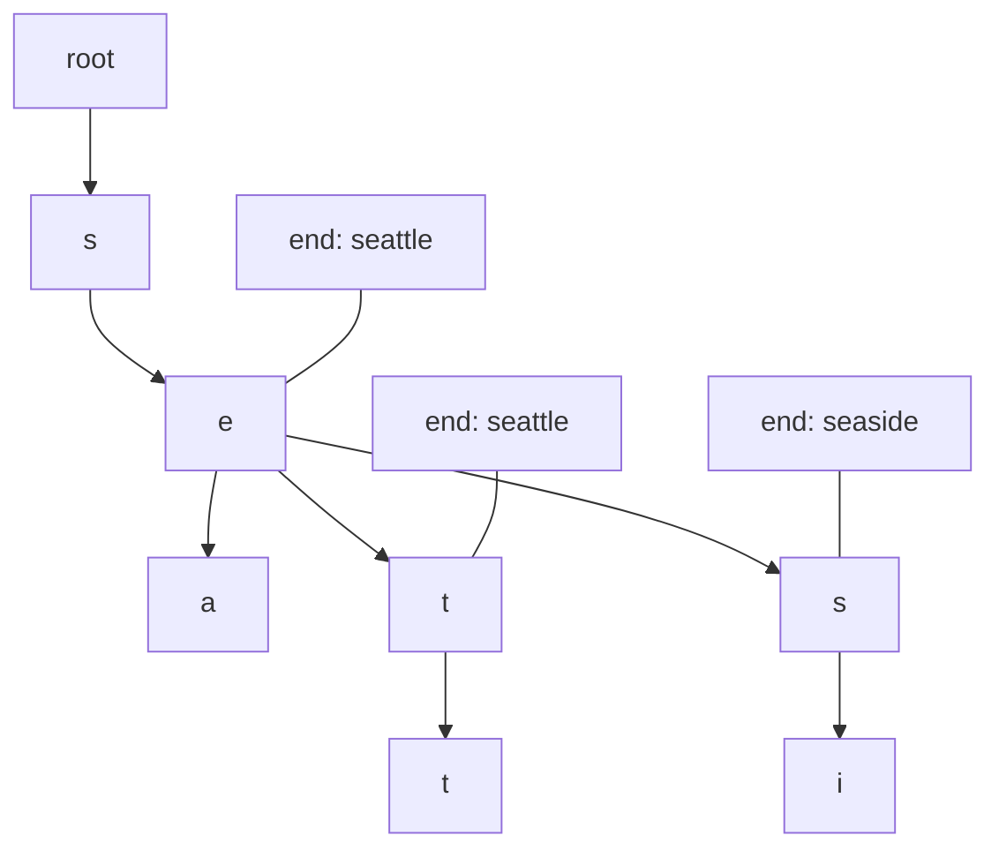
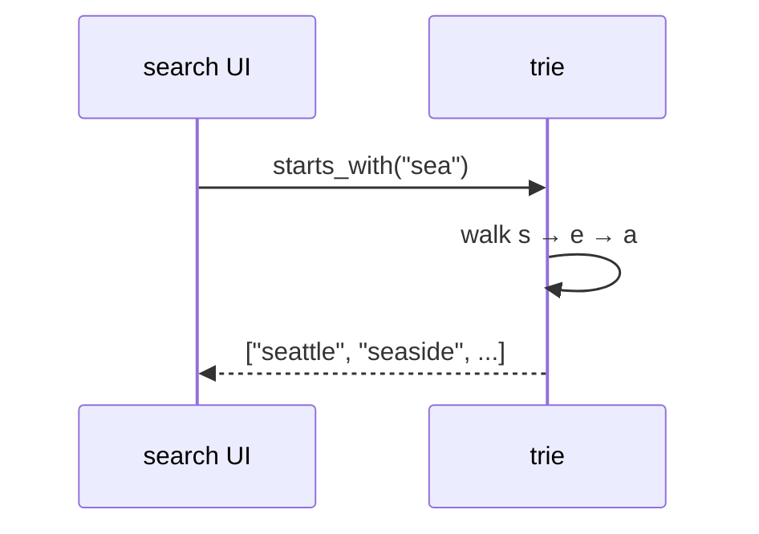
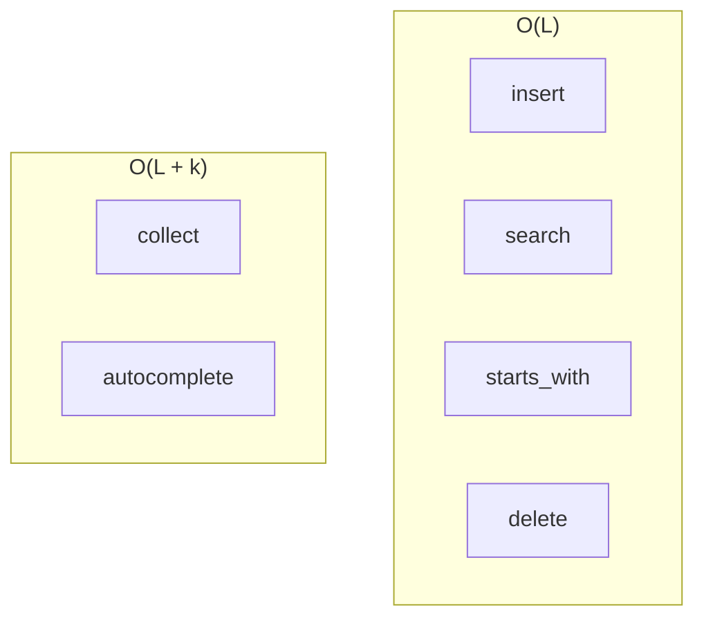
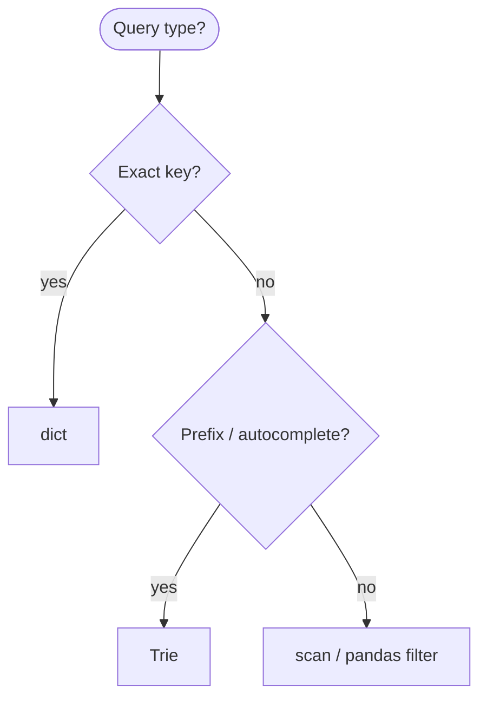
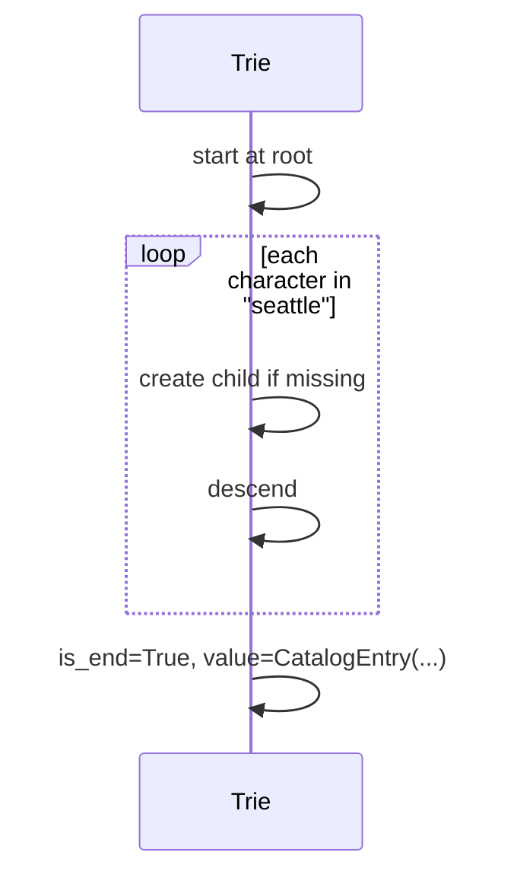
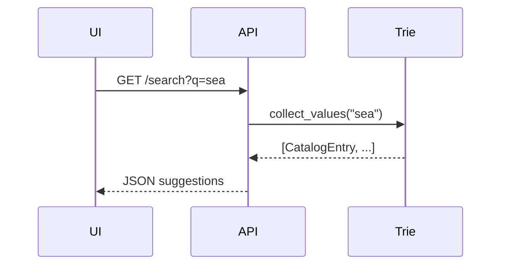

# Tries

A **tree keyed by characters (or tokens)** where each path from the root spells a prefix shared by all strings below it. Also called a **prefix tree** or **digital tree**.

| | |
| --- | --- |
| **What it is** | Each edge labeled with one character; nodes mark end-of-word; search walks characters of the key. |
| **Core operations** | Insert, exact search, prefix search, delete (with pruning). |
| **When to use** | Autocomplete, prefix filters, name catalogs, airport-code suggestions. |
| **Trade-off** | Space grows with alphabet × depth; hash map wins for exact key lookup only. |

Tries shine when users **type ahead** on **names** (`"Sea"` → Seattle, Seaside, SeaTac), **short codes** (`"P"` → PDX, PHX, …), or **tags** with shared prefixes (`"error#"`). Exact `record_id` lookup stays in a [Hash table](../hash-table/index.md); tries complement hashes for **prefix** and **completion** UX.

This page is your **ready reference**: Python implementations (`dict`-of-children and `Trie` class), every operation with practical examples, complexity tables, pitfalls, and when `dict` beats trie. For Big-O notation, see [Complexity analysis](../../complexity/index.md).

[Parent: Data structures](../index.md)

---

## Trie vs hash table vs sorted list

| | **Trie** | **`dict` / `set`** | **Sorted + bisect** |
| --- | --- | --- | --- |
| **Exact lookup** | O(L) | O(1) avg | O(log n) |
| **Prefix all matches** | O(L + k) | O(n) scan all keys | O(log n + k) |
| **Autocomplete** | Natural | Slow scan | Possible |
| **Space** | O(total chars) | O(n) keys | O(n) |
| **Good fit** | Name/typeahead UI | `record_id` index | Leaderboards by name |



**L** = key length (characters). **k** = number of matches returned.

---

## What a trie models

| Use case | Trie keys | Operation |
| --- | --- | --- |
| **Search box** | `entry.name.lower()` | `starts_with("sea")` |
| **Short code** | `"SEA"`, `"PDX"`, … | prefix as user types |
| **Event tags** | `"error#"` shared prefix | group drills |
| **Catalog by name** | `"Portland"` | insert full names |
| **Invalid token filter** | banned substring scan | prefix walk |

```python
from dataclasses import dataclass


@dataclass(frozen=True)
class CatalogEntry:
    entity_id: str
    name: str
    category: str
    score: float


@dataclass(frozen=True)
class Region:
    abbr: str
    state: str
    label: str
```

Each leaf can store a `CatalogEntry` payload, not just the string key. `Trie` is defined in [Reference implementation](#reference-implementation-trie-with-full-api) below; later sections use `CatalogEntry` in operation examples.

---

## Mental model: root, children, end marker

- **Root** — empty string prefix.
- **Edge** — one character (or one token if word-level trie).
- **`is_end`** — node completes a stored string; may also store `entity_id` payload.



| Step | Cost driver |
| --- | --- |
| Descend one char | O(1) per level with dict children |
| Full word length L | O(L) |

---

## Ways to create a trie in Python

### 1. Empty `Trie` class

```python
class TrieNode:
    def __init__(self):
        self.children = {}
        self.is_end = False
        self.value = None

class Trie:
    def __init__(self):
        self.root = TrieNode()
```

| | |
| --- | --- |
| **Time** | O(1) |
| **Space** | O(1) |

### 2. Insert catalog from iterable

```python
def build_catalog_trie(entries):
    t = Trie()
    for e in entries:
        t.insert(e.name.lower(), e)
    return t
```

| | |
| --- | --- |
| **Time** | O(total characters) |
| **Space** | O(total characters) |

### 3. `defaultdict` recursive trie (compact teaching)

```python
from collections import defaultdict

def make_node():
    return defaultdict(make_node)

# root = make_node()  # then navigate root['s']['e']['a']
```

| | |
| --- | --- |
| **Time** | O(1) per node creation lazy |
| **Space** | Shared prefixes |

### 4. Third-party / notes

Production Python services often use:

- **Database** `LIKE 'sea%'` for large name catalogs.
- **Search engines** (Elasticsearch) for fuzzy match.

Tries in pure Python excel in **medium** catalogs (thousands of names) and **teaching**.


---

## Reference implementation: `Trie` with full API

```python
class TrieNode:
    def __init__(self):
        self.children = {}
        self.is_end = False
        self.value = None


class Trie:
    def __init__(self):
        self.root = TrieNode()
        self._size = 0

    def __len__(self):
        return self._size

    def clear(self):
        self.root = TrieNode()
        self._size = 0

    def insert(self, word, value=None):
        node = self.root
        for ch in word:
            if ch not in node.children:
                node.children[ch] = TrieNode()
            node = node.children[ch]
        if not node.is_end:
            self._size += 1
        node.is_end = True
        node.value = value

    def search(self, word):
        node = self._find_node(word)
        if node is None or not node.is_end:
            return None
        return node.value

    def contains(self, word):
        node = self._find_node(word)
        return node is not None and node.is_end

    def starts_with(self, prefix):
        return self._find_node(prefix) is not None

    def _find_node(self, prefix):
        node = self.root
        for ch in prefix:
            if ch not in node.children:
                return None
            node = node.children[ch]
        return node

    def delete(self, word):
        def _delete(node, depth):
            if depth == len(word):
                if not node.is_end:
                    return False
                node.is_end = False
                node.value = None
                return len(node.children) == 0
            ch = word[depth]
            if ch not in node.children:
                return False
            child = node.children[ch]
            should_prune = _delete(child, depth + 1)
            if should_prune:
                del node.children[ch]
            return len(node.children) == 0 and not node.is_end

        if _delete(self.root, 0):
            self._size -= 1
            return True
        node = self._find_node(word)
        if node and node.is_end:
            node.is_end = False
            node.value = None
            self._size -= 1
            return True
        return False

    def collect(self, prefix=""):
        node = self._find_node(prefix)
        if node is None:
            return []
        out = []
        self._dfs_words(node, prefix, out)
        return out

    def collect_values(self, prefix=""):
        node = self._find_node(prefix)
        if node is None:
            return []
        out = []
        self._dfs_values(node, out)
        return out

    def _dfs_words(self, node, path, out):
        if node.is_end:
            out.append(path)
        for ch, child in sorted(node.children.items()):
            self._dfs_words(child, path + ch, out)

    def _dfs_values(self, node, out):
        if node.is_end and node.value is not None:
            out.append(node.value)
        for child in node.children.values():
            self._dfs_values(child, out)

    def longest_common_prefix(self):
        node = self.root
        prefix = []
        while len(node.children) == 1 and not node.is_end:
            ch, node = next(iter(node.children.items()))
            prefix.append(ch)
        return "".join(prefix)
```

---

## All operations (with examples and complexity)



### `insert(word, value=None)`

```python
trie = Trie()
trie.insert("seattle", CatalogEntry("ent-001", "Seattle", "city", 56.0))
trie.insert("seaside", CatalogEntry("ent-002", "Seaside", "city", 5.0))
```

| | |
| --- | --- |
| **Time** | O(L) |
| **Space** | O(L) new nodes worst case (no shared prefix) |


---

### `search(word)` — exact match

```python
entry = trie.search("seattle")
```

| | |
| --- | --- |
| **Time** | O(L) |
| **Space** | O(1) |

Returns attached `CatalogEntry` or `None`.

---

### `contains(word)`

| | |
| --- | --- |
| **Time** | O(L) |
| **Space** | O(1) |

---

### `starts_with(prefix)` — any word under prefix?

```python
assert trie.starts_with("sea")
assert not trie.starts_with("zzz")
```

| | |
| --- | --- |
| **Time** | O(L) |
| **Space** | O(1) |

**UI note:** Enable autocomplete dropdown after user types 3+ chars.

---

### `collect(prefix)` — all completions

```python
matches = trie.collect("sea")
# ["seaside", "seattle"] sorted by DFS order
```

| | |
| --- | --- |
| **Time** | O(L + k + total output length) |
| **Space** | O(k) recursion stack |

---

### `collect_values(prefix)` — payload objects

```python
entries = trie.collect_values("po")
```

| | |
| --- | --- |
| **Time** | O(L + k) |
| **Space** | O(k) |

---

### `delete(word)`

```python
trie.delete("seaside")
```

| | |
| --- | --- |
| **Time** | O(L) |
| **Space** | O(L) recursion stack |

Prune nodes that become useless branches.

---

### `longest_common_prefix()`

```python
t = Trie()
for abbr in ["PDX", "PDT", "PDY"]:
    t.insert(abbr.lower())
# useful for detecting shared code prefixes in toy data
```

| | |
| --- | --- |
| **Time** | O(L) |
| **Space** | O(1) |

---

### `len(trie)` / `clear()`

| | |
| --- | --- |
| **Time** | O(1) len; O(1) clear drop root |
| **Space** | O(1) |

---

## Common patterns with tries

### Autocomplete by name prefix

```python
def autocomplete(trie, partial, limit=10):
    partial = partial.lower().strip()
    if not partial:
        return []
    entries = trie.collect_values(partial)
    return entries[:limit]
```

| | |
| --- | --- |
| **Time** | O(L + k) |
| **Space** | O(k) |

### Short-code typeahead

```python
CODES = ["ABQ", "ATL", "BOS", "DEN", "DFW", "HNL", "IAH", "JFK", "LAS",
         "LAX", "MIA", "MSP", "ORD", "PDX", "PHX", "SAN", "SEA", "SFO",
         "SLC", "TPA"]

code_trie = Trie()
for abbr in CODES:
    code_trie.insert(abbr.lower(), abbr)

def suggest_code(prefix):
    return [code_trie.search(w) for w in code_trie.collect(prefix.lower())]
```

| | |
| --- | --- |
| **Time** | O(L + k) |
| **Space** | O(20) tiny |

For only a few dozen codes, a **sorted list + filter** is simpler—trie pays off when *n* is thousands (names in a large catalog).

### Prefix token filter on ingest logs

```python
banned = Trie()
for word in ("badtoken1", "badtoken2"):
    banned.insert(word)

def has_banned_prefix(token):
    return any(
        banned.starts_with(token[:i])
        for i in range(1, len(token) + 1)
    )
```

| | |
| --- | --- |
| **Time** | O(L²) naive; O(L) with careful walk |
| **Space** | O(banned total chars) |

---

## Variants (conceptual)

| Variant | Idea | When |
| --- | --- | --- |
| **Compressed (radix / Patricia)** | Merge single-child chains | Save space on sparse tries |
| **Array of size 26** | Fixed alphabet | Uppercase A–Z only |
| **Word-level trie** | Edge = whole token | NLP event descriptions |
| **Suffix trie** | All suffixes of one string | advanced text; heavy space |

---

## Array-based children vs `dict` children

| | **`dict` children** | **array[26]** |
| --- | --- | --- |
| **Space** | O(active children) | O(26) per node always |
| **Lookup child** | O(1) hash | O(1) index |
| **Alphabet** | Unicode / arbitrary | Restricted |
| **Mixed-case names** | Preferred (normalized) | Only if A–Z enforced |

---

## Master complexity table

Let **L** = word length, **k** = matches, **N** = total stored characters across all words.

| Operation | Time | Space (aux) |
| --- | --- | --- |
| `insert` | O(L) | O(L) new nodes |
| `search` / `contains` | O(L) | O(1) |
| `starts_with` | O(L) | O(1) |
| `collect` / autocomplete | O(L + k + output) | O(k) stack |
| `delete` | O(L) | O(L) stack |
| Build n entries avg length L̄ | O(n · L̄) | O(N) total |
| DFS all words | O(N) | O(output) |

**Storage:** O(N) characters stored in tree structure plus node overhead.

---

## Python stdlib: what to use instead

| Need | Tool |
| --- | --- |
| Exact `record_id` | `dict[int, Record]` |
| Few dozen codes | `list` + filter |
| Thousands of name typeahead | `Trie` or DB `ILIKE` |
| Fuzzy spelling | `difflib`, rapidfuzz, search engine |
| Prefix in pandas | `df[df['name'].str.startswith('Sea')]` |

```python
import pandas as pd

catalog = pd.read_csv("catalog.csv")
hits = catalog[catalog["name"].str.lower().str.startswith("sea")]
```

Vectorized pandas is often faster than pure Python trie for **batch** queries; trie wins for **interactive** single-prefix lookups in memory.

---

## When trie vs hash vs scan



| Pitfall | Fix |
| --- | --- |
| Storing uppercase mixed keys | Normalize to `.lower()` on insert/search |
| Empty string insert | Define policy (usually skip) |
| Huge alphabet Unicode | Use dict children, not array[65536] |
| Duplicate insert same word | Decide overwrite vs ignore |
| Trie for ~20 codes only | Overkill — use list |
| Not attaching `entity_id` at leaf | Store payload in `value` |

---

## Case-insensitive wrapper

Normalize once at the boundary:

```python
class CaseInsensitiveTrie:
    def __init__(self):
        self._t = Trie()

    def insert(self, word, value=None):
        self._t.insert(word.lower(), value)

    def search(self, word):
        return self._t.search(word.lower())

    def collect(self, prefix):
        return self._t.collect(prefix.lower())
```

| | |
| --- | --- |
| **Time** | O(L) per op |
| **Space** | Same as inner trie |

**Note:** User types `"SEA"` or `"sea"` — same completions.

---

## Array-based trie node (A–Z only)

When keys are **uppercase codes** or A–Z only:

```python
class AlphaTrieNode:
    __slots__ = ("children", "is_end", "value")

    def __init__(self):
        self.children = [None] * 26
        self.is_end = False
        self.value = None

    def _idx(self, ch):
        return ord(ch.upper()) - ord("A")
```

| | |
| --- | --- |
| **Time** | O(1) child index |
| **Space** | 26 pointers per node (sparse waste) |

Use **`dict` children** for full names with mixed characters.

---

## Insert walkthrough (mermaid)



---

## Word search on letter grid (toy)

Given a 2D grid of letters, find if a target word exists (DFS + trie):

```python
def find_word(board, word, trie):
    if not trie.starts_with(word[0]):
        return False
    rows, cols = len(board), len(board[0])

    def dfs(r, c, i):
        if i == len(word):
            return True
        if r < 0 or c < 0 or r >= rows or c >= cols:
            return False
        if board[r][c] != word[i]:
            return False
        ch = board[r][c]
        board[r][c] = "#"
        found = any(
            dfs(r + dr, c + dc, i + 1)
            for dr, dc in ((0, 1), (1, 0), (0, -1), (-1, 0))
        )
        board[r][c] = ch
        return found

    return any(dfs(r, c, 0) for r in range(rows) for c in range(cols))
```

| | |
| --- | --- |
| **Time** | O(rows · cols · 4^L) naive |
| **Space** | O(L) stack |

**Note:** Toy for workbook puzzles—not production catalog search.

---

## `Trie` method checklist

| Method | Time | Returns |
| --- | --- | --- |
| `insert` | O(L) | None |
| `search` | O(L) | payload or None |
| `contains` | O(L) | bool |
| `starts_with` | O(L) | bool |
| `collect` | O(L + output) | list[str] |
| `collect_values` | O(L + k) | list payloads |
| `delete` | O(L) | bool |
| `longest_common_prefix` | O(L) | str |
| `clear` | O(1) | None |
| `len` | O(1) | count words |

---

## Radix / Patricia (compressed) — when space matters

If the trie is **sparse** with long single-child chains, compress paths into one edge labeled with a substring. Python rarely needs this for name tries (≈ few thousand nodes); routing tables and DNA-style keys benefit more.

| | Standard trie | Radix tree |
| --- | --- | --- |
| Space | O(total chars) | O(nodes) smaller |
| Implement | Easy in Python | Harder |
| Name autocomplete | dict trie enough | optional at scale |

---

## Autocomplete API sketch (Flask-style)

```python
def search_catalog(trie, q, limit=8):
    q = q.strip().lower()
    if len(q) < 2:
        return []
    entries = trie.collect_values(q)
    return [
        {"entity_id": e.entity_id, "name": e.name, "category": e.category}
        for e in entries[:limit]
    ]
```

| Step | Time |
| --- | --- |
| normalize query | O(L) |
| `collect_values` | O(L + k) |
| JSON serialize | O(k) |

Debounce keystrokes in the UI so you do not rebuild completions on every keypress for large tries.



---

## Bulk build from CSV

```python
import csv

def trie_from_catalog_csv(path):
    t = Trie()
    with open(path, newline="") as f:
        for row in csv.DictReader(f):
            name = row.get("name", "")
            eid = row["entity_id"]
            category = row.get("category", "")
            score = float(row.get("score", 0))
            t.insert(name.lower(), CatalogEntry(eid, name, category, score))
    return t
```

| | |
| --- | --- |
| **Time** | O(total name characters) |
| **Space** | O(trie nodes) |

Rebuild trie when the catalog updates, not on every HTTP request.

---

## Prefix vs substring

| Query | Structure |
| --- | --- |
| Keys **starting with** `"sea"` | Trie |
| Keys **containing** `"attle"` | Scan all keys O(n) or full-text index |
| Exact `record_id` | `dict` |

Document your search product: trie is **prefix-only**.

---

## Related structures in this guide

| Structure | Link |
| --- | --- |
| [Hash table](../hash-table/index.md) | Exact key O(1) |
| [Binary search tree](../binary-search-tree/index.md) | Ordered keys |
| [Graphs](../graphs/index.md) | Different edge semantics |

---

## Quick reference card

```python
trie = Trie()
trie.insert("seattle", entry_obj)
trie.insert("seaside", other_entry)

# Exact
e = trie.search("seattle")

# Prefix
if trie.starts_with("sea"):
    names = trie.collect("sea")
    entries = trie.collect_values("sea")

# Remove
trie.delete("seaside")
```

Use a **trie** when **prefix queries** and **autocomplete** dominate—name search, shared tag prefixes, command palettes. Use **`dict`** for **`record_id`** and **`Counter`** for stats; use **pandas** for bulk filters.

**Implementation checklist**

1. **Exact record lookup** — `dict` or DataFrame index, not trie.
2. **Name search UI** — trie on normalized `name.lower()`.
3. **Normalize** — case and diacritics policy at insert and query.
4. **Size** — trie for thousands of strings; consider DB for full historical catalog search.
5. **Return payload** — store `CatalogEntry` at `is_end` node, not just string.
