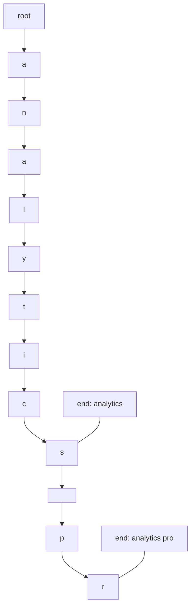
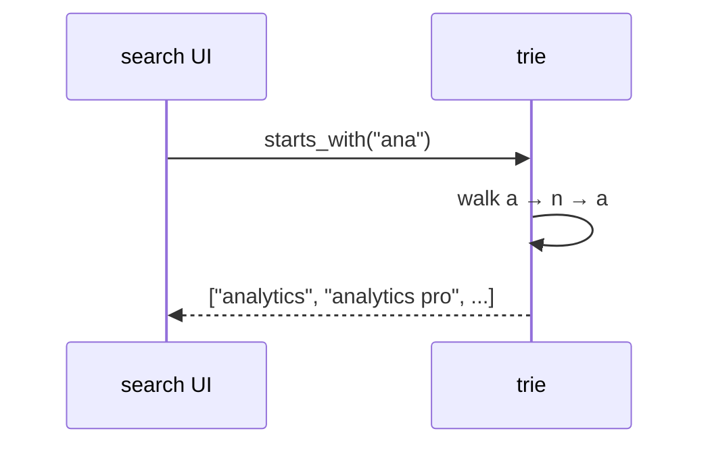
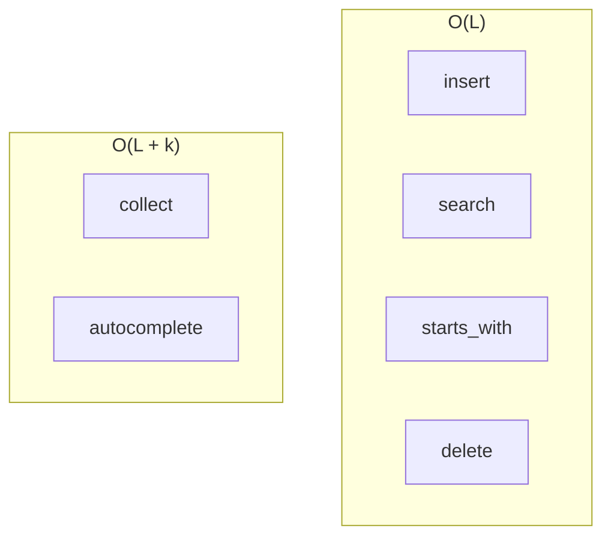
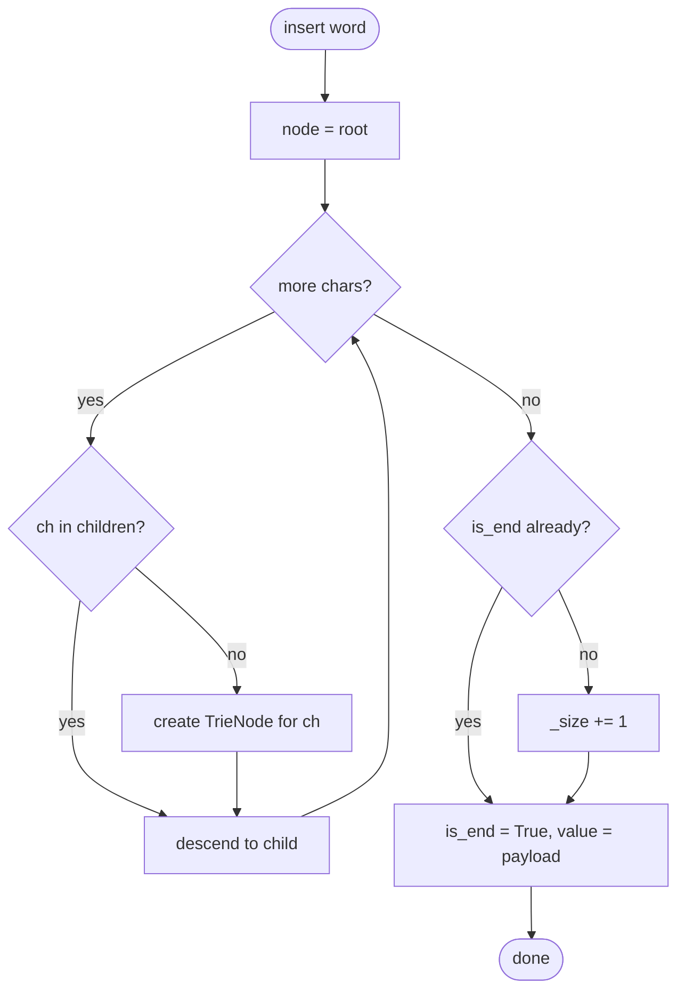
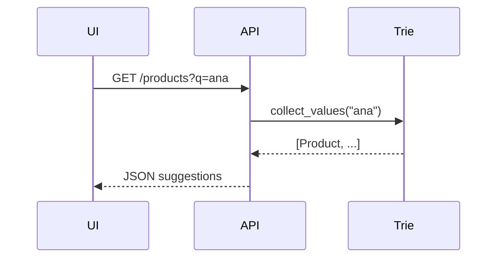

# Tries

A **tree keyed by characters (or tokens)** where each path from the root spells a prefix shared by all strings below it. Also called a **prefix tree** or **digital tree**.

| | |
| --- | --- |
| **What it is** | Each edge labeled with one character; nodes mark end-of-word; search walks characters of the key. |
| **Core operations** | Insert, exact search, prefix search, delete (with pruning). |
| **When to use** | Autocomplete, prefix filters, product name search, URL route prefixes, command palettes. |
| **Trade-off** | Space grows with alphabet × depth; hash map wins for exact key lookup only. |

Tries shine when users **type ahead** on **product names** (`"Ana"` → Analytics, Analytics Pro, Analytics Lite), **URL path segments** (`"/api/v1"` → `/api/v1/users`, `/api/v1/orders`), or **command palette entries** (`"git "` → git status, git commit, git push). Exact `slug` lookup stays in a [Hash table](../hash-table/index.md); tries complement hashes for **prefix** and **completion** UX.

This page is your **ready reference**: Python implementations (`dict`-of-children and `Trie` class), every operation with practical examples, complexity tables, pitfalls, and when `dict` beats trie. For Big-O notation, see [Complexity analysis](../../complexity/index.md).

[Parent: Data structures](../index.md)

---

## Trie vs hash table vs sorted list

| | **Trie** | **`dict` / `set`** | **Sorted + bisect** |
| --- | --- | --- | --- |
| **Exact lookup** | O(L) | O(1) avg | O(log n) |
| **Prefix all matches** | O(L + k) | O(n) scan all keys | O(log n + k) |
| **Autocomplete** | Natural | Slow scan | Possible |
| **Space** | O(total chars) | O(n) keys | O(n) |
| **Good fit** | Product/route/command UI | `slug` index | Leaderboards by name |



**L** = key length (characters). **k** = number of matches returned.

---

## What a trie models

| Use case | Trie keys | Operation |
| --- | --- | --- |
| **Product search** | `product.name.lower()` | `starts_with("ana")` |
| **URL routing** | `"/api/v1/users"`, … | prefix as user types |
| **Command palette** | `"git status"`, `"format document"` | shared prefix filter |
| **Docs by slug** | `"getting-started"` | insert full slugs |
| **Invalid token filter** | banned substring scan | prefix walk |

```python
from dataclasses import dataclass


@dataclass(frozen=True)
class Product:
    product_id = ""
    name = ""
    category = ""
    price = 0.0


@dataclass(frozen=True)
class Route:
    path = ""
    handler = ""
    methods = ()
```

Each leaf can store a `Product` payload, not just the string key. `Trie` is defined in [Reference implementation](#reference-implementation-trie-with-full-api) below; later sections use `Product` in operation examples.

---

## Mental model: root, children, end marker

- **Root** — empty string prefix.
- **Edge** — one character (or one token if word-level trie).
- **`is_end`** — node completes a stored string; may also store `product_id` payload.



| Step | Cost driver |
| --- | --- |
| Descend one char | O(1) per level with dict children |
| Full word length L | O(L) |

---

## Ways to create a trie in Python

### 1. Empty `Trie` class

```python
class TrieNode:
    def __init__(self):
        self.children = {}
        self.is_end = False
        self.value = None

class Trie:
    def __init__(self):
        self.root = TrieNode()
```

| | |
| --- | --- |
| **Time** | O(1) |
| **Space** | O(1) |

### 2. Insert products from iterable

```python
def build_product_trie(products):
    t = Trie()
    for p in products:
        t.insert(p.name.lower(), p)
    return t
```

| | |
| --- | --- |
| **Time** | O(total characters) |
| **Space** | O(total characters) |

### 3. `defaultdict` recursive trie (compact teaching)

```python
from collections import defaultdict

def make_node():
    return defaultdict(make_node)

# root = make_node()  # then navigate root['s']['e']['a']
```

| | |
| --- | --- |
| **Time** | O(1) per node creation lazy |
| **Space** | Shared prefixes |

### 4. Third-party / notes

Production Python services often use:

- **Database** `LIKE 'ana%'` for large product catalogs.
- **Search engines** (Elasticsearch) for fuzzy match.

Tries in pure Python excel in **medium** catalogs (thousands of product names or routes) and **teaching**.


---

## Reference implementation: `Trie` with full API

Canonical source: [`examples/trie/trie.py`](../examples/trie/trie.py).

Empty string `""` is a valid key (it marks the root as a word end). Re-inserting an
existing key updates `value` without changing `len`.

```python
class TrieNode:
    def __init__(self):
        self.children = {}
        self.is_end = False
        self.value = None


class Trie:
    def __init__(self):
        self.root = TrieNode()
        self._size = 0

    def __len__(self):
        return self._size

    def clear(self):
        self.root = TrieNode()
        self._size = 0

    @staticmethod
    def _validate_key(key, *, name='word'):
        if not isinstance(key, str):
            raise TypeError(
                f'{name} must be str, not {type(key).__name__}',
            )

    def insert(self, word, value=None):
        self._validate_key(word)
        node = self.root
        for ch in word:
            if ch not in node.children:
                node.children[ch] = TrieNode()
            node = node.children[ch]
        if not node.is_end:
            self._size += 1
        node.is_end = True
        node.value = value

    def _find_node(self, prefix):
        self._validate_key(prefix, name='prefix')
        node = self.root
        for ch in prefix:
            if ch not in node.children:
                return None
            node = node.children[ch]
        return node

    def search(self, word):
        self._validate_key(word)
        node = self._find_node(word)
        if node is None or not node.is_end:
            return None
        return node.value

    def contains(self, word):
        self._validate_key(word)
        node = self._find_node(word)
        return node is not None and node.is_end

    def starts_with(self, prefix):
        self._validate_key(prefix, name='prefix')
        return self._find_node(prefix) is not None

    def _delete_from(self, node, word, depth):
        if depth == len(word):
            if not node.is_end:
                return False, False
            node.is_end = False
            node.value = None
            return True, len(node.children) == 0
        ch = word[depth]
        if ch not in node.children:
            return False, False
        child = node.children[ch]
        removed, should_prune = self._delete_from(child, word, depth + 1)
        if should_prune:
            del node.children[ch]
        return removed, len(node.children) == 0 and not node.is_end

    def delete(self, word):
        self._validate_key(word)
        removed, _ = self._delete_from(self.root, word, 0)
        if removed:
            self._size -= 1
            return True
        return False

    def collect(self, prefix=''):
        self._validate_key(prefix, name='prefix')
        node = self._find_node(prefix)
        if node is None:
            return []
        out = []
        parts = list(prefix)
        self._dfs_words(node, parts, out)
        return out

    def collect_values(self, prefix=''):
        self._validate_key(prefix, name='prefix')
        node = self._find_node(prefix)
        if node is None:
            return []
        out = []
        self._dfs_values(node, out)
        return out

    def _dfs_words(self, node, parts, out):
        if node.is_end:
            out.append(''.join(parts))
        for ch, child in sorted(node.children.items()):
            parts.append(ch)
            self._dfs_words(child, parts, out)
            parts.pop()

    def _dfs_values(self, node, out):
        if node.is_end and node.value is not None:
            out.append(node.value)
        for child in (
            child for _, child in sorted(node.children.items())
        ):
            self._dfs_values(child, out)

    def longest_common_prefix(self):
        node = self.root
        prefix = []
        while len(node.children) == 1 and not node.is_end:
            ch, node = next(iter(node.children.items()))
            prefix.append(ch)
        return ''.join(prefix)
```

---

## All operations (with examples and complexity)



### `insert(word, value=None)` {#insert-word}

Adds `word` to the trie and optionally attaches `value` to that word’s terminal node. Every path from `root` spells a **prefix**; insertion walks the word one character at a time, creating missing edges as it goes, then marks the last node as a complete word.

```python
trie = Trie()
trie.insert("analytics", Product("prd-001", "Analytics", "saas", 49.0))
trie.insert("analytics pro", Product("prd-002", "Analytics Pro", "saas", 99.0))
```

#### Implementation (step by step)

```python
def insert(self, word, value=None):
    self._validate_key(word)            # 0. reject non-str keys
    node = self.root                    # 1. start at the empty root
    for ch in word:                     # 2. walk one character at a time
        if ch not in node.children:
            node.children[ch] = TrieNode()  # create edge if missing
        node = node.children[ch]          # descend to the child
    if not node.is_end:                 # 3. count only new words
        self._size += 1
    node.is_end = True                  # 4. mark end-of-word
    node.value = value                  # 5. attach optional payload
```

| Step | What happens |
| --- | --- |
| **1. Start at root** | `self.root` is an empty `TrieNode` — it holds no characters, only child links. Every lookup and insert begins here. |
| **2. Walk each character** | For each `ch` in `word`, follow `node.children[ch]` if it exists; otherwise create a new `TrieNode` and store it under `ch`. Then set `node` to that child and repeat. |
| **3. Update size** | Increment `_size` only when `is_end` was `False` — the word is genuinely new, not a re-insert. |
| **4. Mark end-of-word** | Set `is_end = True` on the node reached after the last character. A node can exist on a longer word’s path without being its own word (see pitfalls below). |
| **5. Store value** | Save `value` on that terminal node; `search(word)` returns it later. Re-inserting the same word overwrites the previous value. |

Each `TrieNode` carries three fields:

| Field | Role |
| --- | --- |
| `children` | `dict` mapping the next character → child `TrieNode` |
| `is_end` | `True` when a stored word ends at this node |
| `value` | Optional payload (`Product`, route handler, etc.) attached to that word |

#### Walkthrough: inserting `"cat"`

| Character | Action | `node` after step |
| --- | --- | --- |
| *(start)* | — | `root` |
| `c` | Create child `c` under `root` | `c` node |
| `a` | Create child `a` under `c` | `a` node |
| `t` | Create child `t` under `a` | `t` node |
| *(end)* | `is_end = True`, `_size += 1` | same `t` node |

Tree after `"cat"`:

```text
root
 └── c
      └── a
           └── t   (is_end=True)
```

#### Prefix sharing: inserting `"coat"` after `"cat"`

Only the **shared prefix** is reused. After `"cat"` is in the trie, inserting `"coat"` walks `c → o → a → t`:

| Character | Action |
| --- | --- |
| `c` | **Reuse** existing child under `root` — no new node |
| `o` | **Create** new child under `c` (not present yet) |
| `a` | **Create** new child under `o` |
| `t` | **Create** new child under that `a` |
| *(end)* | Mark `t` as `is_end=True`; `_size` becomes 2 |

```text
root
 └── c
      ├── a
      │    └── t   (is_end=True)   ← "cat"
      └── o
           └── a
                └── t   (is_end=True)   ← "coat"
```

Important: the `a` in `"coat"` is **not** the same node as the `a` in `"cat"`. Same letter, different position in the tree — `c → a` and `c → o → a` are different paths. `contains("cat")` and `contains("coat")` both return `True`; `contains("co")` is still `False` because no node on the `c → o` path has `is_end=True`.

#### Walkthrough: product names (shared prefix)

The example at the top of this section inserts two product names. After `"analytics"`:

```text
root → a → n → a → l → y → t → i → c → s   (is_end=True, Product prd-001)
```

Inserting `"analytics pro"` reuses the entire `"analytics"` path, then adds ` ` (space) → `p` → `r` → `o`:

```text
root → … → s (is_end=True, prd-001)
            └── (space) → p → r → o   (is_end=True, prd-002)
```

Both words are stored; `"analytics"` remains searchable on its own because its terminal `s` node still has `is_end=True` even though `"analytics pro"` continues past it. See [Spaces and multi-word keys](#spaces-and-multi-word-keys) for how spaces behave in prefix queries.

#### Design notes

| Behavior | Why it matters |
| --- | --- |
| **Path vs word** | A node may exist as part of a longer key without being a word itself. `"ca"` is not in the trie after inserting `"cat"` unless you also insert `"ca"`. |
| **Idempotent size** | Re-inserting `"cat"` does not increment `_size` again; it only refreshes `value`. |
| **Prefix compression** | Common prefixes share nodes, saving space vs storing whole strings separately in a flat list or hash map scan. |
| **Exact lookup elsewhere** | For slug-only exact match with no prefix UX, a [Hash table](../hash-table/index.md) is still O(1) avg; tries complement hashes for type-ahead. |

| | |
| --- | --- |
| **Time** | O(L) — one dict lookup/create per character |
| **Space** | O(L) new nodes worst case when no shared prefix with existing keys |



---

### `_find_node(prefix)` — walk to a prefix node

Private helper that **follows a character path** from `root` and returns the `TrieNode` at the end. It does **not** check `is_end` — callers decide whether the path is a complete word, a prefix only, or missing.

```python
trie.insert("analytics", product_obj)
trie.insert("analytics pro", other_product)

node = trie._find_node("ana")       # TrieNode after a → n → a (path exists)
trie._find_node("analytics")        # terminal node of "analytics"
trie._find_node("zzz")              # None — no z child under root
```

#### Implementation (step by step)

```python
def _find_node(self, prefix):
    self._validate_key(prefix, name='prefix')  # 0. reject non-str keys
    node = self.root                    # 1. start at the empty root
    for ch in prefix:                   # 2. walk one character at a time
        if ch not in node.children:
            return None                 # 3. abort on missing edge
        node = node.children[ch]        # 4. descend to the child
    return node                         # 5. return node at end of path
```

| Step | What happens |
| --- | --- |
| **1. Start at root** | Every lookup begins at `self.root`, which holds no characters — only outgoing edges. |
| **2. Walk each character** | For each `ch` in `prefix`, look up `node.children[ch]`. |
| **3. Missing edge** | If `ch` is not a key in `children`, the path was never inserted; return `None` immediately. |
| **4. Descend** | Move `node` to the child and continue with the next character. |
| **5. Return node** | After the last character, return the `TrieNode` reached — even if `is_end` is `False`. |

#### Used by public methods

`_find_node` is the shared O(L) descent used across the trie. Each caller adds its own semantics on top:

| Method | How it uses `_find_node` |
| --- | --- |
| `search(word)` | Requires `node is not None` **and** `node.is_end`; then returns `node.value` |
| `contains(word)` | Returns `node is not None and node.is_end` |
| `starts_with(prefix)` | Returns `node is not None` — path existence is enough |
| `collect(prefix)` | If `node is None`, returns `[]`; otherwise DFS from `node` |
| `collect_values(prefix)` | Same as `collect`, but gathers payloads |
| `delete(word)` | Uses result to confirm the word exists before pruning |

#### Walkthrough: after `"cat"` and `"coat"`

With the trie from the insert walkthrough:

| Query | Result | `is_end` at node | Meaning |
| --- | --- | --- | --- |
| `"cat"` | `t` node on `c → a` path | `True` | Full word — `search` / `contains` succeed |
| `"coat"` | `t` node on `c → o → a` path | `True` | Full word on a different branch |
| `"co"` | `o` node on `c → o` path | `False` | Path exists; `_find_node` returns the node, but it is not a stored word |
| `"ca"` | `a` node on `c → a` path | `False` | Prefix of `"cat"` only |
| `"dog"` | `None` | — | No `d` edge under `root` |

| | |
| --- | --- |
| **Time** | O(L) — one dict lookup per character |
| **Space** | O(1) |

---

### `search(word)` — exact match

Looks up a **complete word** in the trie and returns the **value** stored at its terminal node. Returns `None` when the character path does not exist, when the path is only a prefix of a longer word, or when the word was inserted without a payload.

```python
trie.insert("analytics", Product("prd-001", "Analytics", "saas", 49.0))
trie.insert("car")  # no value argument

p = trie.search("analytics")  # Product("prd-001", ...)
trie.search("car")            # None — word exists but no value was set
trie.search("ana")            # None — prefix exists, not a complete word
trie.search("dog")            # None — path does not exist
```

#### Implementation (step by step)

```python
def search(self, word):
    self._validate_key(word)               # 0. reject non-str keys
    node = self._find_node(word)           # 1. walk to the terminal node
    if node is None or not node.is_end:    # 2. reject missing / prefix-only paths
        return None
    return node.value                      # 3. return stored payload
```

| Step | What happens |
| --- | --- |
| **1. Find node** | `_find_node(word)` walks from `root` along each character. If any edge is missing, it returns `None`; otherwise it returns the node at the end of the path. |
| **2. Validate word** | `node is None` means the word was never inserted. `not node.is_end` means the path exists but nothing was marked as a complete word — for example `"ca"` after inserting only `"cat"`. |
| **3. Return value** | When the node exists and `is_end` is `True`, return `node.value` from `insert(word, value=...)`. |

| | |
| --- | --- |
| **Time** | O(L) — one dict lookup per character via `_find_node` |
| **Space** | O(1) |

---

### `contains(word)` — membership test

Returns `True` when `word` is a **complete stored word** in the trie, `False` otherwise. Unlike `search`, it returns only a boolean — it does not fetch `node.value`.

```python
trie.insert("cat")
trie.insert("coat")

trie.contains("cat")    # True
trie.contains("coat")   # True
trie.contains("ca")     # False — prefix only, not a stored word
trie.contains("dog")    # False — path does not exist
```

#### Implementation (step by step)

```python
def contains(self, word):
    self._validate_key(word)                  # 0. reject non-str keys
    node = self._find_node(word)              # 1. walk to the terminal node
    return node is not None and node.is_end   # 2. path exists and marks a word
```

| Step | What happens |
| --- | --- |
| **1. Find node** | `_find_node(word)` follows the character path from `root`, same as `search`. |
| **2. Test membership** | `node is not None` confirms every character in the path was inserted. `node.is_end` confirms that path is a complete word, not just a prefix of a longer key. Both must be true. |

#### `contains` vs `search`

| Method | Returns | Use when |
| --- | --- | --- |
| `contains(word)` | `True` or `False` | You only need to know whether the word is stored |
| `search(word)` | `node.value` or `None` | You need the payload attached at insert time |

A word with no `value` still returns `True` from `contains` but `None` from `search`.

#### Walkthrough: after `"cat"` and `"coat"`

| Query | `_find_node` result | `is_end` | `contains` returns |
| --- | --- | --- | --- |
| `"cat"` | terminal `t` on `c → a` path | `True` | `True` |
| `"coat"` | terminal `t` on `c → o → a` path | `True` | `True` |
| `"co"` | `o` node on `c → o` path | `False` | `False` |
| `"ca"` | `a` node on `c → a` path | `False` | `False` |
| `"dog"` | `None` | — | `False` |

| | |
| --- | --- |
| **Time** | O(L) — one dict lookup per character via `_find_node` |
| **Space** | O(1) |

---

### `starts_with(prefix)` — any word under prefix?

Returns `True` when at least one stored word **begins with** `prefix` — that is, when the character path exists in the trie. Unlike `contains`, it does **not** require `is_end`; a prefix of a longer word is enough.

```python
trie.insert("analytics", product_obj)
trie.insert("analytics pro", other_product)

trie.starts_with("ana")     # True — path to analytics exists
trie.starts_with("an")      # True — shared prefix of both products
trie.starts_with("analytics")  # True — full word is also a valid prefix
trie.starts_with("zzz")     # False — no z child under root
```

#### Implementation (step by step)

```python
def starts_with(self, prefix):
    self._validate_key(prefix, name='prefix')  # 0. reject non-str keys
    return self._find_node(prefix) is not None   # path exists?
```

| Step | What happens |
| --- | --- |
| **1. Find node** | `_find_node(prefix)` walks from `root` along each character in `prefix`. |
| **2. Test path** | Return `True` if the node is reached; `False` if any edge along the path is missing. `is_end` is not consulted — `"ana"` is valid even when only `"analytics"` and `"analytics pro"` are stored. |

#### `starts_with` vs `contains`

| Method | Checks | Example after inserting `"cat"` only |
| --- | --- | --- |
| `starts_with(prefix)` | Path exists | `starts_with("ca")` → `True` |
| `contains(word)` | Path exists **and** `is_end` | `contains("ca")` → `False` |

Use `starts_with` to gate autocomplete UI (for example, show suggestions only after 3+ characters match a known prefix). Follow with `collect(prefix)` to list completions.

#### Walkthrough: after `"cat"` and `"coat"`

| Query | `_find_node` result | `is_end` | `starts_with` returns |
| --- | --- | --- | --- |
| `"c"` | `c` node under `root` | `False` | `True` — both words share this prefix |
| `"ca"` | `a` node on `c → a` path | `False` | `True` — prefix of `"cat"` |
| `"co"` | `o` node on `c → o` path | `False` | `True` — prefix of `"coat"` |
| `"cat"` | terminal `t` on `c → a` path | `True` | `True` — full word counts too |
| `"dog"` | `None` | — | `False` |

| | |
| --- | --- |
| **Time** | O(L) — one dict lookup per character via `_find_node` |
| **Space** | O(1) |

---

### `collect(prefix)` — all completions {#collect-prefix}

Returns every stored key that starts with `prefix`, sorted alphabetically (DFS visits
children in `sorted(node.children.items())` order).

```python
matches = trie.collect("ana")
# ["analytics", "analytics pro"]
```

#### Implementation (step by step)

```python
def collect(self, prefix=''):
    self._validate_key(prefix, name='prefix')
    node = self._find_node(prefix)       # 1. walk to prefix node
    if node is None:
        return []                        # 2. missing path → no matches
    out = []
    parts = list(prefix)                 # 3. mutable char buffer for current word
    self._dfs_words(node, parts, out)    # 4. DFS from prefix node
    return out

def _dfs_words(self, node, parts, out):
    if node.is_end:
        out.append(''.join(parts))       # word end → join buffer
    for ch, child in sorted(node.children.items()):
        parts.append(ch)                 # extend path
        self._dfs_words(child, parts, out)
        parts.pop()                      # backtrack for siblings
```

| Step | What happens |
| --- | --- |
| **1. Find node** | `_find_node(prefix)` walks from `root`. Returns `None` when any edge is missing. |
| **2. Early exit** | No node under `prefix` means no completions — return `[]`. |
| **3. Seed buffer** | `parts = list(prefix)` copies characters already consumed during navigation. |
| **4. DFS** | `_dfs_words` appends at word ends and uses append/pop on `parts` so siblings share one buffer instead of copying strings at every step. |

See the [`collect(prefix)`](#collect-prefix) section above for a full line-by-line walkthrough.

| | |
| --- | --- |
| **Time** | O(L + k + total output length) |
| **Space** | O(k) recursion stack |

---

### `collect_values(prefix)` — payload objects

Same prefix walk as `collect`, but gathers `node.value` payloads in DFS order.
Children are visited in sorted order; entries with `value is None` are skipped.

```python
products = trie.collect_values("ana")
```

| | |
| --- | --- |
| **Time** | O(L + k) |
| **Space** | O(k) |

---

### `delete(word)` — remove a word and prune dead branches

Removes a **complete word** from the trie: clears `is_end` and `value` at its terminal node, then **prunes** nodes that no longer lead anywhere (no children and not the end of another word). Returns `True` when the word was present and removed, `False` when it was not in the trie.

```python
trie.insert("analytics", product_a)
trie.insert("analytics pro", product_b)

trie.delete("analytics pro")   # True — removes pro; "analytics" remains
trie.contains("analytics")     # True
trie.contains("analytics pro") # False

trie.delete("dog")             # False — word never inserted
```

#### Implementation (step by step)

`delete` delegates to `_delete_from(node, word, depth)`, a post-order recursive
helper that returns a pair `(removed, should_prune)`:

| Return component | Meaning |
| --- | --- |
| `removed` | `True` when the terminal node was unmarked (word was stored) |
| `should_prune` | `True` when the parent should delete its edge to this node |

```python
def _delete_from(self, node, word, depth):
    if depth == len(word):                  # 1. reached terminal node
        if not node.is_end:
            return False, False             # word not stored here
        node.is_end = False                 # 2. unmark word
        node.value = None
        return True, len(node.children) == 0  # removed; prune if now a leaf
    ch = word[depth]
    if ch not in node.children:
        return False, False                 # path does not exist
    child = node.children[ch]
    removed, should_prune = self._delete_from(child, word, depth + 1)
    if should_prune:
        del node.children[ch]               # 3. remove dead edge
    return removed, len(node.children) == 0 and not node.is_end  # 4. bubble up

def delete(self, word):
    self._validate_key(word)
    removed, _ = self._delete_from(self.root, word, 0)
    if removed:                             # 5. update size from removed flag
        self._size -= 1
        return True
    return False
```

| Step | What happens |
| --- | --- |
| **1. Terminal check** | At `depth == len(word)`, the walker is on the node that would end the key. If `is_end` is `False`, the word was never stored — return `(False, False)`. |
| **2. Unmark** | Clear `is_end` and `value` on the terminal node. Return `(True, should_prune)` where `should_prune` is `True` when the node has no children left. |
| **3. Recurse** | Follow `word[depth]` into `children` and call `_delete_from` on the child with `depth + 1`. |
| **4. Prune child** | When the child reports `should_prune`, delete that edge from `node.children`. Bubble `(removed, …)` up; parent prunes when it has no children and is not itself `is_end`. |
| **5. Update size** | The outer `delete` checks `removed` (not `should_prune`) to decrement `_size` and return `True`. |

#### Why pruning matters

Without pruning, `delete` would only flip `is_end` to `False`, leaving orphaned nodes in the tree. Pruning reclaims nodes that are no longer on any path to a stored word.

| After delete | Keep node? | Reason |
| --- | --- | --- |
| `"coat"` from `"cat"` + `"coat"` | Prune `c → o → a → t` branch | No other word uses that path |
| `"analytics pro"` when `"analytics"` remains | Keep `… → s` node | `"analytics"` still ends there with `is_end=True` |
| `"cat"` when `"coat"` remains | Keep `c` node | `c → o → …` branch still needed for `"coat"` |

#### Walkthrough: delete `"coat"` after `"cat"` and `"coat"`

```text
Before:
root → c → a → t (is_end, "cat")
            └── o → a → t (is_end, "coat")

After delete("coat"):
root → c → a → t (is_end, "cat")
```

| Phase | Action |
| --- | --- |
| Descend | Follow `c → o → a → t` |
| Terminal | Clear `is_end` on `coat`’s `t`; no children → signal prune |
| Unwind | Remove `t`, then `a`, then `o` under `c` — each becomes a leaf with `is_end=False` |
| Stop | `c` still has child `a` for `"cat"` — keep `c` |

`contains("coat")` → `False`. `contains("cat")` → `True`.

#### Walkthrough: delete `"analytics pro"`

With both product names inserted (see insert walkthrough), deleting the longer name removes only the ` → pro` suffix branch. The `s` node at the end of `"analytics"` keeps `is_end=True` and its `Product` payload.

| | |
| --- | --- |
| **Time** | O(L) — one descent per character, plus O(L) unwind for pruning |
| **Space** | O(L) recursion stack |

#### What delete does

If the step-by-step implementation above still feels opaque, this section ties the pieces together.

`delete(word)` has two jobs:

1. **Unmark** the terminal node — set `is_end = False` and clear `value` so the string is no longer a stored key.
2. **Prune** on the way back up — remove child links whose nodes are no longer needed (not a word end and have no children).

The helper `_delete_from(node, word, depth)` does both with **post-order recursion**: walk down along `word[depth]`, fix the terminal node, then unwind and delete dead edges.

| `_delete_from` return | Meaning |
| --- | --- |
| `(False, False)` | Word not found, or path missing — nothing changed at this branch |
| `(True, True)` | Word removed **and** this node is a useless leaf — parent should drop the edge |
| `(True, False)` | Word removed but node still needed (has children or is another word’s end) |

The `removed` flag propagates up unchanged so the outer `delete` knows whether to
decrement `_size`. The `should_prune` flag is local to each parent/child link.

**Base case** (`depth == len(word)`): you are on the node that would end the key. If `is_end` is `False`, the word was never inserted — return `(False, False)`. Otherwise clear the word marker and return `(True, should_prune)`.

**Recursive case**: follow the next character into `children`, recurse, and if the child reports `should_prune`, `del node.children[ch]`. Return `(removed, len(node.children) == 0 and not node.is_end)`.

##### Shared prefix: delete `"cat"` when `"car"` remains

```text
root → c → a → t (is_end)
              └→ r (is_end)
```

| Phase | What happens |
| --- | --- |
| Descend | Follow `c → a → t` |
| Terminal | Clear `is_end` on `t`; no children → return `(True, True)` |
| Unwind | `a` removes the `t` edge; `r` remains → `a` returns `(True, False)` |
| Result | `"car"` still works; `"cat"` is gone |

The `c` and `a` nodes stay because `"car"` still needs them. Only the orphaned `t` node is removed.

##### Outer wrapper: size and return value

After `_delete_from(self.root, word, 0)` finishes, the outer method checks `removed`:

| Outcome | Effect |
| --- | --- |
| `removed` is `True` | `_size -= 1`, return `True` |
| `removed` is `False` | Word was not in the trie; return `False`, `_size` unchanged |

When the deleted word shared a prefix with another key, the unmark still happens
inside `_delete_from` during the unwind. The root often returns `should_prune=False`
because other branches remain — only useless suffix nodes are removed. The `removed`
flag ensures the caller still gets `True` and an accurate `len(trie)`.

##### Return values (caller view)

| Situation | `delete` returns |
| --- | --- |
| Word not in trie (missing path or not `is_end`) | `False` |
| Word removed (any prefix layout) | `True` |

---

### `longest_common_prefix()`

```python
t = Trie()
for path in ["/api/v1/users", "/api/v1/orders", "/api/v2/users"]:
    t.insert(path.lower())
# useful for detecting shared route prefixes in toy data
```

| | |
| --- | --- |
| **Time** | O(L) |
| **Space** | O(1) |

---

### `len(trie)` / `clear()`

| | |
| --- | --- |
| **Time** | O(1) len; O(1) clear drop root |
| **Space** | O(1) |

---

## Common patterns with tries

### Autocomplete product names

```python
def autocomplete(trie, partial, limit=10):
    partial = partial.lower().strip()
    if not partial:
        return []
    products = trie.collect_values(partial)
    return products[:limit]
```

| | |
| --- | --- |
| **Time** | O(L + k) |
| **Space** | O(k) |

### URL route prefix typeahead

```python
ROUTES = [
    "/api/v1/users",
    "/api/v1/orders",
    "/api/v1/products",
    "/api/v2/users",
    "/docs",
    "/docs/api",
    "/docs/getting-started",
]

route_trie = Trie()
for path in ROUTES:
    route_trie.insert(path.lower(), path)

def suggest_routes(prefix):
    return [route_trie.search(w) for w in route_trie.collect(prefix.lower())]
```

| | |
| --- | --- |
| **Time** | O(L + k) |
| **Space** | O(k) |

For only a few dozen routes, a **sorted list + filter** is simpler—trie pays off when *n* is thousands (products in a large catalog).

### Command palette filter

```python
COMMANDS = [
    "format document",
    "format selection",
    "find in files",
    "git status",
    "git commit",
    "git push",
]

cmd_trie = Trie()
for cmd in COMMANDS:
    cmd_trie.insert(cmd.lower(), cmd)

def suggest_commands(partial):
    return cmd_trie.collect(partial.lower())[:10]
```

| | |
| --- | --- |
| **Time** | O(L + k) |
| **Space** | O(k) |

### Prefix token filter on ingest logs

```python
banned = Trie()
for word in ("badtoken1", "badtoken2"):
    banned.insert(word)

def has_banned_prefix(token):
    return any(
        banned.starts_with(token[:i])
        for i in range(1, len(token) + 1)
    )
```

| | |
| --- | --- |
| **Time** | O(L²) naive; O(L) with careful walk |
| **Space** | O(banned total chars) |

---

## Variants (conceptual)

| Variant | Idea | When |
| --- | --- | --- |
| **Compressed (radix / Patricia)** | Merge single-child chains | Save space on sparse tries |
| **Array of size 26** | Fixed alphabet | Uppercase A–Z only |
| **Word-level trie** | Edge = whole token | NLP event descriptions |
| **Suffix trie** | All suffixes of one string | advanced text; heavy space |

---

## Array-based children vs `dict` children

| | **`dict` children** | **array[26]** |
| --- | --- | --- |
| **Space** | O(active children) | O(26) per node always |
| **Lookup child** | O(1) hash | O(1) index |
| **Alphabet** | Unicode / arbitrary | Restricted |
| **Mixed-case names** | Preferred (normalized) | Only if A–Z enforced |

---

## Master complexity table

Let **L** = word length, **k** = matches, **N** = total stored characters across all words.

| Operation | Time | Space (aux) |
| --- | --- | --- |
| `insert` | O(L) | O(L) new nodes |
| `search` / `contains` | O(L) | O(1) |
| `starts_with` | O(L) | O(1) |
| `collect` / autocomplete | O(L + k + output) | O(k) stack |
| `delete` | O(L) | O(L) stack |
| Build n products avg length L̄ | O(n · L̄) | O(N) total |
| DFS all words | O(N) | O(output) |

**Storage:** O(N) characters stored in tree structure plus node overhead.

---

## Python stdlib: what to use instead

| Need | Tool |
| --- | --- |
| Exact `slug` | `dict[str, Product]` |
| Few dozen routes | `list` + filter |
| Thousands of product typeahead | `Trie` or DB `ILIKE` |
| Fuzzy spelling | `difflib`, rapidfuzz, search engine |
| Prefix in pandas | `df[df['name'].str.startswith('Ana')]` |

```python
import pandas as pd

products = pd.read_csv("products.csv")
hits = products[products["name"].str.lower().str.startswith("ana")]
```

Vectorized pandas is often faster than pure Python trie for **batch** queries; trie wins for **interactive** single-prefix lookups in memory.

---

## When trie vs hash vs scan


| Pitfall | Fix |
| --- | --- |
| Storing uppercase mixed keys | Normalize to `.lower()` on insert/search |
| Empty string insert | Supported — `insert("")` marks `root` as `is_end`; useful for sentinel keys |
| Huge alphabet Unicode | Use dict children, not array[65536] |
| Non-`str` key passed to any method | `_validate_key` raises `TypeError` |
| Duplicate insert same word | Overwrites `value`; `_size` unchanged |
| Middle-word search (`"status"` → `"git status"`) | Trie cannot — use scan, inverted index, or token-level structure |
| Double spaces in keys vs queries | Paths must match exactly; normalize on insert |
| Trie for ~20 routes only | Overkill — use list |
| Not attaching `product_id` at leaf | Store payload in `value` |

---

## Case-insensitive wrapper

Normalize once at the boundary:

```python
class CaseInsensitiveTrie:
    def __init__(self):
        self._t = Trie()

    def insert(self, word, value=None):
        self._t.insert(word.lower(), value)

    def search(self, word):
        return self._t.search(word.lower())

    def collect(self, prefix):
        return self._t.collect(prefix.lower())
```

| | |
| --- | --- |
| **Time** | O(L) per op |
| **Space** | Same as inner trie |

**Note:** User types `"/API/"` or `"/api/"` — same route completions.

---

## Array-based trie node (A–Z only)

When keys are **uppercase route segments** or A–Z only:

```python
class AlphaTrieNode:
    __slots__ = ("children", "is_end", "value")

    def __init__(self):
        self.children = [None] * 26
        self.is_end = False
        self.value = None

    def _idx(self, ch):
        return ord(ch.upper()) - ord("A")
```

| | |
| --- | --- |
| **Time** | O(1) child index |
| **Space** | 26 pointers per node (sparse waste) |

Use **`dict` children** for full names with mixed characters.

---

## Insert walkthrough

See [`insert(word, value=None)`](#insert-word) above for the full step-by-step explanation, `"cat"` / `"coat"` prefix-sharing example, product-name walkthrough, and flowchart.

---

## Word search on letter grid (toy)

Given a 2D grid of letters, find if a target word exists (DFS + trie):

```python
def find_word(board, word, trie):
    if not trie.starts_with(word[0]):
        return False
    rows, cols = len(board), len(board[0])

    def dfs(r, c, i):
        if i == len(word):
            return True
        if r < 0 or c < 0 or r >= rows or c >= cols:
            return False
        if board[r][c] != word[i]:
            return False
        ch = board[r][c]
        board[r][c] = "#"
        found = any(
            dfs(r + dr, c + dc, i + 1)
            for dr, dc in ((0, 1), (1, 0), (0, -1), (-1, 0))
        )
        board[r][c] = ch
        return found

    return any(dfs(r, c, 0) for r in range(rows) for c in range(cols))
```

| | |
| --- | --- |
| **Time** | O(rows · cols · 4^L) naive |
| **Space** | O(L) stack |

**Note:** Toy for workbook puzzles—not production product search.

---

## `Trie` method checklist

| Method | Time | Returns |
| --- | --- | --- |
| `insert` | O(L) | None |
| `search` | O(L) | payload or None |
| `contains` | O(L) | bool |
| `starts_with` | O(L) | bool |
| `collect` | O(L + output) | list[str] |
| `collect_values` | O(L + k) | list payloads |
| `delete` | O(L) | bool |
| `longest_common_prefix` | O(L) | str |
| `clear` | O(1) | None |
| `len` | O(1) | count words |

---

## Radix / Patricia (compressed) — when space matters

If the trie is **sparse** with long single-child chains, compress paths into one edge labeled with a substring. Python rarely needs this for name tries (≈ few thousand nodes); routing tables and DNA-style keys benefit more.

| | Standard trie | Radix tree |
| --- | --- | --- |
| Space | O(total chars) | O(nodes) smaller |
| Implement | Easy in Python | Harder |
| Product autocomplete | dict trie enough | optional at scale |

---

## Autocomplete API sketch (Flask-style)

```python
def search_products(trie, q, limit=8):
    q = q.strip().lower()
    if len(q) < 2:
        return []
    products = trie.collect_values(q)
    return [
        {"product_id": p.product_id, "name": p.name, "category": p.category}
        for p in products[:limit]
    ]
```

| Step | Time |
| --- | --- |
| normalize query | O(L) |
| `collect_values` | O(L + k) |
| JSON serialize | O(k) |

Debounce keystrokes in the UI so you do not rebuild completions on every keypress for large tries.



---

## Bulk build from CSV

```python
import csv

def trie_from_products_csv(path):
    t = Trie()
    with open(path, newline="") as f:
        for row in csv.DictReader(f):
            name = row.get("name", "")
            pid = row["product_id"]
            category = row.get("category", "")
            price = float(row.get("price", 0))
            t.insert(name.lower(), Product(pid, name, category, price))
    return t
```

| | |
| --- | --- |
| **Time** | O(total name characters) |
| **Space** | O(trie nodes) |

Rebuild trie when the product catalog updates, not on every HTTP request.

---

## Spaces and multi-word keys

A trie has **no word tokenizer**. Every character in the key — letters, digits,
punctuation, **spaces** — becomes one edge in the tree. Multi-word phrases such as
`"git status"` or `"analytics pro"` are stored as a single continuous path:

```text
"git status"  →  g → i → t → (space) → s → t → a → t → u → s
"analytics pro"  →  … → s (is_end) → (space) → p → r → o (is_end)
```

Shorter keys can still end **before** a space branch. After inserting both
`"analytics"` and `"analytics pro"`, the terminal `s` on the shared prefix keeps
`is_end=True`, so `contains("analytics")` and `collect("analytics")` still include
the shorter name even though longer keys continue past it.

### Prefix queries with spaces

`collect(prefix)` and `starts_with(prefix)` match keys that **begin with the exact
character sequence** you pass — including any spaces inside the prefix.

Assume the trie stores `"git commit"`, `"git push"`, and `"git status"`:

| Query | `collect(query)` returns |
| --- | --- |
| `"git"` | all three git commands |
| `"git "` | all three (trailing space is part of the prefix) |
| `"git s"` | `"git status"` only |
| `"git c"` | `"git commit"` only |
| `"status"` | `[]` — no key **starts with** `"status"` |
| `"analytics "` | `"analytics lite"`, `"analytics pro"` (not plain `"analytics"`) |
| `"analytics p"` | `"analytics pro"` only |

The last two rows assume `"analytics"`, `"analytics lite"`, and
`"analytics pro"` are all stored.

### What tries do not do with spaces

| Expectation | Reality |
| --- | --- |
| Type `"status"` → find `"git status"` | No — trie is **prefix-only**, not substring or “any word in phrase” |
| `"git  status"` (two spaces) matches `"git status"` | No — each space is its own edge; paths must match exactly |
| Collapse or trim internal spaces | No — normalize keys **before** insert if you need that policy |

### Normalization at the app boundary

The trie itself does not strip or lower-case keys. Application code often does:

```python
query = user_input.strip().lower()
results = trie.collect(query)
```

| Layer | Behavior |
| --- | --- |
| **Trie** | Uses the string exactly as passed to `insert` / `collect` |
| **App** | `.strip()` removes leading/trailing spaces from the **query** only; `.lower()` applies case policy on both insert and search |

Insert and search with the same normalization (for example `.lower()` on both sides)
so `"Git Status"` in the UI matches `"git status"` in the tree.

---

## Prefix vs substring

| Query | Structure |
| --- | --- |
| Keys **starting with** `"ana"` | Trie |
| Keys **starting with** `"git s"` | Trie — space is part of the prefix (see [Spaces and multi-word keys](#spaces-and-multi-word-keys)) |
| Keys **containing** `"lytics"` or middle word `"status"` | Scan all keys O(n) or full-text index |
| Exact `slug` | `dict` |

Document your search product: trie is **prefix-only** — it matches from the **start**
of each stored key, character by character, not from the middle of a phrase.

---

## Related structures in this guide

| Structure | Link |
| --- | --- |
| [Hash table](../hash-table/index.md) | Exact key O(1) |
| [Binary search tree](../binary-search-tree/index.md) | Ordered keys |
| [Graphs](../graphs/index.md) | Different edge semantics |

---

## Quick reference card

```python
trie = Trie()
trie.insert("analytics", product_obj)
trie.insert("analytics pro", other_product)

# Exact
p = trie.search("analytics")

# Prefix
if trie.starts_with("ana"):
    names = trie.collect("ana")
    products = trie.collect_values("ana")

# Remove
trie.delete("analytics pro")
```

Use a **trie** when **prefix queries** and **autocomplete** dominate—product name search, URL route prefixes, command palettes. Use **`dict`** for **`slug`** and **`Counter`** for stats; use **pandas** for bulk filters.

**Implementation checklist**

1. **Exact slug lookup** — `dict` or DataFrame index, not trie.
2. **Product search UI** — trie on normalized `name.lower()`.
3. **Normalize** — case and diacritics policy at insert and query.
4. **Size** — trie for thousands of strings; consider DB for full product catalog search.
5. **Return payload** — store `Product` at `is_end` node, not just string.
