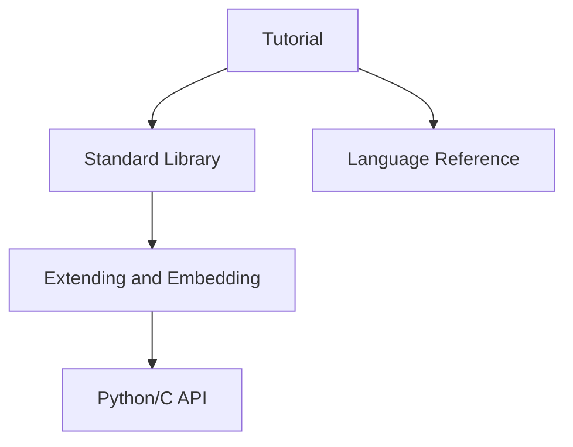

# Python Programming Guide

Structured notes and reference for Python 3.14.5, built with [MkDocs Material](https://squidfunk.github.io/mkdocs-material/).

## :material-language-python: What's here

| Section | Topic | Highlights |
|---|---|---|
| :material-school: [Tutorial](versions/3.14.5/tutorial/index.md) | Getting started | Interpreter, syntax, data structures, modules, classes, exceptions, venv |
| :material-bookshelf: [Standard Library](versions/3.14.5/standard-library/index.md) | Built-in modules | I/O, networking, data types, concurrency, development tools |
| :material-file-document: [Language Reference](versions/3.14.5/language-reference/index.md) | Syntax and semantics | Lexical analysis, data model, statements, imports, grammar |
| :material-cog: [Extending and Embedding](versions/3.14.5/extending-and-embedding-python-interpreter/index.md) | C extensions | Building extensions, embedding Python, Windows notes |
| :material-memory: [Python/C API](versions/3.14.5/python-c-api-reference-manual/index.md) | C API reference | Objects, reference counting, concrete types, utilities |


## :material-language-python: data structures and algorithms

see: [Data structures and algorithms](dsa/index.md) for more details.

## Official sources

Content mirrors and enriches the official Python documentation at [docs.python.org](https://docs.python.org/3/) with teaching notes, runnable examples, and cross-links.



## Local development

```bash
source setup.sh
```

Or manually:

```bash
python3 -m venv .venv
source .venv/bin/activate
pip install -r requirements.txt
mkdocs serve
```

Regenerate the sidebar navigation after adding doc sections:

```bash
./scripts/update_mkdocs_nav.sh
```
