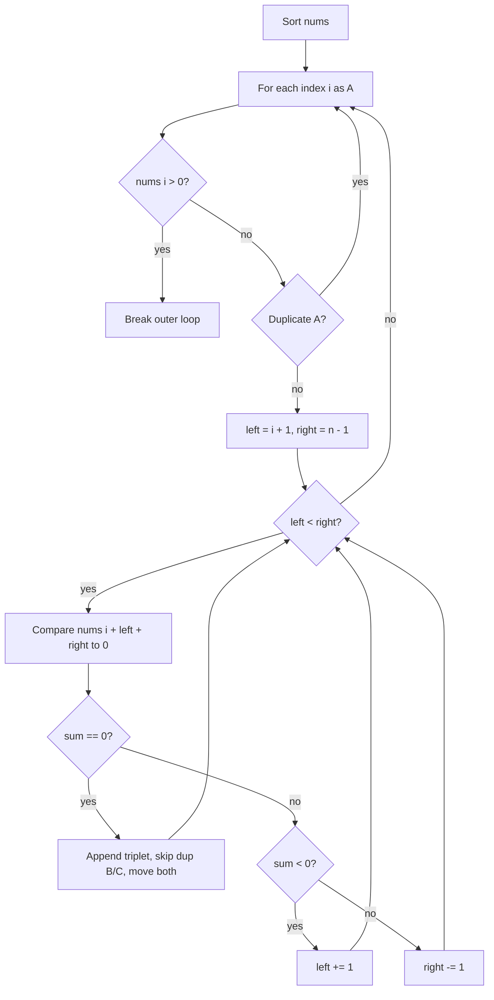

# [3Sum](https://leetcode.com/problems/3sum)

Given an integer array `nums`, return all the triplets `[nums[i], nums[j], nums[k]]` such that `i != j`, `i != k`, and `j != k`, and `nums[i] + nums[j] + nums[k] == 0`.

Notice that the solution set must **not** contain duplicate triplets.

## Example 1:

Input: nums = `[-1,0,1,2,-1,-4]`
Output: `[[-1,-1,2],[-1,0,1]]`
Explanation:
`nums[0] + nums[1] + nums[2] = (-1) + 0 + 1 = 0.`
`nums[1] + nums[2] + nums[4] = 0 + 1 + (-1) = 0.`
`nums[0] + nums[3] + nums[4] = (-1) + 2 + (-1) = 0.`
The distinct triplets are `[-1,0,1]` and `[-1,-1,2]`.
Notice that the order of the output and the order of the triplets inside the output does not matter.

## Example 2:

Input: nums = `[0,1,1]`
Output: `[]`
Explanation: The only possible triplet does not sum to zero.

## Example 3:

Input: nums = `[0,0,0]`
Output: `[[0,0,0]]`
Explanation: The only possible triplet sums to zero.

## Constraints:

- `3 <= nums.length <= 3000`
- `-10^5 <= nums[i] <= 10^5`


## :material-school: What you'll learn

!!! abstract "Learning objectives"
    You will find all unique zero-sum triplets by sorting, fixing one element, reducing the rest to a two-sum with two pointers, and skipping duplicates at each pointer.


## Worked example data

Primary input for the step-by-step trace below:

```text
# primary walkthrough input
nums = [-1, 0, 1, 2, -1, -4]
# expected output: [[-1, -1, 2], [-1, 0, 1]]  (order may vary)
```

| Example | Notes | Answer |
|---------|-------|--------|
| `[-1, 0, 1, 2, -1, -4]` | Full walkthrough below | `[[-1, -1, 2], [-1, 0, 1]]` |
| `[0, 1, 1]` | LeetCode example 2 | `[]` |
| `[0, 0, 0]` | LeetCode example 3 | `[[0, 0, 0]]` |


## Approach

You need every **unique** triplet that sums to zero. Start with three nested loops as a baseline, then upgrade to **sort + fix A + two pointers** for B and C. That second approach is what you should reach for in an interview.

### Brute force: every triplet

Try every combination of three distinct indices. Sort each triplet (or the whole array first) so duplicates collapse cleanly.

| Aspect | Detail |
|--------|--------|
| Time | O(n³) — every triple of indices may be checked |
| Space | O(n) — deduplication set for triplets |
| Drawback | Too slow when `n` reaches thousands |

### Sort, then reduce to two-sum

Sorting turns the problem into a structured search:

| Step | Action |
|------|--------|
| 1 | Sort `nums` ascending |
| 2 | Fix **A** at index `i` and set `target = -nums[i]` |
| 3 | Run two pointers **B** (`left = i + 1`) and **C** (`right = n - 1`) |
| 4 | Move pointers by comparing `nums[left] + nums[right]` with `target` |
| 5 | Skip duplicate **A**, **B**, and **C** values so each triplet is recorded once |

For fixed **A** at `nums[i]`, you need:

$$
\text{nums[left]} + \text{nums[right]} = -\text{nums[i]}
$$

| Pointer move | When |
|--------------|------|
| Record triplet, then `left += 1`, `right -= 1` | `nums[i] + nums[left] + nums[right] == 0` |
| `left += 1` | Pair sum **too small** |
| `right -= 1` | Pair sum **too large** |

!!! info "Fix A, two-sum the rest"
    Each outer index `i` spends O(n) on an inner two-pointer pass, so the full algorithm is **O(n²)** after the O(n log n) sort—far better than O(n³) brute force.

!!! warning "Interview trap: skip duplicates at all three pointers"
    After sorting, identical values sit adjacent. Skip repeated **A** with `if i > 0 and nums[i] == nums[i - 1]: continue`. After recording a valid triplet, advance **B** and **C** past equal neighbors so `[-1, -1, 2]` is not emitted twice.

Early exits save work:

| Condition | Why |
|-----------|-----|
| `nums[i] > 0` | Remaining values are non-negative; no triplet can sum to zero |
| `left >= right` | No pair left for this **A** |



### Walkthrough: `nums = [-1, 0, 1, 2, -1, -4]`

After sorting: `[-4, -1, -1, 0, 1, 2]`

**A = -4** (`i = 0`): target `4`. No pair in `[-1, -1, 0, 1, 2]` sums to `4`.

**A = -1** (`i = 1`): target `1`.

| `left` | `right` | `nums[left]` | `nums[right]` | Pair sum | Action |
|--------|---------|--------------|---------------|----------|--------|
| 2 | 5 | -1 | 2 | 1 | Record `[-1, -1, 2]`, move both |
| 3 | 4 | 0 | 1 | 1 | Record `[-1, 0, 1]`, move both |

**A = -1** (`i = 2`): duplicate of `i = 1` — **skip**.

**A = 0** (`i = 3`): target `0`. Only pair `1 + 2 = 3`; too large, pointers meet with no match.

**A = 1** (`i = 4`): positive — **stop** (remaining values cannot reach zero).

!!! success "Walkthrough confirmed"
    For `nums = [-1, 0, 1, 2, -1, -4]`, the answer is **`[[-1, -1, 2], [-1, 0, 1]]`**.

### Complexity

| Time | Space | Why |
|------|-------|-----|
| O(n²) | O(1) extra | Sort is O(n log n); each **A** runs one O(n) two-pointer pass; output space is separate |

## Implementation

Runnable code: [main.py](main.py)

🎯 Reach for sort + fix **A** + two pointers in an interview.

## Solution 1: Sort + Two Pointers (Best for Interview)

| Time Complexity | Space Complexity |
|-----------------|------------------|
| O(n²)           | O(1) extra       |

```python
def three_sum_two_pointers(nums):
    """
    Sort, fix one element, then two-pointer search for the remaining pair.

    Args:
        nums (List[int]): Input array of integers.

    Returns:
        List[List[int]]: Unique triplets that sum to zero.

    Example:
        three_sum_two_pointers([-1, 0, 1, 2, -1, -4]) -> [[-1, -1, 2], [-1, 0, 1]]
    """
    nums.sort()
    result = []

    n = len(nums) - 2
    for index in range(n):
        anchor = nums[index]
        if index > 0 and anchor == nums[index - 1]:
            continue
        if anchor > 0:
            break
        left, right = index + 1, len(nums) - 1
        while left < right:
            total = anchor + nums[left] + nums[right]
            if total == 0:
                result.append([anchor, nums[left], nums[right]])
                left += 1
                right -= 1
                while left < right and nums[left] == nums[left - 1]:
                    left += 1
                while left < right and nums[right] == nums[right + 1]:
                    right -= 1
            elif total < 0:
                left += 1
            else:
                right -= 1

    return result
```

```java
public class ThreeSum {
    public List<List<Integer>> threeSum(int[] nums) {
        Arrays.sort(nums); // sort the array in ascending order
        List<List<Integer>> result = new ArrayList<>(); // initialize the result list

        // we use i < 
        for (int i = 0; i < nums.length - 2; i++) { // iterate through the array
            if (i > 0 && nums[i] == nums[i - 1]) {
                continue;
            }
            if (nums[i] > 0) {
                break;
            }

            int left = i + 1;
            int right = nums.length - 1;
            while (left < right) {
                int total = nums[i] + nums[left] + nums[right];
                if (total == 0) {
                    result.add(Arrays.asList(nums[i], nums[left], nums[right]));
                    left++;
                    right--;
                    while (left < right && nums[left] == nums[left - 1]) {
                        left++;
                    }
                    while (left < right && nums[right] == nums[right + 1]) {
                        right--;
                    }
                } else if (total < 0) {
                    left++;
                } else {
                    right--;
                }
            }
        }
        return result;
    }
}
```

## Solution 2: Brute Force

| Time Complexity | Space Complexity |
|-----------------|------------------|
| O(n³)           | O(n)             |

Correct but too slow for large inputs; useful to verify small cases.

```python
def three_sum_brute_force(nums):
    """
    Check every distinct triplet; deduplicate with a set of sorted tuples.

    Args:
        nums (List[int]): Input array of integers.

    Returns:
        List[List[int]]: Unique triplets that sum to zero.

    Example:
        three_sum_brute_force([-1, 0, 1, 2, -1, -4]) -> [[-1, -1, 2], [-1, 0, 1]]
    """
    nums.sort()
    triplets = set()

    for i in range(len(nums)):
        for j in range(i + 1, len(nums)):
            for k in range(j + 1, len(nums)):
                if nums[i] + nums[j] + nums[k] == 0:
                    triplets.add((nums[i], nums[j], nums[k]))

    return [list(triplet) for triplet in triplets]
```

## Summary

Run both approaches with the same input:

```python
if __name__ == "__main__":
    """
    Run example tests for each solution.
    Modify walkthrough to test different cases.
    """
    walkthrough = [-1, 0, 1, 2, -1, -4]
    print("Two pointers:", three_sum_two_pointers(walkthrough))
    print("Brute force:", three_sum_brute_force(walkthrough))
```

## Industry scenarios

- 📈 **Portfolio hedging:** Find three instruments whose net exposure nets to zero before rebalancing.
- 🔒 **Feature toggles:** Three config flags that must combine to a neutral security posture—dedupe identical combinations after sorting flag ids.
- 🎮 **Party loadouts:** Three skills whose cooldown costs cancel out—two-pointer search after sorting costs mirrors in-game stat tables.


## :material-lightbulb: Key takeaways

- 🔑 Sort, fix **A**, then two-pointer search for **B + C = -A**; skip duplicates at all three positions.
- ⚡ O(n²) time after sort beats O(n³) brute force.
- 🧩 Break early when **A** is positive—no zero-sum triplet remains.


## Internal References

- 🔗 [Two Sum](../two-sum/index.md) — the inner loop is two-sum on a sorted subarray; hash-map two-sum applies when you need indices instead of values.
- 🔗 [Contains Duplicate](../contains-duplicate/index.md) — set membership for deduplication patterns.


## External References

- :fontawesome-solid-link: [3Sum — LeetCode #15](https://leetcode.com/problems/3sum/)
