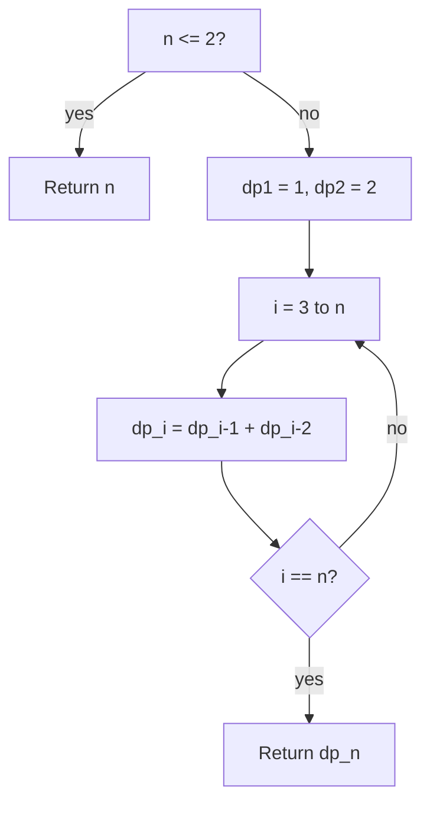

# [Climbing Stairs](https://leetcode.com/problems/climbing-stairs/)

You are climbing a staircase. It takes `n` steps to reach the top.

Each time you can either climb **1** or **2** steps. In how many distinct ways can you climb to the top?

## Example 1:

Input: n = `2`
Output: `2`
Explanation: There are two ways to climb to the top.

1. 1 step + 1 step
2. 2 steps

## Example 2:

Input: n = `3`
Output: `3`
Explanation: There are three ways to climb to the top.

1. 1 step + 1 step + 1 step
2. 1 step + 2 steps
3. 2 steps + 1 step

## Constraints:

- `1 <= n <= 45`


## :material-school: What you'll learn

!!! abstract "Learning objectives"
    You will count distinct 1-or-2 step paths with a Fibonacci-style recurrence, build the answer bottom-up in one pass, and explain why naive recursion blows up without memoization.


## Worked example data

Primary input for the step-by-step trace below:

```text
# primary walkthrough input
n = 4
# expected output: 5
```

| Example | Notes | Answer |
|---------|-------|--------|
| `n = 2` | Two paths: `1+1` or `2` | `2` |
| `n = 3` | Three paths (see Example 2) | `3` |
| `n = 4` | Full walkthrough below | `5` |
| `n = 5` | Fibonacci growth check | `8` |


## Approach

You need the **number of distinct paths** from the ground (step `0`) to the top (step `n`), where each move adds `1` or `2`. Start with brute-force recursion that tries both moves at every step, then replace overlapping subproblems with bottom-up dynamic programming—the pattern you should reach for in an interview.

### Brute force: try every 1-or-2 choice

At each remaining step count, branch: take one step or take two. When remaining hits zero, you found one valid path.

| Aspect | Detail |
|--------|--------|
| Time | O(2^n) — nearly every node splits twice |
| Space | O(n) — recursion depth |
| Drawback | Recomputes the same subcounts many times; fails for larger `n` |

For `n = 4`, the five paths are:

| # | Path (steps from ground) |
|---|--------------------------|
| 1 | 0 → 1 → 2 → 3 → 4 |
| 2 | 0 → 2 → 4 |
| 3 | 0 → 2 → 3 → 4 |
| 4 | 0 → 1 → 3 → 4 |
| 5 | 0 → 1 → 2 → 4 |

The answer is **5**, not `4`.

!!! warning "Interview trap: answer is not n"
    The number of paths grows like Fibonacci—it is **not** equal to `n`. For `n = 4` there are **5** paths; for `n = 5` there are **8**. Do not return `n` or guess linear growth.

### Bottom-up DP: `dp[i]` = ways to reach step `i`

💡 The last move onto step `i` was either a **1-step** from `i - 1` or a **2-step** from `i - 2`. Every path ending at `i` comes from exactly one of those two predecessors:

$$
\text{dp}[i] = \text{dp}[i - 1] + \text{dp}[i - 2]
$$

| Variable | Role |
|----------|------|
| `dp[i]` | Distinct paths that land exactly on step `i` |
| Base `dp[1]` | One way: a single 1-step |
| Base `dp[2]` | Two ways: `1+1` or `2` |

| Step | Action |
|------|--------|
| 0 | If `n <= 2`, return `n` directly. |
| 1 | Set `dp[1] = 1` and `dp[2] = 2`. |
| 2 | For `i` from `3` to `n`, set `dp[i] = dp[i-1] + dp[i-2]`. |
| 3 | Return `dp[n]`. |

!!! info "Fibonacci recurrence"
    Step `i` only depends on the two previous counts—same structure as Fibonacci. You are counting **compositions** of `n` into 1s and 2s, not permutations of a fixed multiset.



### Walkthrough: `n = 4`

| Step `i` | `dp[i-1]` | `dp[i-2]` | `dp[i] = sum` |
|----------|-----------|-----------|---------------|
| 1 | — | — | 1 |
| 2 | — | — | 2 |
| 3 | 2 | 1 | 3 |
| 4 | 3 | 2 | **5** |

Five distinct paths—matches the enumeration table above.

### Top-down memoization (same recurrence)

Define `ways(k)` = paths to reach step `k`. Then `ways(k) = ways(k-1) + ways(k-2)` with base cases `ways(1)=1`, `ways(2)=2`. Memoize so each `k` is computed once—O(n) time, same logic as bottom-up, useful when you think recursively first.

### Space optimization: two rolling variables

Because `dp[i]` only needs the previous two values, replace the array with `prev_prev` and `prev`—O(n) time, O(1) extra space.

| Approach | Time | Space |
|----------|------|-------|
| Brute force recursion | O(2^n) | O(n) stack |
| Top-down memo | O(n) | O(n) |
| Bottom-up array | O(n) | O(n) |
| Bottom-up two variables | O(n) | O(1) |

## Implementation

Runnable code: [main.py](main.py)

🎯 Lead with bottom-up DP in an interview—state the recurrence, fill a small table on the whiteboard, then offer O(1) space if asked.

## Solution 1: Bottom-Up Dynamic Programming (Best for Interview)

| Time Complexity | Space Complexity |
|-----------------|------------------|
| O(n)            | O(n)             |

```python
def climb_stairs_bottom_up(n):
    """
    Bottom-up DP: ways to reach step i = ways(i-1) + ways(i-2).

    Args:
        n (int): Number of stairs.

    Returns:
        int: Count of distinct paths to the top.

    Example:
        climb_stairs_bottom_up(4) -> 5
    """
    if n <= 2:
        return n

    dp = [0] * (n + 1)
    dp[1] = 1
    dp[2] = 2

    for step in range(3, n + 1):
        dp[step] = dp[step - 1] + dp[step - 2]

    return dp[n]
```

```java
public class ClimbingStairs {
    public int climbStairs(int n) {
        if (n <= 2) {
            return n;
        }
        int[] dp = new int[n + 1];
        dp[1] = 1;
        dp[2] = 2;
        for (int i = 3; i <= n; i++) {
            dp[i] = dp[i - 1] + dp[i - 2];
        }
        return dp[n];
    }
}
```

## Solution 2: Top-Down Memoization

| Time Complexity | Space Complexity |
|-----------------|------------------|
| O(n)            | O(n)             |

Same recurrence as Solution 1; natural if you frame the problem as “how many ways from here?”

```python
def climb_stairs_memo(n):
    """
    Top-down DP with memoization on the same recurrence.

    Args:
        n (int): Number of stairs.

    Returns:
        int: Count of distinct paths to the top.

    Example:
        climb_stairs_memo(4) -> 5
    """
    memo = {1: 1, 2: 2}

    def ways(steps):
        if steps in memo:
            return memo[steps]
        memo[steps] = ways(steps - 1) + ways(steps - 2)
        return memo[steps]

    return ways(n)
```

## Solution 3: Constant-Space Bottom-Up

| Time Complexity | Space Complexity |
|-----------------|------------------|
| O(n)            | O(1)             |

Drop the array once you trust the recurrence—only the last two counts matter.

```python
def climb_stairs_constant_space(n):
    """
    Bottom-up DP with only two rolling variables.

    Args:
        n (int): Number of stairs.

    Returns:
        int: Count of distinct paths to the top.

    Example:
        climb_stairs_constant_space(4) -> 5
    """
    if n <= 2:
        return n

    prev_prev = 1
    prev = 2

    for _ in range(3, n + 1):
        current = prev_prev + prev
        prev_prev = prev
        prev = current

    return prev
```

## Solution 4: Brute Force Recursion

| Time Complexity | Space Complexity |
|-----------------|------------------|
| O(2^n)          | O(n)             |

Correct for small `n`; use only to motivate memoization or DP.

```python
def climb_stairs_brute_force(n):
    """
    Enumerate every 1-or-2 step choice recursively.

    Args:
        n (int): Number of stairs.

    Returns:
        int: Count of distinct paths to the top.

    Example:
        climb_stairs_brute_force(4) -> 5
    """
    def count(remaining):
        if remaining <= 0:
            return 1 if remaining == 0 else 0
        return count(remaining - 1) + count(remaining - 2)

    return count(n)
```

## Summary

Run all approaches with the same input:

```python
if __name__ == "__main__":
    """
    Run example tests for each solution.
    Modify walkthrough to test different cases.
    """
    walkthrough = 4
    print("Bottom-up DP:", climb_stairs_bottom_up(walkthrough))
    print("Top-down memo:", climb_stairs_memo(walkthrough))
    print("Constant space:", climb_stairs_constant_space(walkthrough))
    print("Brute force:", climb_stairs_brute_force(walkthrough))
```

## Industry scenarios

- 🎮 **Level design:** Count valid jump sequences when a platformer allows short or long hops.
- 📈 **Fixed coin combinations:** Ways to make exact change using only 1- and 2-unit coins (order matters).
- 📡 **Routing hops:** Distinct path counts when each relay accepts one- or two-segment forward jumps.


## :material-lightbulb: Key takeaways

- 🔑 Recurrence: `dp[i] = dp[i-1] + dp[i-2]` — last step was 1 or 2.
- ⚡ Bottom-up or memoized top-down: O(n) time; two variables drop space to O(1).
- 🧩 Base cases `dp[1]=1`, `dp[2]=2`; answer for `n=4` is **5**, not `4`.


## Internal References

- 🔗 [Decode Ways](../decode-ways/index.md) — similar 1-or-2 step counting with decoding constraints.
- 🔗 [Combination Sum IV](../combination-sum-iv/index.md) — ordered combinations with a target sum.
- 🔗 [House Robber](../house-robber/index.md) — adjacent-step DP on a linear sequence.


## External References

- :fontawesome-solid-link: [Climbing Stairs — LeetCode #70](https://leetcode.com/problems/climbing-stairs/)
