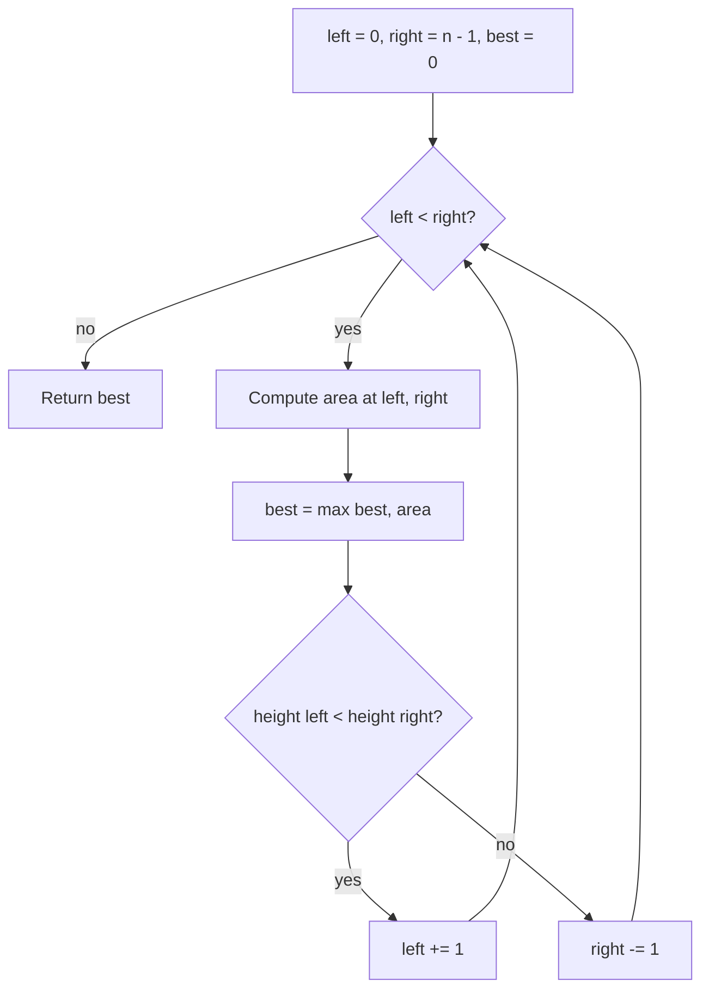

# [Container With Most Water](https://leetcode.com/problems/container-with-most-water)

You are given an integer array `height` of length `n`. There are `n` vertical lines drawn such that the two endpoints of the `i`th line are `(i, 0)` and `(i, height[i])`.

Find two lines that together with the x-axis form a container, such that the container contains the most water.

Return the maximum amount of water a container can store.

Notice that you may not slant the container.

## Example 1:

Input: height = [1,8,6,2,5,4,8,3,7]
Output: 49
Explanation: The vertical lines at index 1 and index 8 form a container with area `min(8, 7) × (8 - 1) = 49`.

## Example 2:

Input: height = [1,1]
Output: 1

## Constraints:

`n == height.length`
`2 <= n <= 10^5`
`0 <= height[i] <= 10^4`


## :material-school: What you'll learn

!!! abstract "Learning objectives"
    You will compute container area from width and bounded height, compare brute force with a two-pointer scan, and explain why advancing the shorter boundary is safe when searching for the maximum.


## Worked example data

Primary input for the step-by-step trace below:

```text
# primary walkthrough input
height = [1, 8, 6, 2, 5, 4, 8, 3, 7]
# expected output: 49  (lines at indices 1 and 8)
```

| Example | Notes | Answer |
|---------|-------|--------|
| `[1, 8, 6, 2, 5, 4, 8, 3, 7]` | Full two-pointer walkthrough below | `49` |
| `[1, 1]` | Equal heights, minimal width | `1` |
| `[4, 3, 2, 1, 4]` | Tall lines at both ends | `16` |


## Approach

You need the largest area between any two vertical lines. Start with the obvious baseline—evaluate every pair—then upgrade to two pointers from the ends. That second approach is what you should reach for in an interview.

### Area formula

For lines at indices `left` and `right`:

| Quantity | Formula |
|----------|---------|
| Width | `right - left` |
| Bounded height | `min(height[left], height[right])` |
| Area | `width × bounded_height` |

Water cannot rise above the shorter boundary—the taller line does not add capacity.

For indices **1** and **8** in the walkthrough array:

```text
width = 8 - 1 = 7
bounded_height = min(8, 7) = 7
area = 7 × 7 = 49
```

Compare indices **1** and **6** (both height 8): width `5`, area `5 × 8 = 40`. Since `49 > 40`, the best pair for this input is indices **1** and **8**.

### Brute force: every pair

The simplest idea is two nested loops: fix `left`, try every `right > left`, compute area, and track the maximum.

| Aspect | Detail |
|--------|--------|
| Time | O(n²) — every pair of lines may be checked |
| Space | O(1) — only loop variables and running max |
| Drawback | Too slow when `n` is up to 10⁵ |

### Two pointers: shrink from both ends

Place `left` at index `0` and `right` at index `n - 1`. At each step:

| Step | Action |
|------|--------|
| 1 | Compute area for `(left, right)` and update `best`. |
| 2 | Move the pointer at the **shorter** line inward. |
| 3 | Stop when `left >= right`. |

When heights are equal, moving either pointer is valid; the implementation below moves `right`.

!!! info "Why move the shorter line?"
    Every move shrinks width. Keeping the shorter boundary fixed cannot help—the area is capped by that height, and width only decreases. Advancing the shorter side is the only chance to find a taller effective boundary with a new partner.



When `height[left] == height[right]`, either pointer may advance; the code above moves `right`.

!!! warning "Interview trap: move the taller pointer"
    Moving the taller line inward always loses width without raising `min(height[left], height[right])`. Candidates who move the taller side "to keep a tall wall" skip valid pairs and break the greedy proof.

### Walkthrough: `height = [1, 8, 6, 2, 5, 4, 8, 3, 7]`

| Step | left | right | width | min height | area | best | move |
|------|------|-------|-------|------------|------|------|------|
| 1 | 0 | 8 | 8 | 1 | 8 | 8 | left |
| 2 | 1 | 8 | 7 | 7 | **49** | **49** | right |
| 3 | 1 | 7 | 6 | 3 | 18 | 49 | right |
| 4 | 1 | 6 | 5 | 8 | 40 | 49 | right |
| 5 | 1 | 5 | 4 | 4 | 16 | 49 | right |
| 6 | 1 | 4 | 3 | 5 | 15 | 49 | right |
| 7 | 1 | 3 | 2 | 2 | 4 | 49 | right |
| 8 | 1 | 2 | 1 | 6 | 6 | 49 | right |

After step 8, `left = 1` and `right = 2`; the loop exits. The peak area **49** appears at step 2.

!!! success "Walkthrough confirmed"
    For `height = [1, 8, 6, 2, 5, 4, 8, 3, 7]`, two pointers return **`49`**.

### Complexity

| Time | Space | Why |
|------|-------|-----|
| O(n) | O(1) | Each pointer moves at most `n - 1` times; only scalars stored |

## Implementation

Runnable code: [main.py](main.py)

🎯 Reach for two pointers from both ends in an interview.

## Solution 1: Two Pointers (Best for Interview)

| Time Complexity | Space Complexity |
|-----------------|------------------|
| O(n)            | O(1)             |

```python
def max_area_two_pointers(height):
    """
    Two pointers from both ends; move the shorter line inward each step.

    Args:
        height (List[int]): Line heights indexed left to right.

    Returns:
        int: Maximum water area between any two lines.

    Example:
        max_area_two_pointers([1, 8, 6, 2, 5, 4, 8, 3, 7]) -> 49
    """
    left = 0
    right = len(height) - 1
    best = 0

    while left < right:
        width = right - left
        bounded_height = min(height[left], height[right])
        best = max(best, width * bounded_height)

        if height[left] < height[right]:
            left += 1
        else:
            right -= 1

    return best
```

```java
public class ContainerWithMostWater {
    public int maxArea(int[] height) {
        int left = 0;
        int right = height.length - 1;
        int best = 0;

        while (left < right) {
            int width = right - left;
            int boundedHeight = Math.min(height[left], height[right]);
            best = Math.max(best, width * boundedHeight);

            if (height[left] < height[right]) {
                left++;
            } else {
                right--;
            }
        }
        return best;
    }
}
```

## Solution 2: Brute Force

| Time Complexity | Space Complexity |
|-----------------|------------------|
| O(n^2)          | O(1)             |

Correct baseline for small inputs or sanity checks; too slow for interview-scale `n`.

```python
def max_area_brute_force(height):
    """
    Try every pair of lines and keep the maximum area.

    Args:
        height (List[int]): Line heights indexed left to right.

    Returns:
        int: Maximum water area between any two lines.

    Example:
        max_area_brute_force([1, 8, 6, 2, 5, 4, 8, 3, 7]) -> 49
    """
    best = 0
    n = len(height)

    for left in range(n):
        for right in range(left + 1, n):
            width = right - left
            bounded_height = min(height[left], height[right])
            best = max(best, width * bounded_height)

    return best
```

## Summary

Run both approaches with the same input:

```python
if __name__ == "__main__":
    """
    Run example tests for each solution.
    Modify walkthrough to test different cases.
    """
    walkthrough = [1, 8, 6, 2, 5, 4, 8, 3, 7]
    print("Two Pointers:", max_area_two_pointers(walkthrough))
    print("Brute Force:", max_area_brute_force(walkthrough))
```

## Industry scenarios

- 🏗️ **Layout optimization:** Maximize rectangular storage between two boundary posts of fixed positions.
- 📊 **Bandwidth windows:** Largest effective throughput between two rate-limited endpoints where capacity is limited by the slower side.
- 🗺️ **Geographic corridors:** Widest usable corridor between two elevation constraints on a fixed baseline.


## :material-lightbulb: Key takeaways

- 🔑 Area = `(right - left) × min(height[left], height[right])`; the shorter line caps capacity.
- ⚡ Two pointers: O(n) time, O(1) space—always move the shorter boundary inward.
- 🧩 Equal heights: either pointer may move; shrinking width without raising the minimum cannot beat the current best.


## Internal References

- 🔗 [3Sum](../3sum/index.md) — sort + fix one element + two pointers on the remaining range.
- 🔗 [Two Sum](../two-sum/index.md) — pair-finding on arrays; complements vs geometric area.


## External References

- :fontawesome-solid-link: [Container With Most Water — LeetCode #11](https://leetcode.com/problems/container-with-most-water/)
