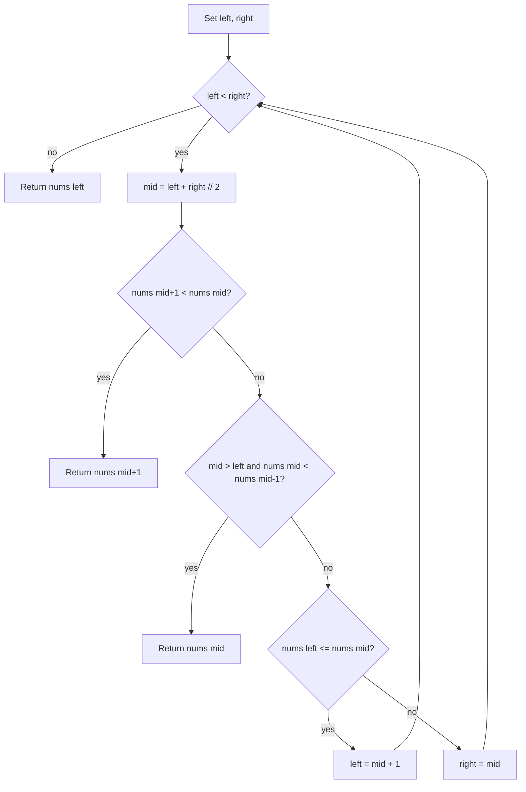

# [Find Minimum in Rotated Sorted Array](https://leetcode.com/problems/find-minimum-in-rotated-sorted-array)

Suppose an array of length `n` sorted in ascending order is **rotated** between `1` and `n` times. For example, the array `nums = [0,1,2,4,5,6,7]` might become:

- `[4,5,6,7,0,1,2]` if it was rotated `4` times.
- `[0,1,2,4,5,6,7]` if it was rotated `7` times.

Notice that **rotating** an array `[a[0], a[1], a[2], ..., a[n-1]]` 1 time results in the array `[a[n-1], a[0], a[1], a[2], ..., a[n-2]]`.

Given the sorted rotated array `nums` of **unique** elements, return the minimum element of this array.

You must write an algorithm that runs in `O(log n)` time.

## Example 1:

Input: nums = `[3,4,5,1,2]`
Output: `1`
Explanation: The original array was `[1,2,3,4,5]` rotated 3 times.

## Example 2:

Input: nums = `[4,5,6,7,0,1,2]`
Output: `0`
Explanation: The original array was `[0,1,2,4,5,6,7]` rotated 4 times.

## Example 3:

Input: nums = `[11,13,15,17]`
Output: `11`
Explanation: The original array was `[11,13,15,17]` rotated 4 times.

## Constraints:

- `n == nums.length`
- `1 <= n <= 5000`
- `-5000 <= nums[i] <= 5000`
- All the integers of `nums` are **unique**.
- `nums` is sorted and rotated between `1` and `n` times.


## :material-school: What you'll learn

!!! abstract "Learning objectives"
    You will locate the minimum in a rotated sorted array with modified binary search, discard the sorted half each step, and explain why the pivot is the only place where a neighbor drops.


## Worked example data

Primary input for the step-by-step trace below:

```text
# primary walkthrough input
nums = [6, 7, 8, 9, 0, 1, 2, 3, 4, 5]
# expected output: 0
```

| Example | Notes | Answer |
|---------|-------|--------|
| `[6, 7, 8, 9, 0, 1, 2, 3, 4, 5]` | Full walkthrough below | `0` |
| `[3, 4, 5, 6, 1]` | Pivot at `mid + 1` | `1` |
| `[3, 4, 5, 1, 2]` | LeetCode example 1 | `1` |
| `[11, 13, 15, 17]` | Not rotated | `11` |


## Approach

You need the smallest value in a **rotated sorted** array in `O(log n)` time. Start with a linear scan baseline, then upgrade to modified binary search that hunts for the **decreasing pivot**—the only index where a value is smaller than its left neighbor.

### Brute force: linear scan

Scan left to right and track the smallest value.

| Aspect | Detail |
|--------|--------|
| Time | O(n) — every element may be visited |
| Space | O(1) — one running minimum |
| Drawback | Fails the logarithmic-time requirement |

### Base cases before binary search

| Case | Action |
|------|--------|
| Length `1` | Return the sole element |
| `nums[0] < nums[-1]` | Array is fully sorted (no rotation); return `nums[0]` |
| Length `2` | Return `min(nums[0], nums[1])` in O(1) |

### Modified binary search: find the decreasing pivot

Set `left = 0`, `right = len(nums) - 1`. Each iteration computes `mid = (left + right) // 2` and asks whether the minimum sits at the pivot:

| Check (in order) | Condition | Result |
|------------------|-----------|--------|
| Decrease at `mid + 1` | `nums[mid + 1] < nums[mid]` | Minimum is `nums[mid + 1]` |
| Decrease at `mid` | `mid > left` and `nums[mid] < nums[mid - 1]` | Minimum is `nums[mid]` |
| Neither | Identify the sorted half and discard it | Shrink the window |

When neither neighbor check fires, one half is still sorted:

| Sorted half | How you know | Discard by |
|-------------|--------------|------------|
| Left (`left` … `mid`) | `nums[left] <= nums[mid]` | `left = mid + 1` |
| Right (`mid` … `right`) | otherwise | `right = mid` |

!!! info "Why the minimum is the decreasing pivot"
    In a rotated sorted array, values increase until the rotation point, then increase again. The rotation point is the **only** index where `nums[i] < nums[i - 1]`. Equivalently, it is the first index where `nums[i] < nums[i - 1]`, detected as a drop at `mid` or `mid + 1`.

!!! warning "Interview trap: check `mid + 1` before `mid`"
    Always test the drop at **`mid + 1` first**, then at `mid` (only when `mid > left`). On a two-element window `[5, 1]`, the pivot is at index `1`; checking `mid` before `mid + 1` can read `nums[mid - 1]` out of range or miss the only valid drop.



### Walkthrough: `nums = [6, 7, 8, 9, 0, 1, 2, 3, 4, 5]`

| Step | `left` | `right` | `mid` | `nums[mid]` | Drop at `mid+1`? | Drop at `mid`? | Sorted half | Action |
|------|--------|---------|-------|-------------|------------------|----------------|-------------|--------|
| 1 | 0 | 9 | 4 | 0 | no (`1 > 0`) | **yes** (`0 < 9`) | — | return **`0`** |

The pivot is index `4`; the answer is `0`.

### Walkthrough: `nums = [3, 4, 5, 6, 1]`

| Step | `left` | `right` | `mid` | `nums[mid]` | Drop at `mid+1`? | Drop at `mid`? | Sorted half | Action |
|------|--------|---------|-------|-------------|------------------|----------------|-------------|--------|
| 1 | 0 | 4 | 2 | 5 | no | no | left sorted | `left = 3` |
| 2 | 3 | 4 | 3 | 6 | **yes** (`1 < 6`) | — | — | return **`1`** |

!!! success "Walkthrough confirmed"
    For `nums = [6, 7, 8, 9, 0, 1, 2, 3, 4, 5]`, modified binary search returns **`0`**.

### Compact variant: compare `mid` with `right`

Another O(log n) template skips explicit pivot detection: if `nums[mid] > nums[right]`, the minimum lies strictly to the right of `mid`; otherwise shrink `right` to `mid`. Both templates discard half the search space each step.

| Time | Space | Why |
|------|-------|-----|
| O(log n) | O(1) | Halve the window each iteration; no extra structures |

## Implementation

Runnable code: [main.py](main.py)

🎯 Reach for decreasing-pivot binary search in an interview; keep the `mid` vs `right` form as a shorter backup.

## Solution 1: Decreasing Pivot Binary Search (Best for Interview)

| Time Complexity | Space Complexity |
|-----------------|------------------|
| O(log n)         | O(1)             |

```python
def find_min_decreasing_pivot(nums):
    """
    Modified binary search: locate the decreasing pivot (minimum).

    Args:
        nums (List[int]): Rotated sorted array of unique integers.

    Returns:
        int: Minimum element in the array.

    Example:
        find_min_decreasing_pivot([6, 7, 8, 9, 0, 1, 2, 3, 4, 5]) -> 0
    """
    # base case: if the array has only one element, return the element
    if len(nums) == 1: # if the length of the array is 1, return the first element
        return nums[0]

    # base case: if the array is sorted, return the first element
    if nums[0] < nums[-1]: # if the first element is less than the last element, the array is sorted
        return nums[0]

    # Initialize two pointers to define the current search range:
    left = 0 # 'left' starts at the beginning of the array
    right = len(nums) - 1 # 'right' starts at the end of the array

    # While the search range is valid (left < right), perform the binary search:
    while left < right:
        # Calculate the middle index:
        mid = (left + right) // 2 # the middle index is the average of the left and right pointers

        # Check if the minimum is at the next index:
        if mid + 1 <= right and nums[mid + 1] < nums[mid]: # if the next index is less than the current index, the minimum is at the next index
            return nums[mid + 1]

        # Check if the minimum is at the current index:
        if mid > left and nums[mid] < nums[mid - 1]: # if the current index is less than the previous index, the minimum is at the current index
            return nums[mid]

        # Check if the minimum is at the left index:
        if nums[left] <= nums[mid]: # if the left index is less than or equal to the middle index, the minimum is at the left index
            left = mid + 1 # move the left pointer to the middle index
        # if the left index is greater than the middle index, the minimum is at the right index
        else: 
            right = mid # move the right pointer to the middle index

    return nums[left] # return the minimum element
```

```java
public class FindMinimumRotated {
    public int findMin(int[] nums) {
        if (nums.length == 1) {
            return nums[0];
        }
        if (nums[0] < nums[nums.length - 1]) {
            return nums[0];
        }
        int left = 0, right = nums.length - 1;
        while (left < right) {
            int mid = left + (right - left) / 2;
            if (mid + 1 <= right && nums[mid + 1] < nums[mid]) {
                return nums[mid + 1];
            }
            if (mid > left && nums[mid] < nums[mid - 1]) {
                return nums[mid];
            }
            if (nums[left] <= nums[mid]) {
                left = mid + 1;
            } else {
                right = mid;
            }
        }
        return nums[left];
    }
}
```

## Solution 2: Compare `mid` with `right`

| Time Complexity | Space Complexity |
|-----------------|------------------|
| O(log n)         | O(1)             |

Equivalent asymptotic cost; fewer branches, no explicit pivot checks.

```python
def find_min_mid_vs_right(nums):
    """
    Compact binary search: compare nums[mid] with nums[right].

    Args:
        nums (List[int]): Rotated sorted array of unique integers.

    Returns:
        int: Minimum element in the array.

    Example:
        find_min_mid_vs_right([3, 4, 5, 1, 2]) -> 1
    """
    left, right = 0, len(nums) - 1

    while left < right:
        mid = (left + right) // 2
        if nums[mid] > nums[right]:
            left = mid + 1
        else:
            right = mid

    return nums[left]
```

## Solution 3: Linear Scan

| Time Complexity | Space Complexity |
|-----------------|------------------|
| O(n)            | O(1)             |

```python
def find_min_linear(nums):
    """
    Linear scan: track the smallest value seen.

    Args:
        nums (List[int]): Rotated sorted array of unique integers.

    Returns:
        int: Minimum element in the array.

    Example:
        find_min_linear([4, 5, 6, 7, 0, 1, 2]) -> 0
    """
    return min(nums)
```

## Summary

Run all approaches with the same input:

```python
if __name__ == "__main__":
    """
    Run example tests for each solution.
    Modify walkthrough to test different cases.
    """
    walkthrough = [6, 7, 8, 9, 0, 1, 2, 3, 4, 5]
    print("Decreasing pivot:", find_min_decreasing_pivot(walkthrough))
    print("Mid vs right:", find_min_mid_vs_right(walkthrough))
    print("Linear:", find_min_linear(walkthrough))
```

## Industry scenarios

- 📈 **Market data rings:** Find the session low after a circular buffer of tick prices wraps past midnight.
- 📡 **Log rotation:** Locate the earliest timestamp in a time-ordered ring buffer after a wraparound overwrite.
- 🎮 **Leaderboard seasons:** Minimum rank score after seasonal reset reorders a sorted ladder.


## :material-lightbulb: Key takeaways

- 🔑 The minimum is the **decreasing pivot**—check `mid + 1` before `mid`, then discard the sorted half.
- ⚡ Modified binary search: O(log n) time, O(1) space.
- 🧩 If `nums[0] < nums[-1]`, the array was never rotated; return `nums[0]` immediately.


## Internal References

- 🔗 [Search in Rotated Sorted Array](../search-in-rotated-sorted-array/index.md) — same rotated-array geometry; decide which half to keep when searching for a **target** value.
- 🔗 [Two Sum](../two-sum/index.md) — complementary use of hash maps vs binary search on structured arrays.


## External References

- :fontawesome-solid-link: [Find Minimum in Rotated Sorted Array — LeetCode #153](https://leetcode.com/problems/find-minimum-in-rotated-sorted-array/)
