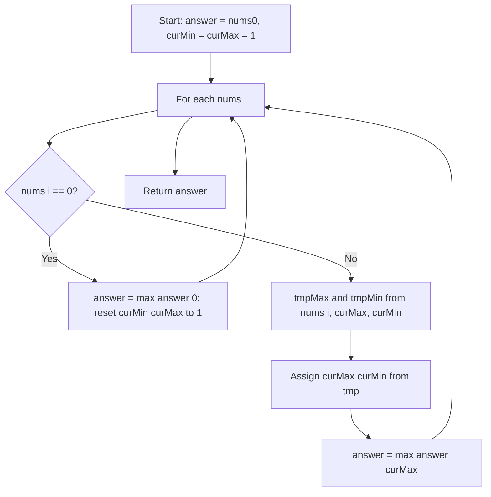

# [Maximum Product Subarray](https://leetcode.com/problems/maximum-product-subarray/)

Given an integer array `nums`, find a contiguous subarray that has the **largest product** and return the product.

The test cases are generated so that the answer will fit in a **32-bit integer**.

Note that the product of an array with a single element is the value of that element.

## Example 1:

Input: nums = [2,3,-2,4]
Output: 6
Explanation: [2,3] has the largest product 6.

## Example 2:

Input: nums = [-2,0,-1]
Output: 0
Explanation: The result cannot be 2, because [-2,-1] is not a subarray.

## Constraints:

`1` <= `nums.length` <= `2 * 10^4`
`-10` <= `nums[i]` <= `10`
The product of any subarray of `nums` is guaranteed to fit in a 32-bit integer.


## :material-school: What you'll learn

!!! abstract "Learning objectives"
    You will find the maximum product of any contiguous subarray in one pass by tracking both the smallest and largest product ending at each index, handle zeros as segment breaks, and explain why Kadane's sum algorithm is not enough when negatives flip signs.


## Lecture walkthrough data

The primary array used step-by-step in the lecture:

```text
# collection of data used in the problem statement
nums = [-1, -2, -3, 0, 3, 5, -1, -2]
# expected answer from lecture: 30  (subarray [3, 5, -1, -2])
```

| Array (lecture intro) | Corrected / note | Answer |
|-----------------------|------------------|--------|
| `[1, 2, 2, 4]` (ASR: "one times two…") | `[1, 2, 3, 4]` | 24 |
| `[-2, -3, 4, -4, -5]` (garbled) | `[-2, -3, 4]` segment | 24 |
| `[2, 3]` | — | 6 |
| `[3, 5, -1, -2]` | — | 30 |
| `[-1, -2, -3, 0, 3, 5, -1, -2]` | Main walkthrough | 30 |


## Approach

You need the largest **product** among all contiguous subarrays. Start with the obvious baseline—try every contiguous subarray and track the best product—then upgrade to a single left-to-right scan with **two** running variables. That second approach is what you should reach for in an interview.

This problem is a close cousin of [Maximum Subarray](../maximum-subarray/index.md) (Kadane for **sum**). Here, a large negative product can become a large positive after one more negative—so you must remember the **minimum** product ending here, not just the maximum.

### Brute force: all contiguous subarrays

The simplest idea is two nested loops: fix a start index, extend the end index, multiply each subarray, and keep the maximum.

| Aspect | Detail |
|--------|--------|
| Time | O(n²) — every contiguous subarray may be multiplied |
| Space | O(1) — only loop variables and running max |
| Drawback | Too slow when `n` is large |

For `nums = [2, 3, -2, 4]`, the best subarray is `[2, 3]` with product `6`.

### Why Kadane for sum is not enough

Kadane tracks one running value because a **negative sum** is always bad for future sums—you drop it and restart.

Products behave differently: a very **negative** running product can become a very **positive** product when the next element is also negative. If you only track the best product ending here, you lose the flip opportunity.

!!! info "Why you need min and max"
    At each index, the best product ending here might come from multiplying `nums[i]` by the **previous minimum** (two negatives make a positive) or by the **previous maximum** (stay on a winning streak). You never know which until you see the next number—so you keep both.

### Min/max scan: `cur_min`, `cur_max`, and `answer`

Scan left to right. At each `nums[i]`, compute the best and worst product of a contiguous subarray **ending at i**:

| Variable | Role |
|----------|------|
| `cur_max` | Largest product of a contiguous subarray ending at the current index |
| `cur_min` | Smallest product of a contiguous subarray ending at the current index |
| `answer` | Best product seen anywhere in the array so far |

For each element (when it is not zero), consider three candidates: start fresh at `nums[i]`, extend with `cur_max`, or extend with `cur_min`:

$$
\text{cur\_max} = \max(\text{nums}[i],\ \text{nums}[i] \times \text{cur\_max},\ \text{nums}[i] \times \text{cur\_min})
$$

$$
\text{cur\_min} = \min(\text{nums}[i],\ \text{nums}[i] \times \text{cur\_max},\ \text{nums}[i] \times \text{cur\_min})
$$

Use temporary variables when updating so `cur_max` and `cur_min` do not overwrite each other mid-step.

| Step | Action |
|------|--------|
| 0 | Set `answer = nums[0]`, `cur_min = cur_max = 1` (neutral identity for multiplication). |
| 1 | Walk `nums` left to right. |
| 2 | If `nums[i] == 0`, set `answer = max(answer, 0)`, reset `cur_min = cur_max = 1`, continue. |
| 3 | Else update `cur_max` / `cur_min` from the three candidates. |
| 4 | Set `answer = max(answer, cur_max)`. |
| 5 | Return `answer`. |

💡 **Intuition:** `cur_min` is not throwaway—it is your ticket to a huge positive when the next value is negative.

### Zeros and sign flips

A zero in the array zeroes any product that includes it. After a zero, no earlier element can help a subarray starting on the right—treat zero as a **segment break**.

!!! warning "Interview trap: reset after zero"
    After `nums[i] == 0`, reset running `cur_min` and `cur_max` to **1** (multiplicative identity), not **0**. If you leave them at 0, every future product stays 0 even when the next elements are large positives or negatives. Also update `answer` with `0` when the zero itself might be the best subarray.

### Control flow



### Walkthrough: lecture array `nums = [-1, -2, -3, 0, 3, 5, -1, -2]`

| Index | `nums[i]` | `cur_min` | `cur_max` | `answer` |
|-------|-----------|-----------|-----------|----------|
| 0 | -1 | -1 | -1 | -1 |
| 1 | -2 | -2 | 2 | 2 |
| 2 | -3 | -6 | 6 | 6 |
| 3 | 0 | — | — | 6 |
| 4 | 3 | 3 | 3 | 6 |
| 5 | 5 | 5 | 15 | 15 |
| 6 | -1 | -15 | -1 | 15 |
| 7 | -2 | -2 | 30 | 30 |

After index 3, trackers reset to `1` (not shown as numeric rows). The winning subarray on the right segment is `[3, 5, -1, -2]` with product `30`.

!!! success "Lecture walkthrough confirmed"
    For `nums = [-1, -2, -3, 0, 3, 5, -1, -2]`, the algorithm returns **30**. The prefix before the zero peaks at **6**; the global best is **30** after the final `-2`.

### Walkthrough: `nums = [2, 3, -2, 4]`

| Index | `nums[i]` | `cur_min` | `cur_max` | `answer` |
|-------|-----------|-----------|-----------|----------|
| 0 | 2 | 2 | 2 | 2 |
| 1 | 3 | 3 | 6 | 6 |
| 2 | -2 | -12 | -2 | 6 |
| 3 | 4 | -48 | 4 | 6 |

The answer is **6** from subarray `[2, 3]`. One pass, O(n) time and O(1) space.

### Complexity of the min/max scan

| Time | Space | Why |
|------|-------|-----|
| O(n) | O(1) | One left-to-right pass; only `cur_min`, `cur_max`, and `answer` |

!!! success "30-second interview script"
    I scan left to right tracking the best and worst product ending at each index. At each step I take the max and min of the element alone, times the previous max, and times the previous min—negatives flip which tracker helps. Zeros break the chain; I reset both trackers to 1 and keep the global best. That is O(n) time and O(1) space.

The implementations below lead with the min/max scan, then show brute force so you can compare trade-offs side by side.


## Implementation

Runnable code: [main.py](main.py)


🎯 Reach for the min/max scan in an interview—it is the standard O(n) solution for this pattern.

## Solution 1: Min/Max Running Products (Best for Interview)

| Time Complexity | Space Complexity |
|-----------------|------------------|
| O(n)            | O(1)             |

```python
def max_product_subarray(nums):
    """
    Min/max running products: track best and worst product ending at each index.

    Args:
        nums (List[int]): Input array of integers.

    Returns:
        int: Largest product of any contiguous subarray.

    Example:
        max_product_subarray([2, 3, -2, 4]) -> 6
    """
    result = nums[0]
    cur_min = cur_max = 1

    for n in nums:
        if n == 0:
            result = max(result, 0)
            cur_min = cur_max = 1
            continue

        tmp_max = max(n, n * cur_max, n * cur_min)
        tmp_min = min(n, n * cur_max, n * cur_min)
        cur_max, cur_min = tmp_max, tmp_min
        result = max(result, cur_max)

    return result
```

```java
public class MaxProductSubarray {
    public int maxProduct(int[] nums) {
        int result = nums[0];
        int curMin = 1;
        int curMax = 1;

        for (int n : nums) {
            if (n == 0) {
                result = Math.max(result, 0);
                curMin = 1;
                curMax = 1;
                continue;
            }
            int tmpMax = Math.max(n, Math.max(n * curMax, n * curMin));
            int tmpMin = Math.min(n, Math.min(n * curMax, n * curMin));
            curMax = tmpMax;
            curMin = tmpMin;
            result = Math.max(result, curMax);
        }
        return result;
    }
}
```

## Solution 2: Brute Force

| Time Complexity | Space Complexity |
|-----------------|------------------|
| O(n^2)          | O(1)             |

```python
def max_product_subarray_brute_force(nums):
    """
    Brute force: multiply every contiguous subarray and keep the maximum.

    Args:
        nums (List[int]): Input array of integers.

    Returns:
        int: Largest product of any contiguous subarray.

    Example:
        max_product_subarray_brute_force([2, 3, -2, 4]) -> 6
    """
    best = nums[0]

    for start in range(len(nums)):
        running = 1
        for end in range(start, len(nums)):
            running *= nums[end]
            best = max(best, running)

    return best
```

## Summary

Run both approaches with the same inputs:

```python
if __name__ == "__main__":
    """
    Run example tests for each solution.
    Modify nums to test different cases.
    """
    leetcode_1 = [2, 3, -2, 4]
    leetcode_2 = [-2, 0, -1]
    lecture = [-1, -2, -3, 0, 3, 5, -1, -2]

    print("Min/Max Scan:", max_product_subarray(leetcode_1))
    print("Min/Max Scan (zeros):", max_product_subarray(leetcode_2))
    print("Min/Max Scan (lecture):", max_product_subarray(lecture))
    print("Brute Force:", max_product_subarray_brute_force(leetcode_1))
```


## Industry scenarios

- 📈 **Financial forecasting:** Consecutive daily return multipliers (e.g. `1.05`, `0.98`, `1.12`) form a contiguous window; you want the stretch with the highest compounded growth—same min/max idea when a string of losses (factors below 1) can flip after an upturn.
- 📡 **Network reliability:** Signal gains and attenuations along a path are multiplied; a chain of heavy loss can still yield strong end-to-end gain if later stages amplify—track worst and best partial products like `cur_min` / `cur_max`.
- 🎮 **Gaming / probability:** Consecutive loot or crit multipliers maximize score when you allow negative modifiers (debuffs) before a positive streak—zeros in the sequence (broken combo) reset the running window.


## :material-lightbulb: Key takeaways

- 🔑 Track **both** `cur_min` and `cur_max` at each index—negatives turn the worst prefix into the best extension.
- ⚡ One left-to-right pass: O(n) time, O(1) space.
- 🧩 **Zeros** break the chain; reset trackers to **1**, not 0, and consider `answer = max(answer, 0)`.
- 🔗 Same contiguous-subarray thinking as [Maximum Subarray](../maximum-subarray/index.md), but products need the min tracker for sign flips.


## Internal References

- 🔗 [Maximum Subarray](../maximum-subarray/index.md) — Kadane's algorithm for maximum **sum**; compare extend-or-restart vs min/max product scan.
- 🔗 [Product of Array Except Self](../product-of-array-except-self/index.md) — prefix/suffix **products** on a different shape (every index except self, no division).


## External References

- :fontawesome-solid-link: [Maximum Product Subarray — LeetCode #152](https://leetcode.com/problems/maximum-product-subarray/)
