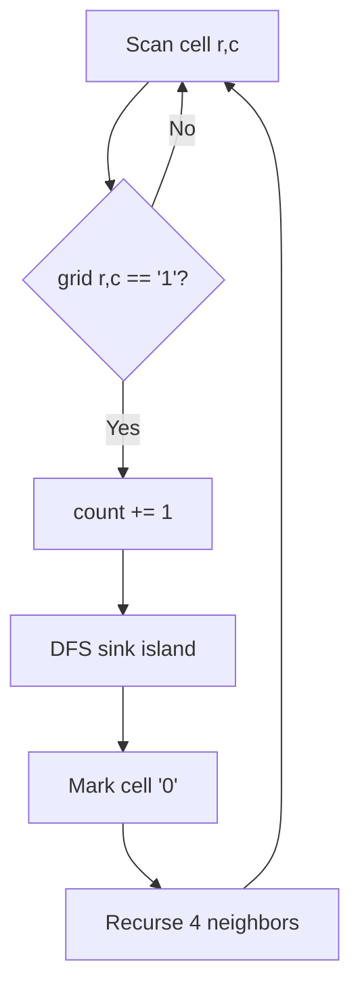

# [Number of Islands](https://leetcode.com/problems/number-of-islands)

Given an `m x n` 2D binary grid `grid` which represents a map of `'1'`s (land) and `'0'`s (water), return *the number of islands*.

An **island** is surrounded by water and is formed by connecting adjacent lands **horizontally or vertically**. You may assume all four edges of the grid are surrounded by water.

## Example 1:

Input: grid = [
  ["1","1","1","1","0"],
  ["1","1","0","1","0"],
  ["1","1","0","0","0"],
  ["0","0","0","0","0"]
]
Output: 1

## Example 2:

Input: grid = [
  ["1","1","0","0","0"],
  ["1","1","0","0","0"],
  ["0","0","1","0","0"],
  ["0","0","0","1","1"]
]
Output: 3

## Constraints:

- `m == grid.length`
- `n == grid[i].length`
- `1 <= m, n <= 300`
- `grid[i][j]` is `'0'` or `'1'`.


## :material-school: What you'll learn

!!! abstract "Learning objectives"
    You will count connected land components on a grid with DFS or BFS flood fill, explain why each unvisited `'1'` starts a new island, and compare in-place marking with Union-Find for the same O(m × n) scan.


## Worked example data

Primary input for the step-by-step trace below:

```text
# primary walkthrough input
grid = [
    ["1", "1", "0", "0", "0"],
    ["1", "1", "0", "0", "0"],
    ["0", "0", "1", "0", "0"],
    ["0", "0", "0", "1", "1"],
]
# expected output: 3
```

| Example | Notes | Answer |
|---------|-------|--------|
| Example 1 (single blob) | One connected 2×2-plus block | `1` |
| Example 2 (walkthrough below) | Three separate components | `3` |
| `[["1"]]` | Single land cell | `1` |
| `[["0"]]` | All water | `0` |


## Approach

Each island is one **connected component** of `'1'` cells under 4-direction adjacency. Scan the grid; every time you land on an unvisited `'1'`, that cell starts a new island—then **flood fill** every reachable `'1'` so you never count the same island twice.

### Brute force: repeated reachability checks

Fix a start cell. If it is land, run BFS/DFS to collect every `'1'` in that component, mark them visited, and increment the island count. Repeat for every cell not yet visited.

| Aspect | Detail |
|--------|--------|
| Time | O(m × n) — each cell visited a constant number of times with a visited set |
| Space | O(m × n) — visited structure plus flood-fill queue or stack |
| Drawback | Extra bookkeeping; in-place sinking is simpler for interviews |

The flood-fill core is identical to the optimal approach; the difference is whether you keep a separate `visited` set or sink cells in the grid.

### DFS flood fill: scan and sink (optimal interview pattern)

Maintain a counter `count`. Walk every cell `(r, c)` in row-major order:

| Step | Action |
|------|--------|
| 1 | If `grid[r][c] != '1'`, continue. |
| 2 | Increment `count` — you found a new island root. |
| 3 | **Sink** the component: DFS from `(r, c)`, flip each visited `'1'` to `'0'`. |
| 4 | Return `count` after the full scan. |

At each DFS call on `(r, c)`:

| Check | Result |
|-------|--------|
| Out of bounds | Return |
| Cell is `'0'` (water or already sunk) | Return |
| Cell is `'1'` | Set `grid[r][c] = '0'`, recurse on four neighbors |



!!! info "Why sinking works"
    Turning `'1'` → `'0'` is both **visit marking** and **exploration** in one step. Any `'1'` still visible later must belong to a different connected component, so incrementing `count` at each fresh `'1'` is correct.

### Walkthrough: Example 2 grid (three islands)

| Scan visit | Cell | Before | Action | `count` |
|------------|------|--------|--------|---------|
| 1 | (0, 0) | `'1'` | DFS sinks (0,0), (0,1), (1,0), (1,1) | 1 |
| 2 | (0, 2) | `'0'` | Skip | 1 |
| … | … | `'0'` | Already water or sunk | 1 |
| 3 | (2, 2) | `'1'` | DFS sinks center cell | 2 |
| 4 | (3, 3) | `'1'` | DFS sinks (3,3) and (3,4) | 3 |

!!! success "Walkthrough confirmed"
    For the Example 2 grid above, flood fill returns **`3`** islands.

### BFS and Union-Find alternatives

**BFS** replaces the recursive stack with a queue—the same sink-in-place logic, often with **O(min(m, n))** auxiliary space instead of a deep recursion stack on wide grids.

**Union-Find** assigns each `'1'` an index, unions with `'1'` neighbors to the **left** and **above**, and tracks component count as you add cells. Same asymptotic time; useful when edges arrive online or you already use disjoint sets elsewhere.

!!! warning "Interview traps"
    **Four directions only** — diagonals do not connect islands. **`'1'` / `'0'` are strings**, not integers; compare with `== "1"`. **In-place DFS mutates the input** — fine on LeetCode, but mention it aloud; use `copy.deepcopy` when testing multiple approaches on one grid.

### Complexity

| Approach | Time | Space | Notes |
|----------|------|-------|-------|
| DFS flood fill | O(m × n) | O(m × n) worst-case stack | Default interview answer |
| BFS flood fill | O(m × n) | O(min(m, n)) typical queue | Avoids recursion limit on huge grids |
| Union-Find | O(m × n · α(mn)) | O(m × n) | No mutation; good for dynamic graphs |

## Implementation

Runnable code: [main.py](main.py)

🎯 Lead with **scan + DFS sink** — one counter, one helper, O(m × n) time.

## Solution 1: DFS Flood Fill (Best for Interview)

| Time Complexity | Space Complexity |
|-----------------|------------------|
| O(m × n)        | O(m × n)         |

```python
def num_islands_dfs(grid):
    """
    DFS flood fill: sink each discovered island in place.

    Args:
        grid (List[List[str]]): Mutable grid of '0' and '1'.

    Returns:
        int: Number of islands.

    Example:
        num_islands_dfs([["1", "0"], ["0", "1"]]) -> 2
    """
    if not grid or not grid[0]:
        return 0

    rows, cols = len(grid), len(grid[0])
    count = 0

    def sink(r, c):
        if r < 0 or c < 0 or r >= rows or c >= cols or grid[r][c] != "1":
            return
        grid[r][c] = "0"
        sink(r + 1, c)
        sink(r - 1, c)
        sink(r, c + 1)
        sink(r, c - 1)

    for r in range(rows):
        for c in range(cols):
            if grid[r][c] == "1":
                count += 1
                sink(r, c)

    return count
```

```java
class Solution {
    public int numIslands(char[][] grid) {
        if (grid.length == 0 || grid[0].length == 0) {
            return 0;
        }
        int rows = grid.length;
        int cols = grid[0].length;
        int count = 0;
        for (int r = 0; r < rows; r++) {
            for (int c = 0; c < cols; c++) {
                if (grid[r][c] == '1') {
                    count++;
                    sink(grid, r, c);
                }
            }
        }
        return count;
    }

    private void sink(char[][] grid, int r, int c) {
        if (r < 0 || c < 0 || r >= grid.length || c >= grid[0].length
                || grid[r][c] != '1') {
            return;
        }
        grid[r][c] = '0';
        sink(grid, r + 1, c);
        sink(grid, r - 1, c);
        sink(grid, r, c + 1);
        sink(grid, r - 1, c);
    }
}
```

## Solution 2: BFS Flood Fill

| Time Complexity | Space Complexity |
|-----------------|------------------|
| O(m × n)        | O(min(m, n))     |

Same counting logic; the queue replaces recursive `sink` calls. Prefer this when recursion depth is a concern.

```python
from collections import deque

def num_islands_bfs(grid):
    if not grid or not grid[0]:
        return 0

    rows, cols = len(grid), len(grid[0])
    count = 0

    for r in range(rows):
        for c in range(cols):
            if grid[r][c] != "1":
                continue
            count += 1
            queue = deque([(r, c)])
            grid[r][c] = "0"
            while queue:
                row, col = queue.popleft()
                for dr, dc in ((1, 0), (-1, 0), (0, 1), (0, -1)):
                    nr, nc = row + dr, col + dc
                    if (
                        0 <= nr < rows
                        and 0 <= nc < cols
                        and grid[nr][nc] == "1"
                    ):
                        grid[nr][nc] = "0"
                        queue.append((nr, nc))

    return count
```

## Solution 3: Union-Find

| Time Complexity | Space Complexity |
|-----------------|------------------|
| O(m × n · α(mn)) | O(m × n)        |

Does not mutate the grid; unions each land cell with `'1'` neighbors already seen to the left and above.

```python
def num_islands_union_find(grid):
    if not grid or not grid[0]:
        return 0

    rows, cols = len(grid), len(grid[0])
    parent = {}
    count = 0

    def find(i):
        if parent[i] != i:
            parent[i] = find(parent[i])
        return parent[i]

    def union(a, b):
        root_a, root_b = find(a), find(b)
        if root_a == root_b:
            return False
        parent[root_b] = root_a
        return True

    for r in range(rows):
        for c in range(cols):
            if grid[r][c] != "1":
                continue
            idx = r * cols + c
            parent[idx] = idx
            count += 1
            if c > 0 and grid[r][c - 1] == "1":
                if union(idx, idx - 1):
                    count -= 1
            if r > 0 and grid[r - 1][c] == "1":
                if union(idx, idx - cols):
                    count -= 1

    return count
```

## Summary

Run all approaches on the same walkthrough grid (deep-copy before each call because DFS/BFS mutate the grid):

```python
import copy

if __name__ == "__main__":
    walkthrough = [
        ["1", "1", "0", "0", "0"],
        ["1", "1", "0", "0", "0"],
        ["0", "0", "1", "0", "0"],
        ["0", "0", "0", "1", "1"],
    ]
    print("DFS:", num_islands_dfs(copy.deepcopy(walkthrough)))
    print("BFS:", num_islands_bfs(copy.deepcopy(walkthrough)))
    print("Union-Find:", num_islands_union_find(copy.deepcopy(walkthrough)))
```

## Industry scenarios

- 🛰️ **Satellite land mapping:** Count distinct land masses in a binary land/water raster tile.
- 🗺️ **GIS / cadastral analysis:** Separate parcels or vegetation patches in a thresholded aerial image.
- 🧬 **Microscopy:** Count distinct cell colonies or connected regions in a binarized plate image.


## :material-lightbulb: Key takeaways

- 🔑 Each unvisited `'1'` during a row-major scan starts exactly one new island; flood fill marks the rest.
- ⚡ One full-grid pass with O(1) work per cell → O(m × n) time.
- 🧩 Sink `'1'` → `'0'` in place for O(1) extra space beyond the stack/queue; Union-Find avoids mutation.
- 🎯 State the 4-direction rule and string cell type before you code.


## Internal References

- 🔗 [Pacific Atlantic Water Flow](../pacific-atlantic-water-flow/index.md) — multi-source BFS from grid borders; same neighbor expansion pattern.
- 🔗 [Word Search](../word-search/index.md) — grid DFS with backtracking instead of sinking entire components.
- 🔗 [Number of Connected Components in an Undirected Graph](../number-of-connected-components-in-an-undirected-graph/index.md) — same component-count idea on an explicit edge list.


## External References

- :fontawesome-solid-link: [Number of Islands — LeetCode #200](https://leetcode.com/problems/number-of-islands/)
