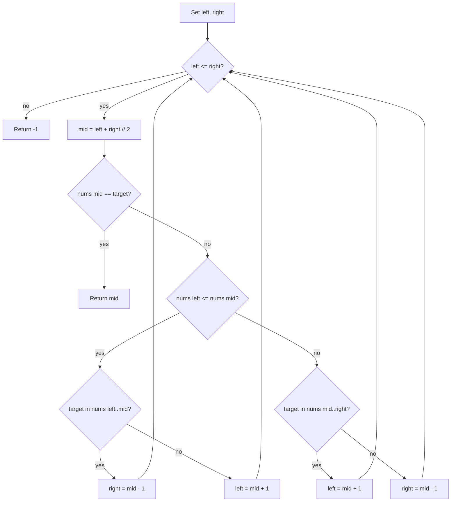

# [Search in Rotated Sorted Array](https://leetcode.com/problems/search-in-rotated-sorted-array)

There is an integer array `nums` sorted in ascending order (with **distinct** values).

Prior to being passed to your function, `nums` is **possibly rotated** at an unknown pivot index `k` (`1 <= k < nums.length`) such that the resulting array is `[nums[k], nums[k+1], ..., nums[n-1], nums[0], nums[1], ..., nums[k-1]]` (0-indexed). For example, `[0,1,2,4,5,6,7]` might become `[4,5,6,7,0,1,2]`.

Given the array `nums` **after** the possible rotation and an integer `target`, return the index of `target` if it is in `nums`, or `-1` if it is not in `nums`.

You must write an algorithm with `O(log n)` runtime complexity.

## Example 1:

Input: nums = `[4,5,6,7,0,1,2]`, target = `0`
Output: `4`

## Example 2:

Input: nums = `[4,5,6,7,0,1,2]`, target = `3`
Output: `-1`

## Example 3:

Input: nums = `[1]`, target = `0`
Output: `-1`

## Constraints:

- `n == nums.length`
- `1 <= n <= 5000`
- `-10^4 <= nums[i], target <= 10^4`
- All values of `nums` are **unique**.
- `nums` is an ascending array that is possibly rotated.


## :material-school: What you'll learn

!!! abstract "Learning objectives"
    You will search a rotated sorted array in O(log n) time by finding which half is still sorted, testing whether the target lies in that half's value range, and discarding the other half each step.


## Worked example data

Primary input for the step-by-step trace below:

```text
# primary walkthrough input
nums = [6, 7, 8, 9, 0, 1, 2, 3, 4, 5]
target = 4
# expected output: 8
```

| Example | Notes | Answer |
|---------|-------|--------|
| `[6, 7, 8, 9, 0, 1, 2, 3, 4, 5]`, target `4` | Full walkthrough below | `8` |
| `[6, 7, 8, 9, 0, 1, 2, 3, 4, 5]`, target `10` | Absent value | `-1` |
| `[4, 5, 6, 7, 0, 1, 2]`, target `0` | LeetCode example 1 | `4` |
| `[4, 5, 6, 7, 0, 1, 2]`, target `3` | LeetCode example 2 | `-1` |


## Approach

You need the **index** of `target` in a rotated sorted array in `O(log n)` time. Start with a linear scan baseline, then upgrade to modified binary search that always identifies one **sorted half** and keeps only the side that can still contain the target.

### Brute force: linear scan

Walk left to right; return the first index where `nums[i] == target`, or `-1` if the scan finishes.

| Aspect | Detail |
|--------|--------|
| Time | O(n) — every element may be compared |
| Space | O(1) — index and loop variable only |
| Drawback | Fails the logarithmic-time requirement |

### Modified binary search: sorted-half elimination

Set `left = 0`, `right = len(nums) - 1`. Each iteration:

| Step | Action |
|------|--------|
| 1 | `mid = (left + right) // 2` |
| 2 | If `nums[mid] == target`, return `mid` |
| 3 | Decide which half is sorted |
| 4 | If `target` is inside that half's **value range**, search there; otherwise discard the sorted half |

Which half is sorted?

| Condition | Sorted half |
|-----------|-------------|
| `nums[left] <= nums[mid]` | Left (`left` … `mid`) |
| otherwise | Right (`mid` … `right`) |

Where can `target` live?

| Sorted half | `target` in range when | Keep by |
|-------------|------------------------|---------|
| Left | `nums[left] <= target <= nums[mid]` | `right = mid - 1` |
| Left | otherwise | `left = mid + 1` |
| Right | `nums[mid] <= target <= nums[right]` | `left = mid + 1` |
| Right | otherwise | `right = mid - 1` |

!!! info "Why one half is always sorted"
    A rotation breaks sorted order at exactly one pivot. For any `mid`, at least one of `[left..mid]` or `[mid..right]` still follows ascending order—compare `nums[left]` with `nums[mid]` to tell which.

!!! warning "Interview trap: use `<=` on the left-half test"
    Write `nums[left] <= nums[mid]`, not strict `<`. When `left == mid` (two-element window), strict `<` mislabels the half as unsorted and sends the search the wrong way.



### Walkthrough: `nums = [6, 7, 8, 9, 0, 1, 2, 3, 4, 5]`, `target = 4`

| Step | `left` | `right` | `mid` | `nums[mid]` | Sorted half | Target in range? | Action |
|------|--------|---------|-------|-------------|-------------|------------------|--------|
| 1 | 0 | 9 | 4 | 0 | right (`0..5`) | yes (`0 <= 4 <= 5`) | `left = 5` |
| 2 | 5 | 9 | 7 | 3 | left (`1..3`) | no | `left = 8` |
| 3 | 8 | 9 | 8 | 4 | — | `nums[8] == 4` | return **`8`** |

Step 1: `nums[0]=6 > nums[4]=0`, so the right half is sorted. `4` fits between `0` and `5`, so discard indices `0..4`.

Step 2: `nums[5]=1 <= nums[7]=3`, so the left half of the window is sorted. `4` is outside `[1, 3]`, so discard indices `5..7`.

Step 3: `nums[8]=4` matches `target`; return index `8`.

### Missing target: `target = 10`

The same loop shrinks the window until `left > right`. No index satisfies `nums[i] == 10`, so the function returns **`-1`**.

!!! success "Walkthrough confirmed"
    For `nums = [6, 7, 8, 9, 0, 1, 2, 3, 4, 5]` and `target = 4`, modified binary search returns **`8`**.

### Complexity

| Time | Space | Why |
|------|-------|-----|
| O(log n) | O(1) | Halve the search space each iteration; only pointer variables |

## Implementation

Runnable code: [main.py](main.py)

🎯 Reach for sorted-half elimination binary search in an interview.

## Solution 1: Modified Binary Search (Best for Interview)

| Time Complexity | Space Complexity |
|-----------------|------------------|
| O(log n)         | O(1)             |

```python
def search_rotated_binary(nums, target):
    """
    Modified binary search: identify the sorted half, then keep or discard it.

    Args:
        nums (List[int]): Rotated sorted array of unique integers.
        target (int): Value to locate.

    Returns:
        int: Index of target, or -1 if absent.

    Example:
        search_rotated_binary([6, 7, 8, 9, 0, 1, 2, 3, 4, 5], 4) -> 8
    """
    left, right = 0, len(nums) - 1

    while left <= right:
        mid = (left + right) // 2
        if nums[mid] == target:
            return mid

        if nums[left] <= nums[mid]:
            if nums[left] <= target <= nums[mid]:
                right = mid - 1
            else:
                left = mid + 1
        else:
            if nums[mid] <= target <= nums[right]:
                left = mid + 1
            else:
                right = mid - 1

    return -1
```

```java
public class SearchRotated {
    public int search(int[] nums, int target) {
        int left = 0, right = nums.length - 1;
        while (left <= right) {
            int mid = left + (right - left) / 2;
            if (nums[mid] == target) {
                return mid;
            }
            if (nums[left] <= nums[mid]) {
                if (nums[left] <= target && target <= nums[mid]) {
                    right = mid - 1;
                } else {
                    left = mid + 1;
                }
            } else {
                if (nums[mid] <= target && target <= nums[right]) {
                    left = mid + 1;
                } else {
                    right = mid - 1;
                }
            }
        }
        return -1;
    }
}
```

## Solution 2: Linear Scan

| Time Complexity | Space Complexity |
|-----------------|------------------|
| O(n)            | O(1)             |

Correct but too slow for the stated constraint; useful as a sanity check while debugging.

```python
def search_rotated_linear(nums, target):
    """
    Linear scan: compare target with each element.

    Args:
        nums (List[int]): Rotated sorted array of unique integers.
        target (int): Value to locate.

    Returns:
        int: Index of target, or -1 if absent.

    Example:
        search_rotated_linear([4, 5, 6, 7, 0, 1, 2], 0) -> 4
    """
    for i, value in enumerate(nums):
        if value == target:
            return i
    return -1
```

## Summary

Run both approaches with the same input:

```python
if __name__ == "__main__":
    """
    Run example tests for each solution.
    Modify walkthrough to test different cases.
    """
    walkthrough = [6, 7, 8, 9, 0, 1, 2, 3, 4, 5]
    target = 4
    print("Binary search:", search_rotated_binary(walkthrough, target))
    print("Linear:", search_rotated_linear(walkthrough, target))
```

## Industry scenarios

- 📈 **Circular price history:** Locate a historical quote index after daily bars wrap in a fixed-size ring buffer.
- 📡 **Rotating telemetry buffers:** Find the timestamp slot for a sensor reading in a sorted circular log.
- 🎮 **Seasonal rank lookup:** Search a rotated leaderboard segment for a player's score tier.


## :material-lightbulb: Key takeaways

- 🔑 Each step: hit at `mid`, else find the sorted half and keep it only if `target` lies in that half's value range.
- ⚡ Modified binary search: O(log n) time, O(1) space.
- 🧩 Use `nums[left] <= nums[mid]` (not `<`) so two-element windows classify correctly.


## Internal References

- 🔗 [Find Minimum in Rotated Sorted Array](../find-minimum-in-rotated-sorted-array/index.md) — same rotated-array geometry; hunt the pivot value instead of a target index.
- 🔗 [Two Sum](../two-sum/index.md) — index lookup with hash maps when the array is not rotation-structured.


## External References

- :fontawesome-solid-link: [Search in Rotated Sorted Array — LeetCode #33](https://leetcode.com/problems/search-in-rotated-sorted-array/)
