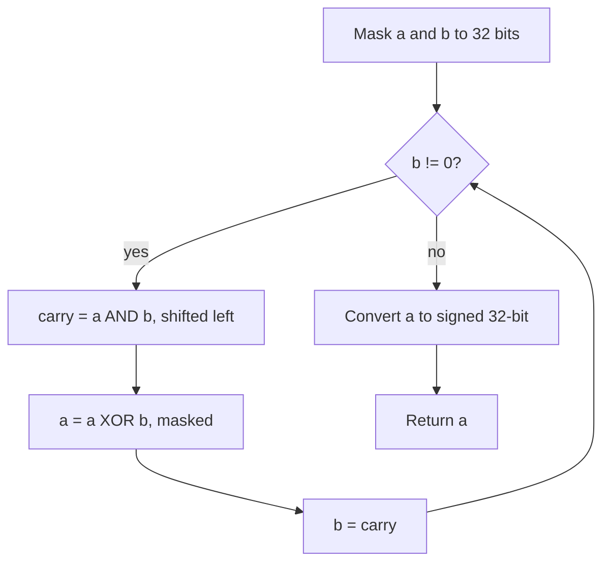

# [Sum of Two Integers](https://leetcode.com/problems/sum-of-two-integers)

Given two integers `a` and `b`, return the sum of the two integers without using the operators `+` and `-`.

## Example 1:

Input: a = `1`, b = `2`
Output: `3`

## Example 2:

Input: a = `2`, b = `3`
Output: `5`

## Constraints:

- `-1000 <= a, b <= 1000`


## :material-school: What you'll learn

!!! abstract "Learning objectives"
    You will add two integers using only bitwise XOR, AND, and left shift—modeling sum and carry the same way hardware adders do—and handle signed 32-bit results correctly in Python.

!!! tip "Prerequisite"
    If XOR, AND, and carries are new, read [Binary arithmetic](../../dsa/binary-arithmetic/index.md) first, then return here for the full LeetCode walkthrough.


## Worked example data

Primary input for the step-by-step trace below:

```text
# primary walkthrough input
a = 5
b = 14
# expected output: 19
```

| Example | Notes | Answer |
|---------|-------|--------|
| `a = 5`, `b = 14` | Full walkthrough below | `19` |
| `a = 1`, `b = 2` | LeetCode example 1 | `3` |
| `a = 2`, `b = 3` | LeetCode example 2 | `5` |
| `a = 37`, `b = 62` | Both positive | `99` |
| `a = -20`, `b = -30` | Both negative | `-50` |


## Approach

You need `a + b` without `+` or `-`. Start with the obvious baseline—repeated increment/decrement loops are correct but unusably slow—then upgrade to **bitwise sum + carry**. That second approach is what you should reach for in an interview.

### Brute force: step one at a time

Simulate addition by moving one unit at a time from `b` into `a`. Each step still needs a way to add or subtract one without `+`/`-`, so you end up reimplementing carry anyway—or you burn O(|b|) iterations.

| Aspect | Detail |
|--------|--------|
| Time | O(\|b\|) or worse |
| Space | O(1) |
| Drawback | Impractical; does not generalize to full integer range |

### Bitwise: XOR for sum, AND for carry

Binary addition splits into two parts at each bit position:

| Role | Bitwise op | Meaning |
|------|------------|---------|
| Sum without carry | `a ^ b` | Add bits where carries do not overlap |
| Carry | `(a & b) << 1` | Positions that both had a 1 generate a carry left |

Repeat until carry is zero:

$$
\text{carry} = (a \mathbin{\&} b) \ll 1,\quad a \leftarrow a \oplus b
$$

!!! info "Same pattern as pencil-and-paper addition"
    XOR gives the result column before carries land. AND finds overlapping 1-bits; shifting left moves each carry to the next higher bit. Loop until nothing is left to carry.

!!! warning "Interview trap: Python needs a 32-bit mask"
    Python integers are unbounded. Without masking to `0xFFFFFFFF`, negative inputs can leave `carry` never reaching zero and the loop runs forever. Mask `a`, `b`, and `carry` each iteration, then convert back to signed with `~(a ^ mask)` when the high bit is set.



### Walkthrough: `a = 5`, `b = 14`

Binary view:

```text
  5 = 0101
 14 = 1110
```

| Iteration | `a` | `b` | `a ^ b` (new sum) | `(a & b) << 1` (carry) |
|-----------|-----|-----|-------------------|------------------------|
| start | 5 | 14 | — | — |
| 1 | 11 | 8 | 11 | 8 |
| 2 | 3 | 16 | 3 | 16 |
| 3 | 19 | 0 | 19 | 0 |

Carry is zero after iteration 3, so the answer is **19**.

Quick checks from the table above:

| `a` | `b` | Expected |
|-----|-----|----------|
| 37 | 62 | 99 |
| -20 | -30 | -50 |

!!! success "Walkthrough confirmed"
    For `a = 5` and `b = 14`, the bitwise loop returns **19**.

### Complexity

| Time | Space | Why |
|------|-------|-----|
| O(1) | O(1) | At most 32 carry rounds for fixed-width integers |

## Implementation

Runnable code: [main.py](main.py)

🎯 Reach for XOR + masked carry loop in an interview.

## Solution 1: Bitwise Iteration (Best for Interview)

| Time Complexity | Space Complexity |
|-----------------|------------------|
| O(1)            | O(1)             |

```python
MASK = 0xFFFFFFFF
MAX_INT = 0x7FFFFFFF


def get_sum_bitwise(a, b):
    """
    Add two integers with XOR (sum without carry) and AND+shift (carry).

    Args:
        a (int): First addend.
        b (int): Second addend.

    Returns:
        int: a + b without using + or -.

    Example:
        get_sum_bitwise(5, 14) -> 19
    """
    a, b = a & MASK, b & MASK
    while b:
        carry = ((a & b) << 1) & MASK
        a, b = (a ^ b) & MASK, carry
    return a if a <= MAX_INT else ~(a ^ MASK)
```

```java
public class SumOfTwoIntegers {
    public int getSum(int a, int b) {
        while (b != 0) {
            int carry = (a & b) << 1;
            a = a ^ b;
            b = carry;
        }
        return a;
    }
}
```

## Solution 2: Recursive Bitwise

| Time Complexity | Space Complexity |
|-----------------|------------------|
| O(1)            | O(1) call depth  |

Same logic as Solution 1, expressed recursively. Java and C++ use native 32-bit `int` overflow behavior; Python still needs masking.

```python
def get_sum_recursive(a, b):
    """
    Recursive bitwise add: base case when carry is zero.

    Args:
        a (int): First addend.
        b (int): Second addend.

    Returns:
        int: a + b without using + or -.

    Example:
        get_sum_recursive(37, 62) -> 99
    """
    a, b = a & MASK, b & MASK
    if b == 0:
        return a if a <= MAX_INT else ~(a ^ MASK)
    carry = ((a & b) << 1) & MASK
    return get_sum_recursive((a ^ b) & MASK, carry)
```

## Summary

Run both approaches with the same input:

```python
if __name__ == "__main__":
    """
    Run example tests for each solution.
    Modify walkthrough_a and walkthrough_b to test different cases.
    """
    walkthrough_a = 5
    walkthrough_b = 14
    print("Bitwise:", get_sum_bitwise(walkthrough_a, walkthrough_b))
    print("Recursive:", get_sum_recursive(walkthrough_a, walkthrough_b))
```


## Industry scenarios

- 📡 **Embedded firmware:** Microcontrollers expose add via ALU opcodes; interviewers test whether you understand carry propagation at the bit level.
- 📈 **Checksum pipelines:** XOR/AND patterns appear in parity checks and low-level aggregation before values hit floating-point paths.
- 🎮 **Fixed-point scores:** Game engines sometimes pack stats into integers; bitwise add mirrors how hardware accumulates without floating-point units.


## :material-lightbulb: Key takeaways

- 🔑 XOR = sum without carry; `(a & b) << 1` = carry; repeat until carry is zero.
- ⚡ O(1) time for 32-bit integers—at most one pass per bit position.
- 🧩 In Python, mask to 32 bits and convert back to signed; unmasked loops can hang on negatives.


## Internal References

- 🔗 [Number of 1 Bits](../number-of-1-bits/index.md) — counting set bits with `n & (n - 1)`.
- 🔗 [Reverse Bits](../reverse-bits/index.md) — shifting and masking individual bits.
- 🔗 [Counting Bits](../counting-bits/index.md) — DP built from bit patterns.


## External References

- :fontawesome-solid-link: [Sum of Two Integers — LeetCode #371](https://leetcode.com/problems/sum-of-two-integers/)
