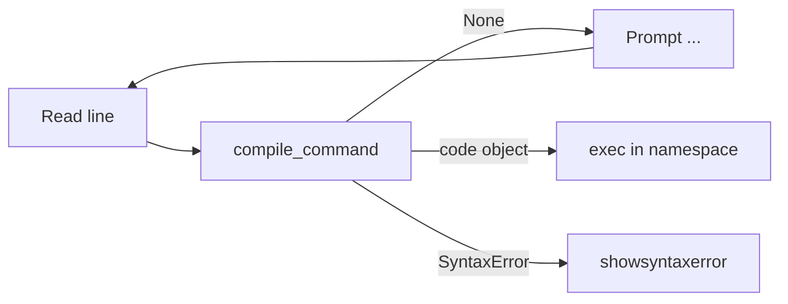

# [Custom Python Interpreters](https://docs.python.org/3/library/custominterp.html)

The modules in this chapter help you build **read-eval-print loop (REPL)**–style interfaces: parsing incomplete input, compiling snippets, and executing code in a controlled namespace. For most applications you want [`code`](code-interpreter-base-classes/index.md) (high-level interpreter classes); [`codeop`](codeop-compile-python-code/index.md) is the lower layer that decides whether more input is needed. Full API reference remains on [docs.python.org](https://docs.python.org/3/library/custominterp.html).

---

## When to use which module

| Module | Role |
|--------|------|
| [`code`](code-interpreter-base-classes/index.md) | `InteractiveInterpreter`, `InteractiveConsole`, and `interact()` for a full mini-REPL |
| [`codeop`](codeop-compile-python-code/index.md) | `compile_command()` and `Compile` / `CommandCompiler` for incomplete-line detection |

---

## Typical REPL flow



---

## Cross-cutting notes

| Topic | Detail |
|-------|--------|
| Namespace | `InteractiveInterpreter(locals=...)` controls where definitions live; defaults to `{'__name__': '__console__'}` |
| Prompts | `InteractiveConsole` uses `sys.ps1` / `sys.ps2` when input is incomplete |
| `local_exit` (3.13+) | `exit()` / `quit()` return to your app instead of raising `SystemExit` when enabled |
| Pickling | Objects created in a custom `locals` dict are only pickleable if that dict is a real module’s `__dict__` |

```python
# Goal: detect incomplete vs complete input like the real REPL
import code

assert code.compile_command("x = 1") is not None
assert code.compile_command("if True:") is None
assert code.compile_command("if True:\n    pass\n") is not None
```

---

## Sections in this repo

| Section | Summary |
|---------|---------|
| [code — Interpreter base classes](code-interpreter-base-classes/index.md) | `InteractiveInterpreter`, `InteractiveConsole`, `interact()` |
| [codeop — Compile Python code](codeop-compile-python-code/index.md) | `compile_command`, `Compile`, `CommandCompiler` |
