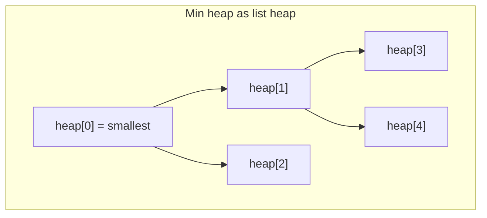
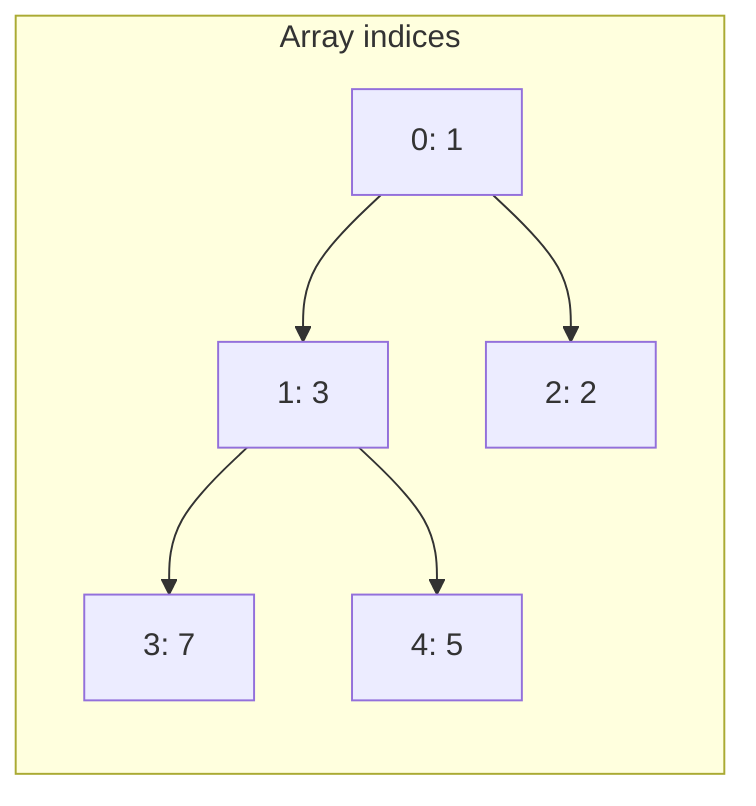
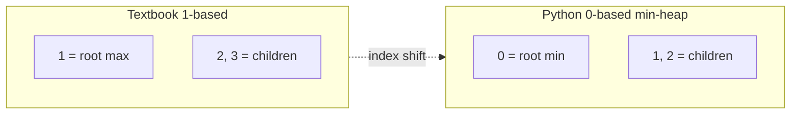
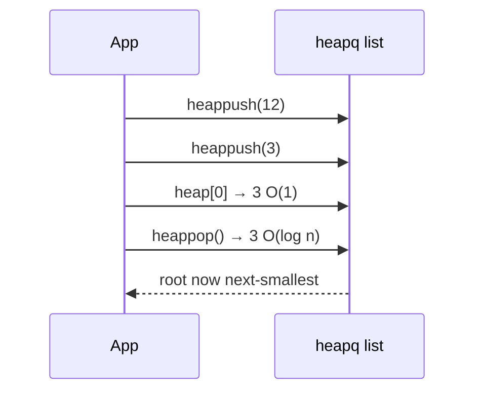
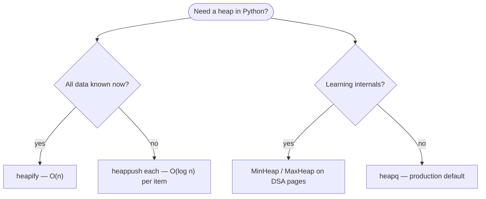
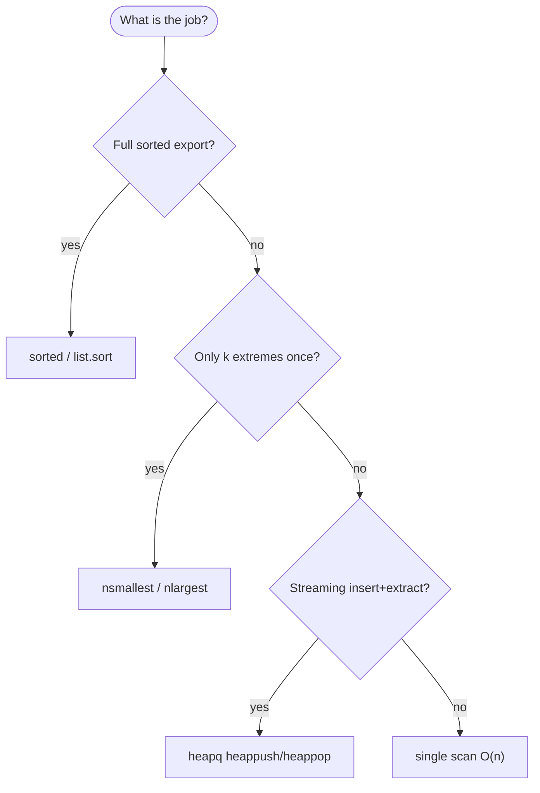

# [heapq — Heap queue algorithm](https://docs.python.org/3/library/heapq.html)

The [`heapq`](https://docs.python.org/3/library/heapq.html) module implements **binary heap** operations on ordinary Python **lists**. It maintains a **min-heap** by default: `heap[0]` is always the smallest element, and `heap.sort()` preserves the heap invariant. Since **Python 3.14**, first-class **max-heap** helpers use a `_max` suffix (`heapify_max`, `heappush_max`, …).

Unlike textbook presentations that often use 1-based indexing and max-heaps for in-place sort, `heapq` uses **zero-based indexing** and favors **min-heaps** so the structure behaves like a regular list with no surprises. Comparisons use only the `<` operator for both min- and max-heaps.

Common uses: **priority queues**, **k-extreme selection** (`nsmallest` / `nlargest`), **merging sorted log streams**, and **streaming medians**. For the underlying tree mechanics and a from-scratch implementation, see [Min heap](../../../../../dsa/data-structures/min-heap/index.md) and [Max heap](../../../../../dsa/data-structures/max-heap/index.md). Canonical API and theory: [docs.python.org](https://docs.python.org/3/library/heapq.html).

| | |
| --- | --- |
| **What it is** | Binary heap operations on a plain Python `list`; **min-heap** by default, **max-heap** via `_max` helpers (3.14+) or negated keys |
| **Core operations** | `heapify`, `heappush`, `heappop`, `heapreplace`, `heappushpop`; utilities `nsmallest`, `nlargest`, `merge` |
| **When to use** | Priority queues, Dijkstra frontiers, k-extreme selection, merging sorted streams, streaming medians |
| **Trade-off** | Only `heap[0]` is guaranteed extremal—the rest of the list is **not** globally sorted; no O(1) arbitrary delete |

---

## What `heapq` models

| Use case | Heap view | Why min at `heap[0]` |
| --- | --- | --- |
| **Earliest-deadline scheduler** | Root = soonest pending event | O(1) peek, O(log n) extract |
| **Dijkstra frontier** | Key = tentative distance | Always expand closest unvisited node |
| **K-smallest / k-largest snapshot** | `nsmallest` / `nlargest` or size-k heap | Avoid full sort on large batches |
| **Merge sorted streams** | One heap entry per stream head | Pop global minimum, push next from that stream |
| **Running median** | Balanced min-heap + max-heap (3.14+) | O(log n) insert per sample |
| **Live “best so far” (min)** | Single-element peek while streaming | Compare new candidate vs root in O(1) |

**Use `heapq.nsmallest` / `nlargest` or `sorted`** when you need k extremes from a large batch **once**. **Use `heappush` / `heappop`** when you **interleave inserts and extracts** on a moderate in-memory set (graph search, simulation, event loop).



Throughout this page, **n** is the number of elements in the heap. **h** = ⌊log₂ n⌋ is tree height.

---

## Mental model: complete tree in a list

A heap is a **complete binary tree** stored in array `heap` with these index relations (0-based):

| Index relation | Formula |
| --- | --- |
| **Parent of `i`** | `(i - 1) // 2` for `i > 0` |
| **Left child of `i`** | `2 * i + 1` |
| **Right child of `i`** | `2 * i + 2` |
| **Last parent** | `(n // 2) - 1` when `n > 0` |

**Min-heap invariant:** for every valid `k`, `heap[k] <= heap[2*k+1]` and `heap[k] <= heap[2*k+2]` (missing children treated as infinite).

**Max-heap invariant (3.14+ `_max` API):** `heap[2*k+1] <= heap[k]` and `heap[2*k+2] <= heap[k]`.



| Step | Cost driver |
| --- | --- |
| One sift-up / sift-down | O(log n) comparisons/swaps |
| `heapify` on n items | O(n) — Floyd build, not O(n log n) |

---

## Zero-based (`heapq`) vs one-based (textbook) heaps

Most algorithms textbooks (CLRS, Sedgewick) store heaps in **1-based arrays**: the root lives at index `1`, parent of `i` is `i // 2`, children are `2*i` and `2*i + 1`. Python lists are **0-based**, so `heapq` shifts every formula by one slot:

| Relation | Textbook (1-based) | Python `heapq` (0-based) |
| --- | --- | --- |
| **Root index** | `A[1]` | `heap[0]` |
| **Parent of `i`** | `i // 2` | `(i - 1) // 2` |
| **Left child** | `2 * i` | `2 * i + 1` |
| **Right child** | `2 * i + 1` | `2 * i + 2` |
| **Last parent** | `n // 2` | `(n // 2) - 1` |

Textbooks also often teach **max-heaps** first because classic **heapsort** extracts the maximum repeatedly. Python’s stdlib chose a **min-heap** so `heap[0]` is the smallest element—matching priority queues where lower numbers mean higher urgency—and so the API aligns with ordinary list indexing. On **Python 3.14+**, `_max` functions mirror the min API without negation; on older versions, store **negated keys** on the min-heap API for max behavior.



---

## `heapq` vs custom heaps vs sorted list

| | **`heapq` (stdlib)** | **[Min heap](../../../../../dsa/data-structures/min-heap/index.md)** | **[Max heap](../../../../../dsa/data-structures/max-heap/index.md)** | **Sorted `list`** |
| --- | --- | --- | --- | --- |
| **Extreme at top** | Minimum (`heap[0]`) | Minimum | Maximum | Min at `[0]`, max at `[-1]` |
| **Insert** | O(log n) `heappush` | O(log n) `insert` | O(log n) `insert` | O(n) insert + keep sorted |
| **Extract best** | O(log n) `heappop` | O(log n) `extract_min` | O(log n) `extract_max` | O(1) pop end; O(n) pop front |
| **Peek** | O(1) `heap[0]` | O(1) | O(1) | O(1) either end |
| **Full order visible** | No | No | No | Yes |
| **Typical choice** | Production default | Learn / teach / debug | Top-k, max schedulers | Full sorted export |

**Rule of thumb:** ship **`heapq`** in services; implement **`MinHeap` / `MaxHeap`** to learn the structure, pass interviews, or wrap extra validation. For max behavior before 3.14, negate keys on a min-heap; on 3.14+, use `_max` helpers or negation interchangeably.



---

## Ways to build a heap with `heapq`

| Pattern | API | Time | Best when |
| --- | --- | --- | --- |
| **Empty, push online** | `h = []` then repeated `heappush` | O(n log n) for n items | Items arrive over time |
| **Bulk offline build** | `heapify(existing_list)` | O(n) | Full batch known upfront |
| **Drain to sorted order** | repeated `heappop` | O(n log n) | Heapsort teaching demo |
| **Copy then heapify** | `h = data.copy(); heapify(h)` | O(n) | Preserve original list |

```python
# Goal: prefer heapify over n heappush calls when data is already in memory
import heapq

batch = [9, 4, 7, 1, 8, 2]

online = []
for x in batch:
    heapq.heappush(online, x)

offline = batch.copy()
heapq.heapify(offline)

assert online[0] == offline[0] == 1

drain = offline.copy()
assert [heapq.heappop(drain) for _ in range(len(drain))] == sorted(batch)
```



---

## Example item types

Heaps compare elements with `<`. Store a **sort key first** when the payload should not participate in ordering:

```python
from dataclasses import dataclass, field


@dataclass(order=True, slots=True)
class TimedEvent:
    deadline_ms: int
    name: str = field(compare=False, default="")


@dataclass(frozen=True, slots=True)
class VertexDistance:
    vertex_id: int
    distance: float


@dataclass(frozen=True, slots=True)
class StreamHead:
    stream_id: int
    value: int
    next_index: int
```

| Stored shape | Typical use |
| --- | --- |
| `(priority, task)` | Simple priority queue |
| `(distance, vertex_id)` | Dijkstra frontier |
| `(value, stream_id, index)` | K-way merge of sorted runs |
| `@dataclass(order=True)` item | Readable items with non-comparable payload fields |

---

## Min-heap core API

| Function | Effect | Empty heap |
| --- | --- | --- |
| `heapify(x)` | Transform list `x` into min-heap in-place, O(n) | N/A (needs existing list) |
| `heappush(heap, item)` | Push item, preserve invariant | Works on `[]` |
| `heappop(heap)` | Pop and return smallest | `IndexError` |
| `heappushpop(heap, item)` | Push then pop; faster than separate calls | Pop from singleton after push |
| `heapreplace(heap, item)` | Pop then push; size unchanged | `IndexError` |

Access smallest without pop: **`heap[0]`**.

```python
# Goal: build min-heap and drain in ascending order
import heapq

data = [5, 1, 4, 2, 3]
heapq.heapify(data)
assert data[0] == 1

heapq.heappush(data, 0)
assert heapq.heappop(data) == 0
assert [heapq.heappop(data) for _ in range(len(data))] == [1, 2, 3, 4, 5]
```

### Combined push/pop semantics

| Call | Returns | Leaves on heap |
| --- | --- | --- |
| `heappushpop(h, x)` | `min(x, old_min)` if h non-empty; else `x` | The **larger** of the two |
| `heapreplace(h, x)` | **Old** smallest (may be > x) | `x` and remaining items |

Use **`heappushpop`** when you only care about the smaller value and want the larger to stay. Use **`heapreplace`** when evicting the current minimum must always happen; for **fixed-size top-k smallest**, use a size-k **max-heap** and `heapreplace_max` (see example below).

```python
# Goal: fixed-size top-3 smallest — max-heap root is the cutoff
import heapq
import sys

stream = [9, 4, 7, 1, 8, 2, 6, 3, 5]
if sys.version_info >= (3, 14):
    top3 = stream[:3]
    heapq.heapify_max(top3)
    for x in stream[3:]:
        if x < top3[0]:
            heapq.heapreplace_max(top3, x)
else:
    top3 = [-x for x in stream[:3]]
    heapq.heapify(top3)
    for x in stream[3:]:
        if x < -top3[0]:
            heapq.heapreplace(top3, -x)
    top3 = [-x for x in top3]
assert sorted(top3) == [1, 2, 3]
```

---

## Max-heap API (Python 3.14+)

| Function | Effect |
| --- | --- |
| `heapify_max(x)` | In-place max-heap, O(n) |
| `heappush_max(heap, item)` | Push preserving max invariant |
| `heappop_max(heap)` | Pop largest; `IndexError` if empty |
| `heappushpop_max(heap, item)` | Push then pop largest |
| `heapreplace_max(heap, item)` | Pop largest then push item |

Largest element at **`heap[0]`**. On older Python, build a max-heap by storing negated values on the min-heap API.

```python
# Goal: compare 3.14 max-heap API vs negated min-heap
import heapq
import sys

scores = [10, 3, 25, 7, 25]

if sys.version_info >= (3, 14):
    mh = scores.copy()
    heapq.heapify_max(mh)
    assert heapq.heappop_max(mh) == 25
else:
    mh = [-s for s in scores]
    heapq.heapify(mh)
    assert -heapq.heappop(mh) == 25

assert heapq.nlargest(2, scores) == [25, 25]
```

### Max behavior via negated keys (all Python versions)

Before 3.14—and still valid today—store **negated numeric keys** on the min-heap API. Pop and negate to recover the original maximum. Works for integers and floats; do **not** negate arbitrary objects.

```python
# Goal: max-priority queue using negated scores on min-heap API
import heapq

leaderboard = []
for player, score in [("alice", 1200), ("bob", 980), ("carol", 1500)]:
    heapq.heappush(leaderboard, (-score, player))

best_player = heapq.heappop(leaderboard)[1]
assert best_player == "carol"
```

| Approach | Pros | Cons |
| --- | --- | --- |
| **`_max` API (3.14+)** | Reads naturally; no sign flip | Requires 3.14+ |
| **Negated keys** | Works on every Python 3 | Easy to forget `-` on pop; not for non-numeric keys |
| **`nlargest` one-shot** | No heap maintenance | Re-scans data each call |

---

## Utility functions: `merge`, `nsmallest`, `nlargest`

| Function | Returns | Best when |
| --- | --- | --- |
| `merge(*iterables, key=None, reverse=False)` | Iterator over merged sorted values | Each input already sorted; lazy/streaming |
| `nsmallest(n, iterable, key=None)` | List of n smallest | Small **n**, large iterable |
| `nlargest(n, iterable, key=None)` | List of n largest | Small **n**, large iterable |

For large **n**, prefer `sorted(iterable)[:n]` or `sorted(iterable, reverse=True)[:n]`. For **n == 1**, use built-in `min()` / `max()`. If you call these repeatedly on the same data, **`heapify`** once and maintain the heap.

```python
# Goal: lazy merge of sorted runs without materializing everything
import heapq

a = [1, 4, 7]
b = [2, 3, 8]
c = [0, 5, 6]
assert list(heapq.merge(a, b, c)) == [0, 1, 2, 3, 4, 5, 6, 7, 8]

words = ["apple", "pie", "Banana", "cherry"]
assert heapq.nsmallest(2, words, key=str.lower) == ["apple", "Banana"]
assert heapq.nlargest(2, words, key=len) == ["Banana", "cherry"]
```

### Choosing `nsmallest` / `nlargest` vs `sorted`

| Situation | Prefer |
| --- | --- |
| **k ≪ n** (e.g. top 10 of 1M rows) | `nsmallest` / `nlargest` — O(n log k) |
| **k close to n** (e.g. bottom 90% of 100 items) | `sorted(...)[:k]` — simpler and often faster |
| **n == 1** | Built-in `min()` / `max()` |
| **Need full ranking once** | `sorted` |
| **Repeated k-extreme on growing set** | Maintain size-k heap with `heappush` / `heapreplace` |

```python
# Goal: size-k streaming minimum — size-k max-heap tracks cutoff
import heapq
import sys

stream = [5, 1, 9, 2, 8, 3, 7, 4, 6, 0]
k = 3
if sys.version_info >= (3, 14):
    window = stream[:k]
    heapq.heapify_max(window)
    for x in stream[k:]:
        if x < window[0]:
            heapq.heapreplace_max(window, x)
else:
    window = [-x for x in stream[:k]]
    heapq.heapify(window)
    for x in stream[k:]:
        if x < -window[0]:
            heapq.heapreplace(window, -x)
    window = [-x for x in window]
assert sorted(window) == [0, 1, 2]
```

### `merge` with `reverse=True`

Each input must still be sorted in the direction you intend. `reverse=True` merges **descending** runs (largest first).

```python
# Goal: merge descending log shards lazily
import heapq

high = [9, 6, 3]
low = [8, 5, 2]
assert list(heapq.merge(high, low, reverse=True)) == [9, 8, 6, 5, 3, 2]
```

### Heapsort (unstable)

```python
# Goal: heapsort via repeated heappop — not stable unlike sorted()
import heapq

def heapsort(iterable):
    h = []
    for value in iterable:
        heapq.heappush(h, value)
    return [heapq.heappop(h) for _ in range(len(h))]

assert heapsort([1, 3, 5, 7, 9, 2, 4, 6, 8, 0]) == list(range(10))
```

---

## Priority queue recipes

Heaps are the usual backing store for a **priority queue**, but several design questions need explicit answers:

| Challenge | Recommended pattern |
| --- | --- |
| **Stable tie-breaking** | `(priority, entry_count, task)` — monotonic counter breaks ties |
| **Non-comparable payloads** | `@dataclass(order=True)` with `compare=False` on payload field |
| **Priority change / delete** | Lazy removal: mark old entry removed, push fresh entry |
| **Thread safety** | Use `queue.PriorityQueue` or external locking |

### Tuple priorities

```python
# Goal: tasks ordered by priority; lower number = higher urgency
import heapq

h = []
for priority, task in [(3, "create tests"), (1, "write spec"), (5, "write code"), (7, "release")]:
    heapq.heappush(h, (priority, task))

assert [heapq.heappop(h)[1] for _ in range(4)] == [
    "write spec", "create tests", "write code", "release"
]
```

### Dataclass items (3.7+)

```python
# Goal: compare by priority only; ignore task body
import heapq
from dataclasses import dataclass, field
from typing import Any

@dataclass(order=True)
class PrioritizedItem:
    priority: int
    item: Any = field(compare=False)

pq = []
heapq.heappush(pq, PrioritizedItem(2, "background sync"))
heapq.heappush(pq, PrioritizedItem(1, "user request"))
assert heapq.heappop(pq).item == "user request"
```

### Lazy deletion with entry finder

Adapted from the [official priority queue notes](https://docs.python.org/3/library/heapq.html#priority-queue-implementation-notes):

```python
# Goal: update or remove pending tasks without breaking heap shape
import heapq
import itertools

pq = []
entry_finder = {}
REMOVED = "<removed-task>"
counter = itertools.count()

def add_task(task, priority=0):
    if task in entry_finder:
        remove_task(task)
    count = next(counter)
    entry = [priority, count, task]
    entry_finder[task] = entry
    heapq.heappush(pq, entry)

def remove_task(task):
    entry = entry_finder.pop(task)
    entry[-1] = REMOVED

def pop_task():
    while pq:
        priority, count, task = heapq.heappop(pq)
        if task is not REMOVED:
            del entry_finder[task]
            return task
    raise KeyError("pop from an empty priority queue")

add_task("write spec", 1)
add_task("write code", 3)
add_task("write spec", 0)  # higher priority update
assert pop_task() == "write spec"
assert pop_task() == "write code"
```

### Max-priority with negated tuple keys

When `_max` helpers are unavailable, push `(-priority, tie_breaker, task)` and ignore the sign when reading results.

```python
# Goal: highest numeric priority first using negated keys
import heapq
import itertools

counter = itertools.count()
h = []
for priority, label in [(3, "low"), (10, "critical"), (7, "normal")]:
    heapq.heappush(h, (-priority, next(counter), label))

assert heapq.heappop(h)[2] == "critical"
```

---

## Application patterns

### Dijkstra frontier (conceptual)

A min-heap keyed by tentative distance is the standard Dijkstra frontier. Production code needs a **`vertex → heap entry`** map for decrease-key; this sketch shows the `heapq` shape.

```python
# Goal: shortest-path frontier — always expand smallest distance next
import heapq

def dijkstra_distances(edges, start, n_vertices):
    """edges[u] -> list of (v, weight); returns distance list or None if unreachable."""
    INF = 10**18
    dist = [INF] * n_vertices
    dist[start] = 0
    frontier = [(0, start)]
    while frontier:
        d, u = heapq.heappop(frontier)
        if d > dist[u]:
            continue  # stale entry after a shorter path was found
        for v, w in edges.get(u, []):
            nd = d + w
            if nd < dist[v]:
                dist[v] = nd
                heapq.heappush(frontier, (nd, v))
    return dist

edges = {0: [(1, 4), (2, 1)], 1: [(3, 1)], 2: [(1, 2), (3, 5)], 3: []}
assert dijkstra_distances(edges, 0, 4) == [0, 3, 1, 4]
```

| | |
| --- | --- |
| **Time** | O((V + E) log V) with lazy stale pops |
| **Space** | O(V) frontier entries |

### K-way merge of sorted streams

```python
# Goal: merge k sorted iterators — one heap entry per active stream head
import heapq

streams = [[1, 4, 7], [2, 3], [0, 5, 6]]
iters = [iter(s) for s in streams]
heap = []
for sid, it in enumerate(iters):
    val = next(it, None)
    if val is not None:
        heapq.heappush(heap, (val, sid))

merged = []
while heap:
    val, sid = heapq.heappop(heap)
    merged.append(val)
    nxt = next(iters[sid], None)
    if nxt is not None:
        heapq.heappush(heap, (nxt, sid))

assert merged == [0, 1, 2, 3, 4, 5, 6, 7]
```

---

## Running median (3.14+)

Balance a **max-heap** for the lower half and a **min-heap** for the upper half. When sizes are equal, median is the average of both tops; otherwise the top of the larger heap.

```python
# Goal: online median — uses heappush_max / heappushpop_max on 3.14+
import heapq
import sys

def running_median(iterable):
    lo = []  # max-heap (lower half)
    hi = []  # min-heap (upper half)
    for x in iterable:
        if sys.version_info >= (3, 14):
            if len(lo) == len(hi):
                heapq.heappush_max(lo, heapq.heappushpop(hi, x))
                yield lo[0]
            else:
                heapq.heappush(hi, heapq.heappushpop_max(lo, x))
                yield (lo[0] + hi[0]) / 2
        else:
            # Pre-3.14: emulate max-heap with negated keys on lo
            if len(lo) == len(hi):
                heapq.heappush(lo, -heapq.heappushpop(hi, x))
                yield -lo[0]
            else:
                heapq.heappush(hi, -heapq.heappushpop(lo, -x))
                yield (-lo[0] + hi[0]) / 2

assert list(running_median([5.0, 9.0, 4.0, 12.0, 8.0, 9.0])) == [
    5.0, 7.0, 5.0, 7.0, 8.0, 8.5
]
```

---

## Master complexity table

Let **n** = heap size, **k** = number of extracts or `nsmallest`/`nlargest` count, **m** = total elements in merged streams.

| Operation | Time | Space (aux) | Notes |
| --- | --- | --- | --- |
| `heapify` n items | O(n) | O(1) | Prefer over n `heappush` calls |
| `heappush` | O(log n) | O(1) | Sift-up |
| `heappop` | O(log n) | O(1) | Sift-down |
| Peek `heap[0]` | O(1) | O(1) | |
| `heappushpop` / `heapreplace` | O(log n) | O(1) | One sift path |
| n online inserts | O(n log n) | O(n) | |
| Drain all n | O(n log n) | O(1) per step | Heapsort pattern |
| `nsmallest(k, …)` / `nlargest(k, …)` | O(n log k) typical | O(k) | Beat sort when k ≪ n |
| `merge` k sorted streams | O(m log k) | O(k) | Lazy iterator |
| Lazy-delete PQ | O(log n) push; amortized pop | O(tasks) | Stale entries cleaned at pop |

**Storage:** Θ(n) list entries. The list object is the heap — no separate node allocation.

---

## When to pick which tool



| Scenario | Best tool |
| --- | --- |
| Full sorted export | `sorted` or `list.sort` |
| Bottom-k or top-k one batch | `nsmallest` / `nlargest` |
| Interactive min-priority queue | `heapq` + lazy-delete recipe |
| Dijkstra / merge k sorted lists | `heapq` or [Min heap](../../../../../dsa/data-structures/min-heap/index.md) |
| Learn heap property step-by-step | [Min heap](../../../../../dsa/data-structures/min-heap/index.md) class |
| Repeated maximum access | `heapify_max` (3.14+) or [Max heap](../../../../../dsa/data-structures/max-heap/index.md) |
| Sorted insertion by key | [`bisect`](../bisect-array-bisection-algorithm/index.md) |

---

## Best practices

| Practice | Why |
| --- | --- |
| Store **(priority, tie_breaker, payload)** tuples | Stable ordering when priorities tie |
| Use **`@dataclass(order=True)`** with `compare=False` fields | Clean items without tuple noise |
| Call **`heapify` once** on bulk data | O(n) vs O(n log n) repeated push |
| Mark removed tasks in priority queues | Heaps lack efficient arbitrary delete |
| Choose **`nsmallest`/`nlargest`** only for small k | Full sort wins for large k |
| Use **`merge`** only on **pre-sorted** inputs | Wrong order otherwise |
| Pick **one heap convention** per list | Never mix min and max ops on same list |

---

## Common pitfalls

| Pitfall | What goes wrong | Mitigation |
| --- | --- | --- |
| Comparing incomparable task objects | `TypeError` on equal priorities | Monotonic tie-breaker counter |
| Using `merge` on unsorted iterables | Incorrect global order | Pre-sort each input |
| Mixing min- and max-heap ops on one list | Broken invariant | Separate lists or one convention |
| Expecting stable heapsort | Equal elements may reorder | Use `sorted` if stability matters |
| Updating priorities in-place | Heap does not auto-resort | Lazy deletion pattern |
| n inserts when `heapify` possible | O(n log n) vs O(n) | Batch `heapify` |
| Assuming entire list is sorted | Only root is extremum | Full sort is different |
| Negating keys on 3.14+ max API | Redundant mental overhead | Use `_max` helpers when available |

---

## Quick reference

```python
# Goal: copy-paste cheat sheet — every call is valid Python
import heapq

h = []
heapq.heappush(h, 3)
heapq.heappush(h, 1)
assert heapq.heappop(h) == 1
peek = h[0] if h else None

data = [3, 1, 4, 1, 5]
heapq.heapify(data)

heapq.heappushpop(h, 0)
heapq.heapreplace(h, 2)

items = range(100_000)
heapq.nsmallest(10, items)
heapq.nlargest(10, items)
list(heapq.merge([1, 3, 5], [2, 4, 6]))

if hasattr(heapq, "heapify_max"):
    mx = [10, 3, 25]
    heapq.heapify_max(mx)
    heapq.heappop_max(mx)
```

Use **`heapq`** when you need **repeated access to the current minimum** (or maximum via `_max` / negation) with **interleaved inserts**. Reach for **`nsmallest`**, **`nlargest`**, and **`sorted`** when the job is **one-shot ranking** on a large batch.

**Application checklist**

| Step | Tool |
| --- | --- |
| 1. One-shot bottom-k / top-k | `nsmallest` / `nlargest` |
| 2. Streaming min-priority queue | `heappush` / `heappop` + tie-breaker |
| 3. Batch known set | `heapify` O(n), not n `heappush` calls |
| 4. Merge sorted logs | `merge` on pre-sorted iterables |
| 5. Need maximum repeatedly | `heapify_max` (3.14+) or negated keys |
| 6. Full total ordering | `sorted`, not heap drain |

---

## See also

| Page | Relationship |
| --- | --- |
| [Min heap](../../../../../dsa/data-structures/min-heap/index.md) | From-scratch min-heap class and Dijkstra examples |
| [Max heap](../../../../../dsa/data-structures/max-heap/index.md) | From-scratch max-heap; top-k patterns |
| [Priority queue](../../../../../dsa/data-structures/priority-queue/index.md) | ADT backed by heaps |
| [Heap sort (data structures)](../../../../../dsa/data-structures/heap-sort/index.md) | Sort via heap drain |
| [`bisect`](../bisect-array-bisection-algorithm/index.md) | Sorted list insertion |
| [`queue.PriorityQueue`](https://docs.python.org/3/library/queue.html) | Thread-safe wrapper |
