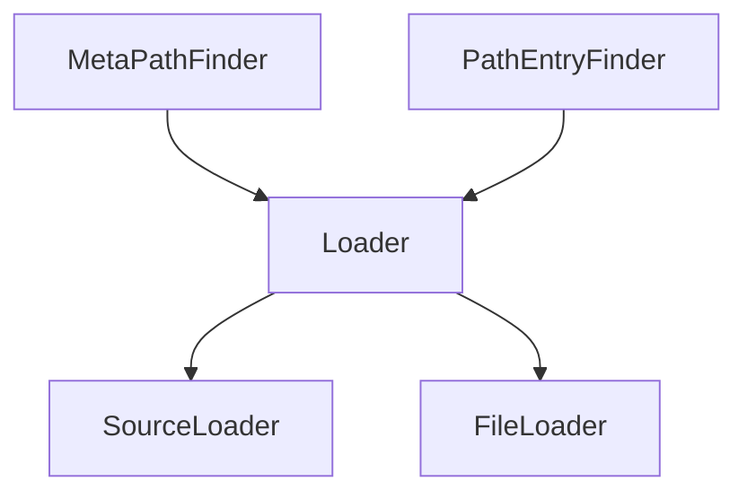

# [importlib — The implementation of import](https://docs.python.org/3/library/importlib.html)

[`importlib`](https://docs.python.org/3/library/importlib.html) is the **pure-Python implementation of import**: the same machinery behind `import` and `__import__()`, exposed so you can build custom finders/loaders, reload modules, and manage packages programmatically. Submodules [`importlib.metadata`](../importlibmetadata-accessing-package-metadata/index.md) and [`importlib.resources`](../importlibresources-package-resource-reading-opening-and-access/index.md) cover distribution metadata and package assets. Full API reference remains on [docs.python.org](https://docs.python.org/3/library/importlib.html).

---

## Top-level functions — [Functions](https://docs.python.org/3/library/importlib.html#functions)

| Function | When to use |
|----------|-------------|
| `import_module(name, package=None)` | **Preferred** programmatic import; supports relative names with `package` |
| `reload(module)` | Re-execute an already-imported module after editing source |
| `invalidate_caches()` | After installing/creating modules while the interpreter runs |
| `__import__(name, ...)` | Low-level; returns **top-level** package, not the leaf module |

```python
# Goal: import_module returns the leaf module
import importlib

enc = importlib.import_module("encodings.idna")
assert enc.__name__ == "encodings.idna"
parent = importlib.import_module("encodings")
assert parent is not enc
```

```python
# Goal: relative import with package anchor
import importlib

mod = importlib.import_module(".abc", package="importlib")
assert mod.__name__ == "importlib.abc"
```

```python
# Goal: reload re-executes module code in the same module object
import importlib

json = importlib.import_module("json")
reloaded = importlib.reload(json)
assert reloaded is json
assert hasattr(reloaded, "dumps")
```

---

## Package layout

| Submodule | Role |
|-----------|------|
| `importlib.abc` | `MetaPathFinder`, `PathEntryFinder`, `Loader`, … |
| `importlib.machinery` | `ModuleSpec`, `PathFinder`, built-in loaders |
| `importlib.util` | `spec_from_loader`, `module_from_spec`, helpers |
| `importlib.metadata` | Installed distribution metadata |
| `importlib.resources` | Non-code package resources |

---

## ABC overview — [importlib.abc](https://docs.python.org/3/library/importlib.html#importlib-abc-abstract-base-classes-related-to-import)



| ABC | Hook |
|-----|------|
| `MetaPathFinder.find_spec` | First chance for every import (`sys.meta_path`) |
| `PathEntryFinder.find_spec` | One entry on `sys.path` |
| `Loader.create_module` / `exec_module` | Construct and populate the module namespace |

Custom importers implement `find_spec` and a loader’s `exec_module`. Use `importlib.util.spec_from_loader()` when prototyping.

```python
# Goal: every import goes through machinery.ModuleSpec
import importlib.util
import json

spec = importlib.util.find_spec("json")
assert spec is not None
assert spec.name == "json"
assert spec.loader is not None
```

---

## `reload` caveats

| Caveat | Detail |
|--------|--------|
| Old instances keep old methods | Class objects from before reload are unchanged on existing instances |
| `from M import x` | Reloading `M` does not update `x` in other namespaces |
| Not thread-safe | Serialize reloads with a lock |
| Extension modules | `__init__` may not run again; behavior varies |

---

## Related docs in this repo

| Page | Topic |
|------|-------|
| [importlib.metadata](../importlibmetadata-accessing-package-metadata/index.md) | Versions, entry points, `RECORD` |
| [importlib.resources](../importlibresources-package-resource-reading-opening-and-access/index.md) | `files()`, traversable resources |
| [sys.path initialization](../the-initialization-of-the-syspath-module-search-path/index.md) | Startup path construction |
