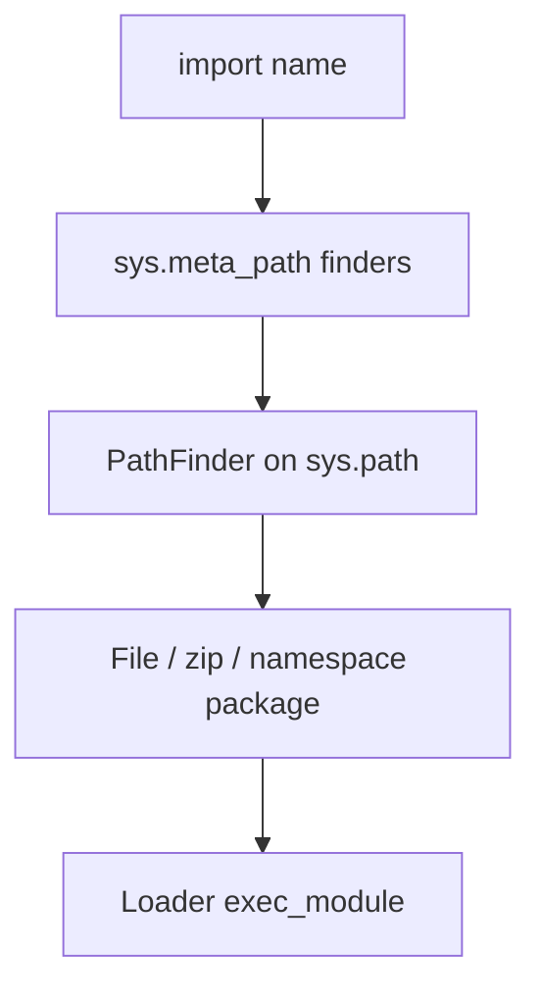

# [Importing Modules](https://docs.python.org/3/library/modules.html)

This chapter covers **how Python locates and loads code**: ZIP imports, package path extension, static dependency analysis, programmatic execution, and the [`importlib`](importlib-the-implementation-of-import/index.md) machinery that implements (and extends) the import system. Full reference prose remains on [docs.python.org](https://docs.python.org/3/library/modules.html).

---

## Module map

| Module | Primary use |
|--------|-------------|
| [`zipimport`](zipimport-import-modules-from-zip-archives/index.md) | Import `.py` / `.pyc` from ZIP archives on `sys.path` |
| [`pkgutil`](pkgutil-package-extension-utility/index.md) | Extend package `__path__`, walk modules, read package data |
| [`modulefinder`](modulefinder-find-modules-used-by-a-script/index.md) | Discover transitive imports of a script |
| [`runpy`](runpy-locating-and-executing-python-modules/index.md) | Run modules or paths without prior import (`python -m` backend) |
| [`importlib`](importlib-the-implementation-of-import/index.md) | Pure-Python import implementation, reload, custom finders |
| [`importlib.resources`](importlibresources-package-resource-reading-opening-and-access/index.md) | Read non-code assets shipped inside packages |
| [`importlib.resources.abc`](importlibresourcesabc-abstract-base-classes-for-resources/index.md) | ABCs for loaders exposing resources |
| [`importlib.metadata`](importlibmetadata-accessing-package-metadata/index.md) | Installed distribution metadata (version, entry points, files) |
| [sys.path initialization](the-initialization-of-the-syspath-module-search-path/index.md) | How `sys.path` is built at startup |

---

## Import pipeline (simplified)



---

## Choosing a tool

| Task | Start here |
|------|------------|
| Ship a library as a single `.zip` on `sys.path` | [`zipimport`](zipimport-import-modules-from-zip-archives/index.md) (usually automatic) |
| Split one logical package across directories | [`pkgutil.extend_path`](pkgutil-package-extension-utility/index.md) |
| List what a script will import (packaging audit) | [`modulefinder`](modulefinder-find-modules-used-by-a-script/index.md) |
| Run `package.module` as `__main__` from code | [`runpy.run_module`](runpy-locating-and-executing-python-modules/index.md) |
| Custom import hooks or reload after edit | [`importlib`](importlib-the-implementation-of-import/index.md) |
| Read `data.json` inside an installed package | [`importlib.resources`](importlibresources-package-resource-reading-opening-and-access/index.md) |
| Query installed package version / entry points | [`importlib.metadata`](importlibmetadata-accessing-package-metadata/index.md) |
| Debug missing modules at startup | [sys.path initialization](the-initialization-of-the-syspath-module-search-path/index.md) |

```python
# Goal: programmatic import matches import statement semantics
import importlib

json = importlib.import_module("json")
assert json.__name__ == "json"
assert hasattr(json, "dumps")
```

---

## Sections in this repo

| Section | Summary |
|---------|---------|
| [zipimport — Import modules from Zip archives](zipimport-import-modules-from-zip-archives/index.md) | `zipimporter`, ZIP on `sys.path` |
| [pkgutil — Package extension utility](pkgutil-package-extension-utility/index.md) | `extend_path`, `walk_packages`, `get_data` |
| [modulefinder — Find modules used by a script](modulefinder-find-modules-used-by-a-script/index.md) | `ModuleFinder`, `run_script` |
| [runpy — Locating and executing Python modules](runpy-locating-and-executing-python-modules/index.md) | `run_module`, `run_path` |
| [importlib — The implementation of import](importlib-the-implementation-of-import/index.md) | `import_module`, `reload`, ABCs |
| [importlib.resources](importlibresources-package-resource-reading-opening-and-access/index.md) | `files()`, `read_text`, `as_file` |
| [importlib.resources.abc](importlibresourcesabc-abstract-base-classes-for-resources/index.md) | `Traversable`, `TraversableResources` |
| [importlib.metadata](importlibmetadata-accessing-package-metadata/index.md) | `version`, `entry_points`, `metadata` |
| [The initialization of the sys.path module search path](the-initialization-of-the-syspath-module-search-path/index.md) | `PYTHONPATH`, prefix, venv, `site` |
