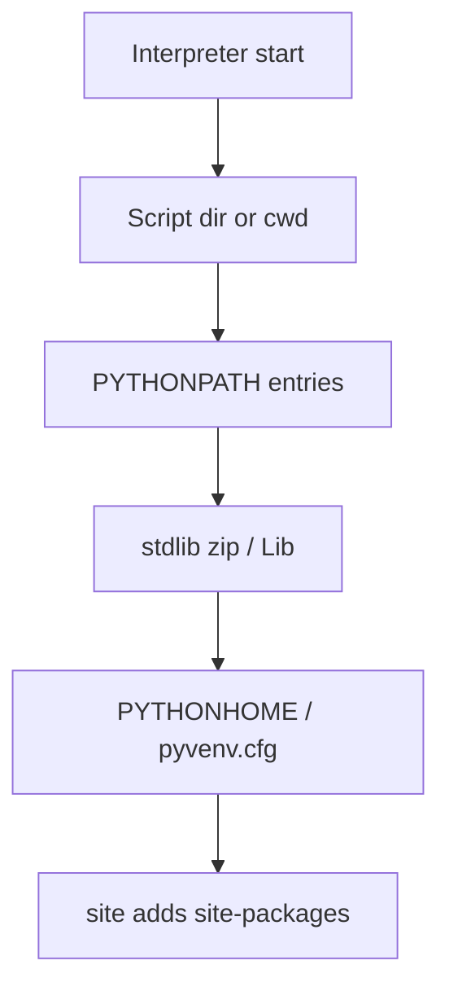

# [The initialization of the sys.path module search path](https://docs.python.org/3/library/sys_path_init.html)

This document explains how CPython builds **`sys.path`** at interpreter startup: script directory, `PYTHONPATH`, standard library prefixes, virtual environments, **`site-packages`**, and optional **`._pth`** overrides. Understanding the order helps debug “module not found” errors and deploy embedded or standalone builds. Full prose remains on [docs.python.org](https://docs.python.org/3/library/sys_path_init.html).

---

## Startup sequence (high level)



| Stage | What gets added |
|-------|-----------------|
| 1 | Directory containing the script, or **current directory** for `-c`, `-m`, REPL |
| 2 | Directories from **`PYTHONPATH`** (affects all installs on the machine—use carefully) |
| 3 | **`prefix`** / **`exec_prefix`** stdlib paths (and optional `pythonXY.zip`) |
| 4 | **`pyvenv.cfg`** may repoint `sys.prefix` / `sys.exec_prefix` (venv); since **3.14**, set during path init, not only in `site` |
| 5 | **`site`** processes **`site-packages`** and `.pth` files |

---

## Key environment variables

| Variable | Effect |
|----------|--------|
| `PYTHONPATH` | Prepends directories to `sys.path` (global across Python versions) |
| `PYTHONHOME` | Overrides prefix discovery; bypasses `pyvenv.cfg` detection when set |
| `PYTHONPLATLIBDIR` | Platform lib dir name (`lib` vs `lib64`, etc.) |

---

## Virtual environments — [Virtual Environments](https://docs.python.org/3/library/sys_path_init.html#virtual-environments)

| Attribute | Meaning |
|-----------|---------|
| `sys.prefix` / `sys.exec_prefix` | Active environment (venv) |
| `sys.base_prefix` / `sys.base_exec_prefix` | Base installation |
| `pyvenv.cfg` | Marker beside the venv’s Python executable |

```python
# Goal: base_prefix differs from prefix inside a typical venv
import sys

# always true: attributes exist
assert hasattr(sys, "prefix")
assert hasattr(sys, "base_prefix")
# in a venv, prefix usually points at the venv directory
assert isinstance(sys.path, list)
assert len(sys.path) > 0
```

---

## `._pth` files — [_pth files](https://docs.python.org/3/library/sys_path_init.html#pth-files)

A file named like **`python312._pth`** beside the executable can **fully override** `sys.path`:

| Rule | Detail |
|------|--------|
| Isolated mode | Enabled; registry/env path ignored |
| `import site` line | Required to run `site` and process `.pth` |
| Comments | Lines starting with `#` ignored |

Use for embedded/redistributable runtimes that must not pick up user `PYTHONPATH`.

---

## Inspecting the live path

```python
# Goal: first sys.path entry follows script-or-cwd rule
import sys

assert isinstance(sys.path[0], str)
# script directory, cwd, or "" for some layouts
assert sys.path[0] is not None
```

```python
# Goal: site-packages appears after site initialization
import sys

site_packages = [p for p in sys.path if p.endswith("site-packages") or "site-packages" in p]
# plain installs without site are rare; allow empty in minimal builds
assert isinstance(site_packages, list)
```

---

## Command-line flags that alter paths

| Flag | Effect |
|------|--------|
| `-E` | Ignore `PYTHONPATH` and similar env vars |
| `-I` | Isolated mode (`-E` plus more) |
| `-s` | Skip user `site` |
| `-S` | Skip `import site` entirely |

See [Command line](https://docs.python.org/3/using/cmdline.html) for full details.

---

## Embedded Python

For embedders, **`Py_InitializeFromConfig()`** and **`PyConfig`** replace much of this logic—see [Python Path Configuration](https://docs.python.org/3/c-api/init_config.html#python-path-configuration) in the C API docs.

---

## Related modules in this chapter

| Module | Connection |
|--------|------------|
| [`zipimport`](../zipimport-import-modules-from-zip-archives/index.md) | ZIP paths on `sys.path` |
| [`site`](https://docs.python.org/3/library/site.html) | Final `site-packages` and `.pth` processing |
| [`importlib`](../importlib-the-implementation-of-import/index.md) | Finders that consume `sys.path` |
