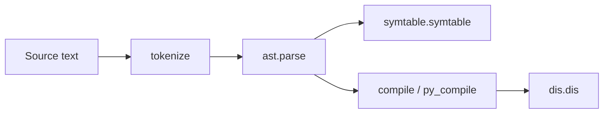

# [Python Language Services](https://docs.python.org/3/library/language.html)

The **Python Language Services** section groups modules that inspect, parse, compile, or introspect Python source and bytecode. They sit between raw text and running code: tokenizers turn source into tokens, `ast` and `symtable` expose compiler structures, `py_compile` / `compileall` produce `.pyc` files, and `dis` / `pickletools` decode binary formats. Full API reference remains on [docs.python.org](https://docs.python.org/3/library/language.html).

Use these modules when building linters, IDEs, static analyzers, coverage tools, or debugging the import/compile pipeline—not for everyday application logic.

---

## Module overview

| Module | Primary use |
|--------|-------------|
| [`ast`](ast-abstract-syntax-trees/index.md) | Parse source to an abstract syntax tree; walk, transform, unparse |
| [`symtable`](symtable-access-to-the-compilers-symbol-tables/index.md) | Compiler symbol tables (scopes, locals, globals, nonlocals) |
| [`token`](token-constants-used-with-python-parse-trees/index.md) | Numeric codes and names for parse-tree leaf tokens |
| [`keyword`](keyword-testing-for-python-keywords/index.md) | Detect reserved words and soft keywords |
| [`tokenize`](tokenize-tokenizer-for-python-source/index.md) | Lex Python source into `(type, string, start, end, line)` tuples |
| [`tabnanny`](tabnanny-detection-of-ambiguous-indentation/index.md) | Flag inconsistent tabs vs spaces in indentation |
| [`pyclbr`](pyclbr-python-module-browser-support/index.md) | Read class/function definitions without executing a module |
| [`py_compile`](py_compile-compile-python-source-files/index.md) | Compile one `.py` file to bytecode on disk |
| [`compileall`](compileall-byte-compile-python-libraries/index.md) | Batch-compile trees of `.py` files |
| [`dis`](dis-disassembler-for-python-bytecode/index.md) | Disassemble code objects and inspect opcodes |
| [`pickletools`](pickletools-tools-for-pickle-developers/index.md) | Disassemble and document the pickle wire format |

---

## Typical pipeline



---

## Choosing the right tool

| Task | Start here |
|------|------------|
| Lint or refactor Python syntax | [`ast`](ast-abstract-syntax-trees/index.md) + [`tokenize`](tokenize-tokenizer-for-python-source/index.md) |
| Resolve names and scopes statically | [`symtable`](symtable-access-to-the-compilers-symbol-tables/index.md) |
| Check indentation style | [`tabnanny`](tabnanny-detection-of-ambiguous-indentation/index.md) |
| List classes in a module safely | [`pyclbr`](pyclbr-python-module-browser-support/index.md) |
| Warm `__pycache__` before deploy | [`compileall`](compileall-byte-compile-python-libraries/index.md) |
| Debug what the interpreter executes | [`dis`](dis-disassembler-for-python-bytecode/index.md) |
| Reverse-engineer pickle blobs | [`pickletools`](pickletools-tools-for-pickle-developers/index.md) |

---

## Cross-cutting best practices

| Practice | Why |
|----------|-----|
| Prefer **`ast.parse(..., type_comments=True)`** when you need PEP 484 comments | Default parsing ignores `# type:` annotations on assignments |
| Use **`ast.unparse`** (3.9+) for round-trip experiments, not production codegen | Unparser output may differ cosmetically from original source |
| Compare token types by **name**, not integer | Token numeric codes can change between Python versions |
| Run **`compileall -q`** in CI to catch syntax errors early | Fails the build before import-time surprises |
| Treat **`pickletools`** output as documentation aid | Never unpickle untrusted data based on disassembly alone |

```python
# Goal: parse, inspect, and compile a tiny module in one namespace
import ast
import dis

source = "def add(a, b):\n    return a + b\n"
tree = ast.parse(source)
assert isinstance(tree.body[0], ast.FunctionDef)
code = compile(tree, "<demo>", "exec")
dis.dis(code)
assert code.co_names == ("add",)
```

---

## Sections in this repo

| Section | Summary |
|---------|---------|
| [ast — Abstract syntax trees](ast-abstract-syntax-trees/index.md) | Parse, walk, transform, and unparse AST nodes |
| [symtable — Access to the compiler's symbol tables](symtable-access-to-the-compilers-symbol-tables/index.md) | Scope analysis from the compiler |
| [token — Constants used with Python parse trees](token-constants-used-with-python-parse-trees/index.md) | Token type constants and helpers |
| [keyword — Testing for Python keywords](keyword-testing-for-python-keywords/index.md) | `iskeyword`, `issoftkeyword`, `kwlist` |
| [tokenize — Tokenizer for Python source](tokenize-tokenizer-for-python-source/index.md) | Lexical analysis API |
| [tabnanny — Detection of ambiguous indentation](tabnanny-detection-of-ambiguous-indentation/index.md) | Tab/space consistency checker |
| [pyclbr — Python module browser support](pyclbr-python-module-browser-support/index.md) | Static class/function index |
| [py_compile — Compile Python source files](py_compile-compile-python-source-files/index.md) | Single-file bytecode writer |
| [compileall — Byte-compile Python libraries](compileall-byte-compile-python-libraries/index.md) | Recursive `.pyc` generation |
| [dis — Disassembler for Python bytecode](dis-disassembler-for-python-bytecode/index.md) | Opcode listing and bytecode helpers |
| [pickletools — Tools for pickle developers](pickletools-tools-for-pickle-developers/index.md) | Pickle opcode reference and disassembler |
